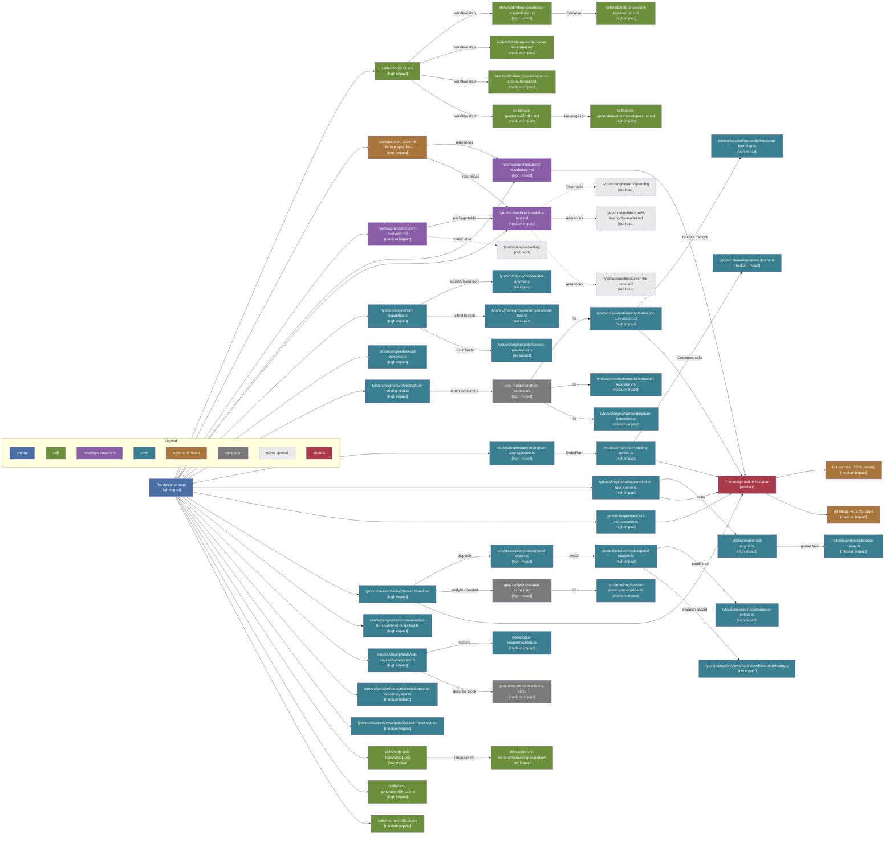

# Design Phase Context

The phase produced [../design-ending-on-an-answer/1-index.md](../design-ending-on-an-answer/1-index.md) and [../unit-tests/1-index.md](../unit-tests/1-index.md), and corrected [../4-acceptance-criteria.md](../4-acceptance-criteria.md) and [../1-index.md](../1-index.md). Conventions, the colour key and the impact scale are in [1-index.md](1-index.md).

Cost: 66,252 estimated read tokens. By category, code 36,412, skill 23,210, command 5,291, navigation 826, state 514. By impact, high 21,800, medium 18,400, low 13,100, no impact 12,900. Full accounting in [4-context-budget.md](4-context-budget.md).

## Discovery path

Arrows: discovery path, source pointed me at the target.

## Per source

| Source                                   | Impact   | What it decided                                                                                     |
| ---------------------------------------- | -------- | --------------------------------------------------------------------------------------------------- |
| The design prompt                        | high     | Named all three hard calls and every code claim to verify; nothing had to be found                  |
| sdd/SKILL.md                             | high     | The artefact set, the numbering, and that the design fills the decisions file's Design section      |
| sdd design-conventions.md                | high     | The section order, and what a New interfaces block may and may not hold                             |
| sdd unit-tests-format.md                 | high     | Pseudocode then outline, per production method, and the 120-line break-out rule                     |
| sdd acceptance-criteria-format.md        | medium   | That a criterion the test plan now covers comes out, which removed the seventh                      |
| sdd decisions-file-format.md             | medium   | The D5 heading shape and its resolved-date marker                                                   |
| code-generation/SKILL.md                 | medium   | The append-to-the-end rule for the new constructor field, and the naming tests                      |
| code-generation typescript.md            | high     | That the sixth field is appended before no defaulted parameter, and that an enum stays an enum here |
| code-unit-tests/SKILL.md                 | low      | One test per branch, which the outline already followed                                             |
| code-unit-tests typescript.md            | low      | Vitest describe nesting, already visible in the four target test files                              |
| text-generation/SKILL.md                 | high     | Forced the split of both new files, and cut a conversational note from the criteria                 |
| mermaid/SKILL.md                         | medium   | No theme, no rect, bracketed suffixes, and the new marker inside the brackets                       |
| The four spec files                      | high     | Every decision the design implements, and the three code claims it had to check                     |
| architecture/1-overview.md               | medium   | That no new package is needed and that the wiring rule is untouched                                 |
| architecture/4-the-turn.md               | medium   | The How A Turn Ends table, which the returned pair falsifies                                        |
| architecture/2-vocabulary.md             | high     | Both claims the design corrects: the five-ending table and the never-reaches-history line           |
| tool-call-outcome.ts                     | high     | The five existing fields, and that the factories pair fields the call sites must not                |
| turn-ending-kind.ts                      | high     | The five values and their comment shape, which Answered follows                                     |
| turn-step-outcome.ts                     | high     | That EndedTurn already holds the pair, so TurnResult copies a shape rather than inventing one       |
| turn-outcomes.ts                         | medium   | The split the new method must not land on: it writes to history, so it is not here                  |
| turn-ending-service.ts                   | high     | Where endTurnWithAnswer sits, and that it must not focus an edit                                    |
| conversation-turn-runner.ts              | high     | That the stuck check runs before the spend, which fixes where the answer is read                    |
| tool-call-executor.ts                    | high     | That the loop returns void today, so the accumulate-then-return shape is the change                 |
| tool-dispatcher.ts                       | high     | Confirmed :202 and :231, and that publishModelAnswer changes one line                               |
| tools/model-answer.ts                    | low      | That the sources are a separate field, so appending the text alone is one argument                  |
| shared/models/outcome.ts                 | medium   | That Outcome narrows through a this-is predicate, so a fourth variant would touch every caller      |
| chat-turn.ts                             | low      | The private-kind-plus-factories precedent TurnResult follows                                        |
| harness-result-kind.ts                   | no       | Checked as a naming precedent; the enum comment shape came from turn-ending-kind                    |
| edit-engine.ts                           | high     | The failure branch in runTurn that also needs wrapping in TurnResult                                |
| utterance-queue.ts                       | medium   | That the queue is generic over the promise, so the type moves with one signature                    |
| SessionPanel.tsx                         | high     | The three branches, and that the new one goes first because answered is a success                   |
| panel-action.ts                          | high     | That turnAnswered is a new action rather than a reuse of summary                                    |
| panel-reducer.ts                         | high     | That the answer case leaves the phase alone, so the ending must move it                             |
| asked-entries.ts                         | high     | turnEnded as the settling mechanism turnAnswered has to call                                        |
| useRecordedHistory.ts                    | low      | That the record follows every dispatch, so the new action is recorded like the rest                 |
| transcript-repository.ts                 | medium   | That recordEnding takes any kind, so it needs no change beyond a test                               |
| transcript-turn-section.ts               | high     | The finding the spec missed: the Replied branch at :100 assumes five endings                        |
| transcript-turn-step.ts                  | high     | That the ending renders as the raw enum value, which removed the seventh criterion                  |
| session-panel-props-builder.ts           | medium   | Confirmed the one production caller of processUtterance, closing a requirements assumption          |
| test-support/builders.ts                 | medium   | anEngine and aToolTurn as the helpers the plan names                                                |
| conversation-turn-runner-endings.test.ts | high     | The endings() helper the new leaves assert through                                                  |
| edit-engine-harness.test.ts              | high     | That respondsWith falls through to a text turn, correcting the prompt's claim                       |
| SessionPanel.test.tsx                    | medium   | That the processUtterance mock is what moves with the type                                          |
| transcript-repository.test.ts            | medium   | The when-a-turn-ends block the new leaf joins                                                       |
| grep TurnEndingKind across src           | high     | Found transcript-turn-section.ts, the site no spec file names                                       |
| grep notifySucceeded across src          | high     | Found the wiring caller, closing the assumption about a second consumer                             |
| grep the answers-from-a-listing block    | medium   | The two existing tests, and that neither asserts the continue behaviour                             |
| bun run test                             | medium   | 1504 passing with src untouched, which is what the prompt asked be checked                          |
| git status                               | medium   | Proved no production file moved this session                                                        |
| src/engine/waiting                       | not read | Named in the folder table; out of scope per the requirements                                        |
| src/engine/turn/spending                 | not read | The spend is unchanged, so the counters needed no reading                                           |
| architecture/5-asking-the-model.md       | not read | What one model call holds; the change touches no prompt assembly                                    |
| architecture/7-the-panel.md              | not read | Pointed at by 4-the-turn; the panel files themselves were read instead                              |

## Shape notes

- The prompt is the hub, not a document. Sixteen sources hang directly off it, including every code claim it asked be verified. A phase whose prompt names its own reading list has a flat graph, and the deep chains here are the ones the prompt did not anticipate.
- One chain paid for itself: turn-ending-kind to the grep to transcript-turn-section to transcript-turn-step. Four hops, and it is where the finding the spec missed came from. Nothing in the spec folder points at either file.
- The other deep chain is the panel's: SessionPanel to panel-action to panel-reducer to asked-entries. Four hops, and it is what turned "the panel branches on the kind" into a named new action that has to settle the turn.
- Two greps did the work a reference could not. Both were consumer sweeps rather than lookups, and both closed an assumption the requirements had left open.
- Four sources were pointed at and left unopened, all four correctly. Three are out of scope by the requirements, and the fourth was superseded by reading the panel code directly.
