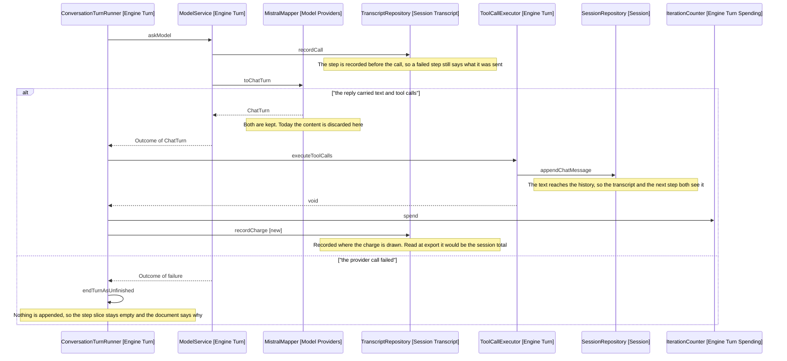

# Behaviour Sequence

One diagram, since there is no flag to branch on. It covers the two paths the change touches: a reply carrying both text and calls, and a step whose provider call failed.

Arrows: uses-relationship (client to supplier).

## What The Diagram Does Not Show

The two recording sites sit either side of the tool calls, and that ordering is what makes the budget line correct.

TranscriptRepository.recordCall (Session Transcript) runs before the provider call, so a step the provider failed on still names what it was sent. TranscriptRepository.recordCharge (Session Transcript, new) runs after the calls have run, because ConversationTurnRunner.spendOn (Engine Turn) is the one place a batch's size reaches the counter and it is called once the batch is done.
