# Design Phase Context

The phase produced the design folder, the unit test plan, and corrections to three spec files. Conventions are in [1-index.md](1-index.md).

Cost: 67,762 estimated read tokens across 90 reads. Code 37,798, skills 23,342, navigation 5,163, commands 853, state 392. By impact: high 21,400, medium 24,100, low 15,800, no impact 6,400. The accounting is [3-context-budget.md](3-context-budget.md).

## Discovery Path

```mermaid
flowchart LR
    Prompt["The design prompt [prompt]<br/>high impact"]

    Index["spec/2026-09-18d/1-index.md [reference document]<br/>low impact"]
    Reqs["spec/2026-09-18d/2-requirements.md [reference document]<br/>high impact"]
    Decisions["spec/2026-09-18d/3-decisions.md [reference document]<br/>high impact"]
    AC["spec/2026-09-18d/4-acceptance-criteria.md [reference document]<br/>medium impact"]

    Sdd["skills/sdd/SKILL.md [skill]<br/>medium impact"]
    DesignConv["skills/sdd/references/design-conventions.md [skill]<br/>high impact"]
    UnitFmt["skills/sdd/references/unit-tests-format.md [skill]<br/>high impact"]
    CodeGen["skills/code-generation/SKILL.md [skill]<br/>medium impact"]
    TypeScript["skills/code-generation/references/typescript.md [skill]<br/>medium impact"]
    TextGen["skills/text-generation/SKILL.md [skill]<br/>high impact"]
    Mermaid["skills/mermaid/SKILL.md [skill]<br/>medium impact"]

    Vocab["docs/architecture/2-vocabulary.md [reference document]<br/>medium impact"]
    Overview["docs/architecture/1-overview.md [reference document]<br/>low impact"]
    Sibling["spec/2026-09-18c/ folder shape [navigation]<br/>medium impact"]

    TurnStep["tyto src/session/transcript/transcript-turn-step.ts [code]<br/>high impact"]
    TurnSection["tyto src/session/transcript/transcript-turn-section.ts [code]<br/>high impact"]
    Mapper["tyto src/model/providers/mistral-mapper.ts [code]<br/>high impact"]
    ChatTurn["tyto src/model/providers/models/chat-turn.ts [code]<br/>high impact"]
    Runner["tyto src/engine/turn/conversation-turn-runner.ts [code]<br/>high impact"]
    Outcomes["tyto src/engine/turn/ending/turn-outcomes.ts [code]<br/>high impact"]
    Ending["tyto src/engine/turn-ending-service.ts [code]<br/>high impact"]
    Counter["tyto src/engine/turn/spending/iteration-counter.ts [code]<br/>high impact"]
    Repo["tyto src/session/transcript/transcript-repository.ts [code]<br/>medium impact"]
    Executor["tyto src/engine/turn/tool-call-executor.ts [code]<br/>high impact"]
    Snapshot["tyto src/session/models/session-snapshot.ts [code]<br/>medium impact"]
    Builders["tyto src/test-support/builders.ts [code]<br/>medium impact"]
    DocTest["tyto src/session/transcript/tests/transcript-document.test.ts [code]<br/>medium impact"]
    PromptTest["tyto src/model/prompt/tests/system-prompt.test.ts [code]<br/>high impact"]
    Skills["tyto src/engine/skill-gating/applicable-skills.ts [code]<br/>medium impact"]

    Repro["A throwaway vitest file [system of record]<br/>high impact"]
    Suite["bun run test [system of record]<br/>low impact"]

    Panel["tyto src/session/views/ [never opened]<br/>not read"]
    Search["tyto src/search/SearchReport [never opened]<br/>not read"]

    Artefact["design folder and unit-tests folder [artefact]"]

    Prompt --> Index
    Index -->|refs| Reqs
    Index -->|refs| Decisions
    Index -->|refs| AC
    Prompt -->|names| Sdd
    Sdd -->|refs| DesignConv
    Sdd -->|refs| UnitFmt
    Prompt -->|names| CodeGen
    CodeGen -->|refs| TypeScript
    DesignConv -->|refs| Mermaid
    Prompt -->|names| Vocab
    Prompt -->|names| Overview

    Reqs -->|refs| TurnStep
    Reqs -->|refs| TurnSection
    Reqs -->|refs| Mapper
    Reqs -->|refs| Counter
    Reqs -->|refs| Repo
    Reqs -->|points at| Search
    Decisions -->|names| ChatTurn
    Decisions -->|names| Snapshot
    Decisions -->|names| Builders

    Mapper -->|imports| ChatTurn
    ChatTurn -->|grep for consumers| Runner
    Runner -->|calls| Outcomes
    Runner -->|calls| Ending
    Runner -->|calls| Executor
    TurnSection -->|reads endings| Outcomes
    Counter -->|held by| Runner

    TurnSection -->|reproduce the symptom| Repro
    Repro -->|falsified the claim| Outcomes
    Repro --> Suite

    Prompt -->|names the fixture| PromptTest
    Reqs -->|names the gate| Skills
    Reqs -->|names| DocTest
    AC -->|points at| Panel
    Sdd -->|folder shape| Sibling
    TextGen -->|file length| Sibling

    Repro --> Artefact
    DesignConv --> Artefact
    UnitFmt --> Artefact
    TextGen --> Artefact
    Outcomes --> Artefact
    Mapper --> Artefact
    Counter --> Artefact

    subgraph LEGEND["Legend"]
        L1["prompt"]
        L2["skill"]
        L3["reference document"]
        L4["code"]
        L5["system of record"]
        L6["navigation"]
        L7["never opened"]
        L8["artefact"]
    end

    classDef prompt fill:#d9e8fb,stroke:#3b6ea5,color:#111
    classDef skill fill:#e4dcf5,stroke:#6b51a8,color:#111
    classDef refdoc fill:#d9f0e1,stroke:#2f7d4f,color:#111
    classDef code fill:#fbe8cf,stroke:#b5751f,color:#111
    classDef record fill:#f7d9d9,stroke:#a33b3b,color:#111
    classDef nav fill:#e8e8e8,stroke:#666666,color:#111
    classDef unread fill:#f5f5f5,stroke:#999999,color:#555,stroke-dasharray: 5 3
    classDef artefact fill:#fff3b0,stroke:#9a7d10,color:#111

    class Prompt,L1 prompt
    class Sdd,DesignConv,UnitFmt,CodeGen,TypeScript,TextGen,Mermaid,L2 skill
    class Index,Reqs,Decisions,AC,Vocab,Overview,L3 refdoc
    class TurnStep,TurnSection,Mapper,ChatTurn,Runner,Outcomes,Ending,Counter,Repo,Executor,Snapshot,Builders,DocTest,PromptTest,Skills,L4 code
    class Repro,Suite,L5 record
    class Sibling,L6 nav
    class Panel,Search,L7 unread
    class Artefact,L8 artefact
```

Arrows: discovery path, source pointed me at the target.

## What Each Source Decided

| Source                          | Impact  | What it decided                                                                      |
| ------------------------------- | ------- | ------------------------------------------------------------------------------------ |
| The design prompt               | high    | Which decisions were closed, which were mine, and seven code claims to verify         |
| 2-requirements.md               | high    | The six additions and the per-step line budget. Also the claim that proved wrong      |
| 3-decisions.md                  | high    | D1, D2 and D3 as settled inputs; D4 and D5 as the two to close                        |
| 4-acceptance-criteria.md        | medium  | Which check to drop when D4 closed on no change                                       |
| 1-index.md                      | low     | Reading order, which the prompt already gave                                          |
| sdd SKILL.md                    | medium  | The Write Design workflow and the file naming                                         |
| design-conventions.md           | high    | The required sections, and which two to drop for a repo with no flags                 |
| unit-tests-format.md            | high    | The pseudocode-then-outline shape, and the 120-line break-out rule                    |
| code-generation SKILL.md        | medium  | Repository naming for RepeatedCalls, and the value-object choice for StepCharge       |
| code-generation typescript.md   | medium  | Class over interface for the two new values, and the defaulted-parameter rule         |
| text-generation SKILL.md        | high    | Forced the split of both over-length files, and stripped backticks from tables        |
| mermaid SKILL.md                | medium  | The bracketed system suffixes and the arrow legend                                    |
| 2-vocabulary.md                 | medium  | Turn, turn step and progress line kept distinct throughout                            |
| 1-overview.md                   | low     | Confirmed the package the new file belongs in, which the sibling files already showed |
| transcript-turn-step.ts         | high    | The three empty-response wordings, and where the repeat mark goes                      |
| transcript-turn-section.ts      | high    | The truncation's real behaviour, which is where the correction started                 |
| turn-outcomes.ts                | high    | That Exhausted, Stuck and Failed write nothing. The fact that falsified the claim     |
| turn-ending-service.ts          | high    | That only Replied and Cancelled append, which is the other half of the same fact      |
| mistral-mapper.ts               | high    | Both signatures, and that the loss is symmetric                                       |
| chat-turn.ts                    | high    | The relaxed invariant and the defaulted content parameter                             |
| conversation-turn-runner.ts     | high    | The one production consumer, and where recordCharge has to sit                        |
| iteration-counter.ts            | high    | That spent is already private with the right body, so the change is an exposure       |
| tool-call-executor.ts           | high    | That results carry the call id, so the repeat test needs nothing recorded             |
| system-prompt.test.ts           | high    | That the release 3 fixture compares the system prompt alone and is unaffected         |
| transcript-repository.ts        | medium  | The one step-creation site, and where a charge attaches                               |
| session-snapshot.ts             | medium  | Confirmed the one-line restore fix                                                    |
| builders.ts                     | medium  | The sibling builder, and the real call-site count                                     |
| transcript-document.test.ts     | medium  | The document-level test shape the plan follows                                        |
| applicable-skills.ts            | medium  | That declaresArgument already distinguishes the two claims, which closed D4            |
| The throwaway vitest file       | high    | Falsified the requirements' central claim. The single highest-value read of the phase |
| bun run test                    | low     | A clean baseline and a clean finish                                                   |
| spec/2026-09-18c folder shape   | medium  | The folder naming for the split, and that the prefix drops                            |
| src/session/views/              | not read| Out of scope by the requirements, and never needed                                    |
| SearchReport                    | not read| The requirements' claim that its reason travels in the tool result was taken as given |

## Shape Notes

- The requirements file is the hub: seven of the eight most expensive code reads were reached through its References section, and it paid for itself despite carrying the one wrong claim.
- The longest chain is five hops, and it is the one that mattered: prompt, requirements, transcript-turn-section, a throwaway test, turn-outcomes. Nothing pointed at turn-outcomes directly, and the design's one correction sits at the end of that chain.
- Two skills were reached through another skill rather than the prompt: design-conventions through sdd, and mermaid through design-conventions. Both were high or medium impact, so the indirection paid.
- text-generation has no inbound link from the work at all. It fired on the repo's own post-write rule, and it changed the deliverable's shape more than any other skill.
- The two never-opened sources were both named by the requirements as settled. Neither needed checking, which is the requirements doing its job.
