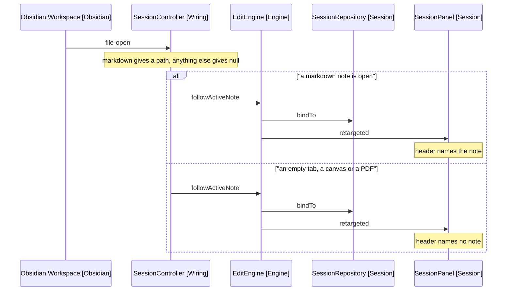

# Design

One rule, already written down: a session is bound to the open markdown note,
or to null when nothing markdown is open. One path does not follow it.

## Goal

Unbind the session when the active tab holds no markdown note, so an
instruction lands on what the user is looking at or on nothing at all.

## Where The Event Is Dropped

SessionController.retargetActiveEngine ([session-controller.ts:96](../../../../src/wiring/session-controller.ts)):

```typescript
private retargetActiveEngine(file: TFile | null): void {
  if (file?.extension === 'md') void this.activeEngine?.followActiveNote(file.path)
}
```

The guard covers two cases that want different answers. A markdown note binds.
Anything else, a canvas or a null from an empty tab, falls through and leaves
the session on the note it had.

The comment above it argues for not binding to a canvas, which is right. What
the code does instead is stay bound to the last note, which is a different
thing.

## The Rule Already Exists

ActiveNote.path ([active-note.ts:10](../../../../src/wiring/active-note.ts))
answers the same question correctly for the two entry points that build a
session:

```typescript
const file = this.app.workspace.getActiveFile()
return file?.extension === 'md' ? file.path : null
```

Same test, opposite treatment of the false branch: a path or null, rather than a
path or nothing. The fix is to make the retarget path return null the way this
one does.

## What Changes

| Concern              | Today                               | New                            |
| -------------------- | ----------------------------------- | ------------------------------ |
| Empty tab            | Session keeps the note it had       | Session unbinds                |
| Canvas or PDF opened | Session keeps the note it had       | Session unbinds                |
| Note opened          | Session binds to it                 | Unchanged                      |
| Panel header         | Names the note the session has left | Names no note while unbound    |
| Next instruction     | Edits a note the user cannot see    | Model is told no note is bound |

## Types That Widen

Four signatures type the path as string. Each becomes string or null.

| Site                                | Today                    |
| ----------------------------------- | ------------------------ |
| EditEngine.followActiveNote         | `(path: string)`         |
| SessionRepository.changeTargetNote  | `(path: string)`         |
| SessionListeners.retargets          | `Listeners<string>`      |
| TargetNotePorts.onTargetNoteChanged | `(path: string) => void` |

ToolDispatcher ([tool-dispatcher.ts:253](../../../../src/engine/tool-dispatcher.ts))
also calls changeTargetNote, always with a path. Widening the parameter leaves
that caller unchanged.

## Two Mutators Become One

SessionRepository holds the same assignment twice
([session-repository.ts:32](../../../../src/session/session-repository.ts)):

```typescript
changeTargetNote(path: string): void {
  this.targetPath = path
}

bindTo(path: string | null): void {
  this.targetPath = path
}
```

The comment on bindTo says the two are separate because changeTargetNote's
callers "can only ever move a session to a note". That stops being true, and
with it the reason for two methods. They collapse into bindTo, whose name says
what both do and whose signature is already right.

## Behaviour Sequence



Arrows: uses-relationship (client to supplier).

Today the second branch does not exist: the guard returns and nothing is called.

## A Running Turn

EditEngine.retargetRunningTurn resolves the new target and hands it to the
running turn ([edit-engine.ts:36](../../../../src/engine/edit-engine.ts)). It
already returns early when the resolve finds nothing, which is what an unbound
session produces, so a turn in flight keeps the note it started on. That is the
existing behaviour for a note the resolver cannot reach, and it needs no change.

## Test Plan

### SessionController

- unbinds the session when the opened file is null
- unbinds the session when the opened file is not markdown
- binds to the note when the opened file is markdown

### EditEngine

- binds to null, so a session with no note open is unbound
- publishes the retarget so the panel header follows
- returns early when the path has not moved, including null to null

### SessionRepository

- reports itself unbound after binding to null

### useTargetNote

- clears the header name when the retarget carries null

## Out Of Scope

- Recording that a retarget happened, in the transcript, the panel entry list or
  the model's history. That is
  [recording-a-retarget](../recording-a-retarget/1-index.md).
- Saying "no note bound" in the panel beyond the header going blank. The
  sibling's retarget step already says it (D1).
- Moving the markdown-only rule out of wiring and into engine, which
  [7-package-design.md](../../../architecture/7-package-design.md) records as
  open.

## References

- [2-requirements.md](2-requirements.md) - the rule, the replication steps and the scenarios
- [29-following-the-note-across-a-restore](../../3-archived/29-following-the-note-across-a-restore/1-index.md) - states the rule and fixes the two entry points this one misses
- [src/wiring/session-controller.ts:96](../../../../src/wiring/session-controller.ts) - retargetActiveEngine, the guard that drops the event
- [src/wiring/active-note.ts:10](../../../../src/wiring/active-note.ts) - the same test, returning null where the guard returns nothing
- [src/session/session-repository.ts:32](../../../../src/session/session-repository.ts) - changeTargetNote and bindTo, the two mutators that collapse
