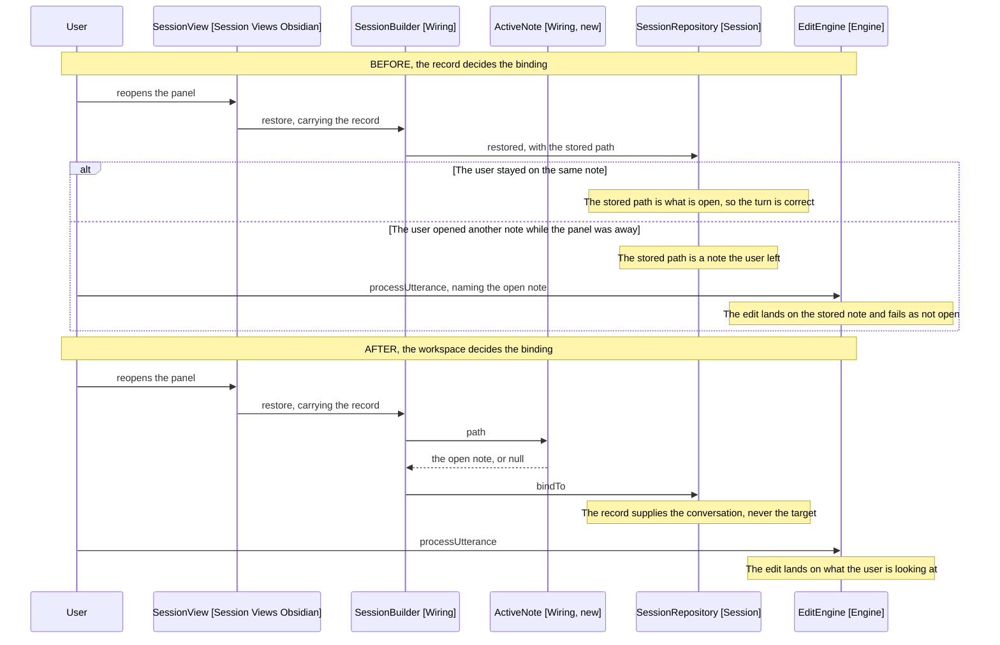

# Design

One rule: the binding is read from the workspace, at the moment a session is
assembled. Nothing carries a note in from anywhere else.

## Goal

Make a restored session bind to the note the user has open, so a session resumed
after the user moved on edits what is in front of them rather than what the
record remembers.

## Where a binding is decided today

Three places, and they disagree. The requirements call this out; these are the
sites.

| Site                        | Today                                    |
| --------------------------- | ---------------------------------------- |
| EditEngine.followActiveNote | Rebinds to the opened note, silently     |
| TytoPlugin.bindOrAskRebind  | Prompts, and rebinding drops the history |
| SessionBuilder.restore      | Takes stored.targetPath, never asks      |

The first is the rule already. The design makes the other two agree with it.

## The seam

SessionBuilder has two entry points that meet at one private method:

```text
build(file, presence)    ->  assemble(presence, target, sessions, transcript)
restore(stored, presence) ->  assemble(presence, target, sessions, transcript)
```

The target is a parameter, so the two callers each decide it. That is the
duplication the bug lives in: build reads a file it was handed, restore reads a
path off the record, and nothing checks they agree with the workspace.

The fix is to stop passing the target in. assemble asks for it.

## What asks the workspace

An ActiveNote (Wiring, new) answers one question: which markdown note is open,
or null. It holds the App and nothing else.

```typescript
class ActiveNote {
  constructor(private app: App) {}

  // Null for anything but a note, so a session with a canvas or a PDF in front
  // is unbound rather than bound to something no editor can show.
  path(): string | null {
    const file = this.app.workspace.getActiveFile()
    return file?.extension === 'md' ? file.path : null
  }
}
```

This is TytoPlugin.activeNote (main.ts:155) moved and narrowed to a path. The
plugin keeps no copy: a second reader of the workspace is a second answer that
can drift from the first.

It is built by PluginScope, which already holds the App and already exists for
this: what outlives one session, built from the vault and the live settings.
WorkspaceNoteLocator and NoteOpener reach the App the same way, through
EngineFactory's scope (engine-factory.ts:58, :97).

SessionBuilder takes the ActiveNote in its constructor rather than the scope.
It holds an EngineFactory today and not a scope, and taking one now would give
the builder the whole App to reach through when it needs one question answered.

## What assemble does with it

The target becomes two facts rather than one, and only the entries stay a
parameter:

```text
assemble(presence, entries, sessions, transcript):
  path = activeNote.path()
  sessions.bindTo(path)
  ...
```

build passes no file. restore passes no path. Both get the workspace's answer,
which is the rule stated in the one place both reach.

The write is bindTo rather than changeTargetNote, which takes a path and never
null. Its callers are a command and a file-open, and neither can unbind a
session; assemble can, because nothing markdown open is an unbound session.
Widening changeTargetNote would have let those two unbind by accident.

SessionRepository.restored keeps its targetPath parameter, since the tests
construct a bound repository through it, but the production call passes null.
Passing the stored path and overwriting it a line later reads as though the
record still decided something.

## Why the record still stores a path

It is written and no longer read back. Two options, and the design takes the
first:

- Keep writing it, read nothing. The field costs nothing, and a record naming
  the note a session was on is worth having when reading a session file by hand
  or diagnosing another report like this one.
- Stop writing it, and bump SESSION_SNAPSHOT_VERSION. A version bump discards
  every stored session, which costs a user their in-flight conversation to
  remove a field that is already harmless.

So targetPath stays in SessionSnapshot, and the requirements' question about it
is answered: it is a diagnostic, not an input.

## The listener needs no backlog

followActiveNoteWith (main.ts:122) registers a file-open listener while an
engine is built, and the engine is built per session. A note opened while no
panel existed reaches nothing.

Nothing is added to fix that. Reading the workspace at assemble time makes the
gap unreachable: what is open has an answer at any moment, so the binding never
has to be reconstructed from the events that led there. The listener keeps doing
what it does, which is following the user while a session runs.

The one-listener guard stays too. followsActiveNote exists so only the newest
engine follows the user, and that is still right.

## What goes

RebindModal (Session Views Obsidian) and bindOrAskRebind (main.ts:64). Under the
rule there is nothing to ask: the note moved, so the binding moves, and the
conversation is untouched either way.

openSession collapses to its two real jobs, revealing the view and binding a
session if one is not already bound:

```typescript
private async openSession(): Promise<void> {
  const view = await this.revealSessionView()
  if (!view) return
  if (!view.hasSession()) view.bindSession(this.buildPanelProps(view))
}
```

The early return that skipped the comparison goes with it, because there is no
comparison left to skip. The stored-session read stays where it already is, in
SessionView.onOpen, which is the path that restores a leaf Obsidian reopened.

buildPanelProps loses its file parameter. So does startNewSession's call to it
(main.ts:148), which passed activeNote() to get the behaviour the rule now gives
everyone.

## Behaviour Sequence

The same restore, before and after. The alt in the first half is the reported
session.



Arrows: uses-relationship (client to supplier).

The two halves differ in what is asked. Before, the binding is whatever the
record held. After, it is whatever the workspace holds, and the record is read
only for the conversation.

## The command replay

Out of this design's reach, and the requirements say why: the rule binds at the
start of a turn, and a tool call moving the target mid-turn is legitimate.

What this design changes is the pressure closest to the decision.
NoteContextMessage is the last message in the request and it names the session's
target. Bind correctly and it names the shopping list, which is the cheapest
test of whether the replayed worked example still pulls the model back.

That test is by hand against a real vault, because a prompt change cannot be
unit tested (docs/AGENTS.md). If it fails, CommandSection is the next lever, and
it is a separate change.

## What does not change

- What a record holds, so a session written before this restores after it.
- EditEngine.followActiveNote, which already states the rule.
- The one-listener guard, and which engine follows the user.
- Reset, which still discards the conversation and the stored record.
- The prompt, so the release-3 fixture stays green.

## Test plan

SessionBuilder is already unit tested with a fake app, and FakeWorkspace already
answers getActiveFile, so the binding decision is testable where it now lives.
That is the answer to the requirements' note that main.ts has no tests: the
decision moves out of main.ts.

FakeWorkspace's getActiveFile needed one change: it returned a TFile with no
extension, and a reader deciding whether the open file is a note has only what
Obsidian puts on the TFile. The extension now comes off the path, so a test can
say a canvas is in front by naming one.

- A restored session binds to the open note, not the stored one
- A restored session binds to null when nothing markdown is open
- A restored session keeps its entries and its chat history whatever it binds to
- A restored session binds to the open note when it matches the stored one
- A session built fresh binds to the open note
- A session built with a canvas or a PDF in front is unbound
- ActiveNote returns null for a non-markdown file
- ActiveNote returns null when nothing is open
- A second session on another note keeps the conversation, since nothing prompts

By hand, against a real vault:

- The reported session: restore, open another note, and speak an instruction
  naming it
- Whether the model still re-runs the binding command once the target is right

## Out of scope

- CommandSection's wording, which is the next lever if the binding fix is not
  enough on its own.
- Withdrawing binding commands once a session is bound, which breaks asking for
  a different note mid-session.
- Removing targetPath from the record, which costs a version bump and every
  stored session to delete a harmless field.
- The insert_text refusal in the transcript, which is real behaviour repeating
  because the turn repeated.

## References

- [2-requirements.md](2-requirements.md) - the rule, and the three paths that disagree with it
- [3-transcript.md](3-transcript.md) - the reported session
- src/wiring/session-builder.ts:65 - build, which passes a file it was handed
- src/wiring/session-builder.ts:78 - restore, which passes the stored path
- src/wiring/session-builder.ts:98 - assemble, the seam both reach
- src/main.ts:48 - openSession, and the early return that skipped the check
- src/main.ts:64 - bindOrAskRebind, which goes
- src/main.ts:155 - activeNote, which becomes ActiveNote
- src/main.ts:122 - followActiveNoteWith, and the listener that needs no backlog
- src/engine/edit-engine.ts:26 - followActiveNote, which already states the rule
- src/session/session-repository.ts:16 - restored, which the production call now passes null
- src/wiring/tests/session-builder.test.ts:36 - where the binding tests go
- src/test-support/fake-workspace.ts:72 - getActiveFile, which the tests already have
