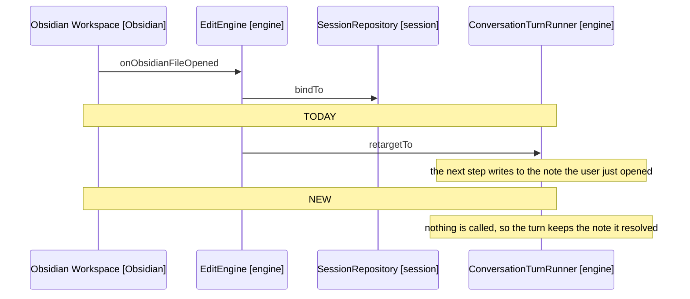

# Design

## Goal

Keep a running turn on the note it started, and pair every anchor with the read
that preceded it by allowing one edit per step, with a whole-note write to make
that affordable.

## Behaviour Change

| Concern                      | Today                                        | New                                        |
|------------------------------|----------------------------------------------|--------------------------------------------|
| User opens a note mid-turn   | The running turn's target swaps under it     | The session binds; the turn keeps its note |
| Second edit call in one step | Applied against a note the first one changed | Refused, naming the step boundary          |
| A scattered edit             | A batch of anchors from one snapshot         | One whole-note write                       |
| A whole-note write           | No such tool, and the prompt forbids one     | Offered, behind three guards               |
| Anchor computed from         | The step's snapshot, however many calls in   | The step's snapshot, which is one call     |

## Where A Turn Keeps Its Note



Arrows: uses-relationship (client to supplier).

EditEngine.retargetRunningTurn goes, with the resolve it performs, and
ConversationTurnRunner.retargetTo goes with it since nothing else calls it. The
session bind and the panel entry stay, so the header follows the user and the
next turn resolves the new note through the path every turn uses.

A command retargeting mid-turn is untouched: ToolDispatcher reaches the turn
repository directly, a different route from the one being removed.

## One Edit Per Step

ToolCallExecutor.executeToolCalls walks a batch in order. It gains a count of
the edit calls it has run, and refuses the second.

```text
for each call in the batch
  if the call is an edit tool and an edit already ran this step
    record a refusal naming the boundary
    continue to the next call
  execute it
```

The refusal is a tool result like any other, so the model sends the next edit on
the following step where the note context has been rebuilt. It names the rule
rather than the anchor, since an anchor never tried is not what was wrong.

The count is per step, so a turn still makes as many edits as the instruction
needs, and it lives in the method so no state outlives the call.

## The Whole-Note Write

A fourth edit tool, WRITE_NOTE, taking the full content and the content the
model last read. It reaches NoteEditor like the other three and replaces the
whole range, so Obsidian's undo stack holds it as one entry.

The three guards from D5, in the order a model meets them:

| Guard             | Refuses when                                            | Reads                                   |
|-------------------|---------------------------------------------------------|-----------------------------------------|
| Read this turn    | No read_note for this note has run this turn            | A set on TurnRepository                 |
| Unchanged since   | The note no longer matches the content the call carries | The editor, against the call's argument |
| The user confirms | The user declines                                       | NoteChoiceService, as an open does      |

The first needs a repository the turn lacks. NotesReadRepository joins
NotesChosenByUserRepository and PathsReturnedByVaultRepository on
TurnRepository, written by HarnessToolsService.readNote. Turn-scoped like its
siblings: a read in an earlier turn says nothing about the note now.

The second is what makes the tool safe to offer at all. The call carries what
the model read, and the guard refuses when the editor no longer matches it.

The third reuses NoteChoiceService rather than adding a second way to ask, since
a write is what that service already exists to consent to.

## The Prompt

Three lines in ModelsRole, which is where the batch is asked for today.

- "Never rewrite the whole note" narrows to say when a rewrite is right: an edit
  touching several places at once, where the note has been read in full this
  turn.
- "Multi-part instructions become multiple tool calls, applied in order" stops
  asking for a batch of edits. One edit per step is the rule, and a scattered
  edit is one write.
- A line naming the pairing, so a refusal reads as the rule rather than a fault:
  one edit per step, because the note is read at the start of each.

The todo skill's archive workflow says it is a whole-note operation in its own
steps, rather than leaving the model to infer it from a prompt line.

Each is a prompt change, which docs/AGENTS.md treats as a behaviour change
needing a real vault to judge. 4-acceptance-criteria.md carries those checks.

## Unit Tests

In [6-unit-tests.md](6-unit-tests.md), broken out to keep this file under the
limit.

## Out Of Scope

- Whether a batch mixing an edit with search calls is worth keeping. D3's
  first-refusal rule already ends one cleanly, and narrowing further is its own
  change.
- An undo tool. Obsidian's own undo reverses a model edit, which D5 costed out,
  and a tool that duplicates it buys nothing the editor does not.

## References

- [2-requirements.md](2-requirements.md) - the four changes and what each is for
- [3-decisions-editing.md](3-decisions-editing.md) - D6 on the pairing, D5 on the guards, D3 on the backstop
- src/engine/edit-engine.ts:26-41 - followActiveNote and retargetRunningTurn, which goes
- src/engine/turn/conversation-turn-runner.ts:32-36 - retargetTo, which goes with it
- src/engine/turn/tool-call-executor.ts:16-21 - executeToolCalls, where the edit count lives
- src/engine/tools/tool-schemas.ts:22-59 - the three edit schemas the fourth joins
- src/engine/turn/turn-repository.ts:26-38 - the turn-scoped repositories a reads set joins
- src/model/prompt/system-prompt-sections/models-role.ts:8-14 - the two lines that change
