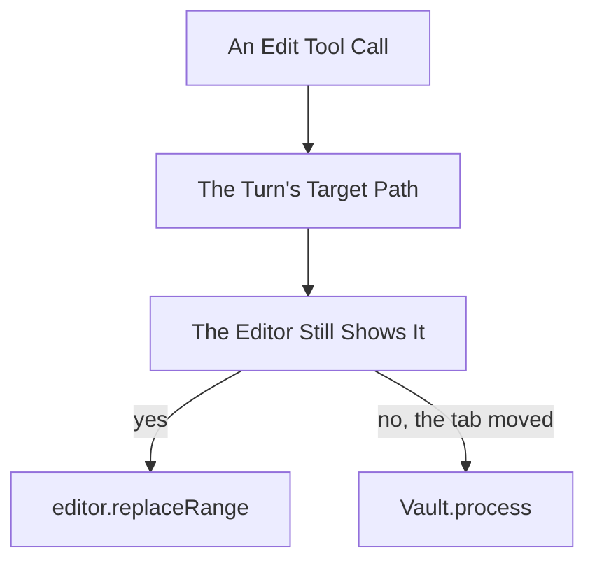

# Design

## Goal

Reach a note by its path rather than through a handle that moves, and make the
note a turn is writing to the thing the panel says about that turn.

## Behaviour Change

| Concern                   | Today                                | New                                                  |
| ------------------------- | ------------------------------------ | ---------------------------------------------------- |
| A write                   | Through the editor the turn resolved | The editor while it shows the target, else the vault |
| A read of the turn's note | vault.cachedRead, the file           | The editor the turn holds                            |
| A read of any other note  | vault.cachedRead                     | Unchanged                                            |
| grep_notes                | vault.cachedRead                     | Unchanged, per D2                                    |
| The note in the header    | The session's, always                | Gone                                                 |
| A turn in the entry list  | Entries between two user entries     | One entry holding its own                            |
| A turn's target           | Nowhere                              | On the turn, from its first step                     |

## Where A Write Lands



Arrows: data flow (direction data moves).

NoteEditor takes the target path and compares before writing. The editor branch
is what happens today, so undo and the cursor are unchanged in the case that is
almost always true. The vault branch skips the cursor, since a user whose tab
moved is not watching that note.

An Editor does not name the file it shows, so the comparison cannot ask it. It
asks the locator instead: WorkspaceNoteLocator.locate(path) returns the editor
of the leaf showing that path now, and the branch takes the editor when that is
the same handle the turn holds. A different handle, or none, means the tab moved
and the write takes the vault.

## Where A Read Comes From

NoteReader keeps reading files and gains no collaborator. The branch belongs
where the read is dispatched, since that is what holds the turn.

HarnessToolsService.readNote takes the turn state already. It asks the turn for
its note, and where the path matches, answers from that editor rather than
calling NoteReader at all.

```text
read_note for path P
  P is the turn's target and its editor still shows P
    answer from the editor
  otherwise
    answer from NoteReader, as today
```

That is the same comparison the write makes. A turn whose editor moved reads the
file, which is stale rather than wrong, and its writes take the vault branch
anyway.

## A Turn As A Container

PanelEntry gains a turn kind holding the utterance, the target and the entries
that belong to it. The eleven existing kinds stay as they are and become what a
turn holds rather than what sits beside one.

- PanelReducer appends to the open turn rather than to the list, so withStep and
  openStepsAt go: there is no scanning back to the last user entry.
- The turn opens on the transcript action, which is where a user entry is
  appended today, and takes the session's target then, per D5.
- A retarget entry still belongs to no turn and stays a sibling, which is what
  archived spec 32 settled.
- TranscriptTurn.split reads turns rather than inferring them. before() stays,
  since entries preceding the first turn are still siblings.

SESSION_SNAPSHOT_VERSION moves. A record written by the flat shape is discarded
rather than migrated, which is what session-file-store.ts:22 already does on a
version mismatch.

## The Panel

PanelHeader loses name and path and keeps Copy and Reset. The header becomes a
toolbar and useTargetNote goes with it.

The turn renders its target first, since D4 asks for it to be the most prominent
thing about a turn. The target changes when a tool opens a note, and that change
is the one worth seeing, so the turn shows the note it is on now rather than a
history of what it has been.

The retargets channel carries the path and byUser. A turn's target is a
different fact, starting as the session's note and moving only by a tool, so it
takes its own action rather than a channel carrying the user's moves too.

## Unit Tests

In [6-unit-tests.md](6-unit-tests.md), broken out to keep this file under the
limit.

## Out Of Scope

- Migrating a stored session to the turn shape. The version discards it, which
  is what archived spec 22 built the version for.
- Whether a vault write reaches the editor's undo stack. It decides how loudly
  the fallback announces itself, which is a panel question once the fact is
  known.

## References

- [2-rules.md](2-rules.md) - the two rules every change here serves
- [4-decisions.md](4-decisions.md) - D1 on reads, D2 on grep, D3 on writes
- [4-decisions-showing.md](4-decisions-showing.md) - D4, D5 and D6 on the panel
- src/engine/note-editing/note-editor.ts:19-31 - apply and focusEdit, where the branch goes
- src/engine/note-binding/workspace-note-locator.ts:24-30 - findEditor, which reads the leaf rather than the file
- src/engine/tools/harness-tools-service.ts:96-99 - readNote, which takes the turn already
- src/session/models/panel-state.ts:13-41 - the eleven kinds a turn comes to hold
- src/session/models/panel-state.ts:158-175 - withStep and openStepsAt, which go
- src/session/transcript/models/transcript-turn.ts:26-40 - before and split, one of which stays
