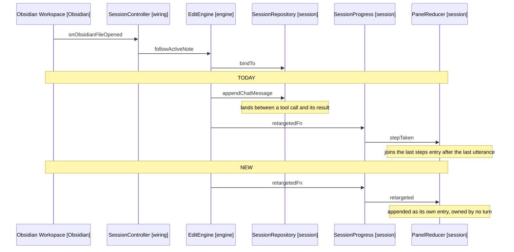

# Design

## Goal

Give a retarget its own panel entry kind so it needs neither a slot in the chat
history nor a turn to own it, and refuse a tool name that is not offered before
the dispatcher routes it anywhere.

## Behaviour Change

| Concern                           | Today                                          | New                                              |
|-----------------------------------|------------------------------------------------|--------------------------------------------------|
| Retarget reaches the model        | System message appended to the chat history    | Nothing; NoteContextMessage already names the note |
| Retarget in the panel             | A step inside the open turn's steps entry      | Its own entry, on the timeline where it happened |
| Retarget in the transcript        | Rendered from the history system message       | Rendered from the entry, as a restore is         |
| Retarget mid tool call            | Splits the tool pair, provider answers 400     | Nothing is appended, so the pair is intact       |
| Retarget after a restore          | Joins the turn above the restore marker        | Sits after it, unattached                        |
| Unknown tool name                 | Routed to NoteEditTool, refused by the parser  | Refused by the dispatcher, naming the offered tools |
| Applied edit result               | `applied`                                      | Names the operation, the note and the line       |

## Behaviour Sequence



Arrows: uses-relationship (client to supplier).

## The Retarget Entry

Following the restored entry kind at each step.

- PanelEntry gains the retargeted kind, PanelAction the retargeted action.
- PanelReducer gains a case appending the entry with the phase unchanged, beside
  the instructions and warned cases it resembles. It does not go through
  withStep, which is the whole point.
- RetargetedText (new) builds the line from a path and answers the unbound case,
  as RestoredText answers a missing stamp.
- EntryWeights maps the kind to context, HistoryEntry gains its class, and
  TranscriptEntryLines a case rendering it as a line.
- useEngineEvents forwards the existing onTargetNoteChanged subscription to the
  new action. SessionPanelPropsBuilder already exposes it; today only
  useTargetNote consumes it, for the header.

EditEngine loses the appendChatMessage call and the retargetMessage factory.
SessionProgress loses the publishStep call in retarget, keeping the
retargets.publish that moves the header.

### The Snapshot

A retarget entry is stored, unlike the restored marker. The marker is filtered
out because a restore adds a fresh one each time, so storing it would stack; a
retarget happened once, and dropping it loses the record this spec exists to
keep. SessionSnapshotFactory needs no change: its filter names restored alone.

SESSION_SNAPSHOT_VERSION does not move: no existing field changes meaning, and a
record written before this lands carries no retargeted entries.

### The Transcript Before The First Utterance

TranscriptTurn.split drops every entry before the first user entry, so a
retarget arriving on a fresh session would not render. TranscriptTurnSection
already has the seam: its setup method writes the panel steps preceding a turn's
first step. Give split a leading section, or render through that same path.

Without it the transcript loses the case the panel now gets right.

## The Unknown Tool Name

ToolDispatcher.execute gains a guard before the load-skill branch, since a name
that is not offered is not a load_skill either. The offered set comes from
ToolCatalogue.forCapabilities, which HarnessToolsService already calls for the
schemas sent with each request; the dispatcher reads that list, not a copy.

```text
if the call's name is not in the offered set
  publish a refused step naming the call
  return a refusal naming the tools that may be called
```

The refusal names the offered tools, not the name it was sent: echoing it is
what put the model's reasoning blob into the history three times in one session.

NoteOperationParser keeps its own unknown-tool branch, unreachable from the
dispatcher once this lands. It is exhaustiveness, not a second gate.

## The Applied Result

NoteEditTool.applyOperation answers a line naming the operation, the note and
the line the edit ended on, rather than the bare applied string. ApplyResult
already carries endedAt, and the note is in hand as the OpenNote it was given.

The content is not echoed: the model sent it one message earlier, and a dictated
paragraph makes that cost unbounded.

## Unit Tests

In [6-unit-tests.md](6-unit-tests.md), broken out to keep this file under the
limit.

## Out Of Scope

- Whether a batch stops after a refusal, which is D4 and still open.
- The transcript copy truncating near 20 KB, noted in 8-transcripts.md. The
  plugin writes the whole string, so the cut is downstream of it.

## References

- [3-decisions.md](3-decisions.md) - D1 choosing the session event, D2 and D3 settling the two results
- src/session/models/panel-state.ts:12-36, 146-163 - the entry union, and withStep scoping to the last utterance
- src/engine/edit-engine.ts:26-40 - followActiveNote and the retargetMessage factory that go
- src/session/session-progress.ts:41-44 - retarget, publishing to both channels today
- src/session/views/hooks/useEngineEvents.ts:35-46 - where the new subscription is forwarded
- src/engine/tool-dispatcher.ts:53-65 - execute, and the fall-through the guard precedes
- src/engine/tools/note-edit-tool.ts:37-42 - applyOperation and the bare applied string
- src/session/transcript/models/transcript-turn.ts:28-36 - split, dropping entries before the first utterance
- src/session/session-snapshot-factory.ts:29-32 - the filter naming restored alone
