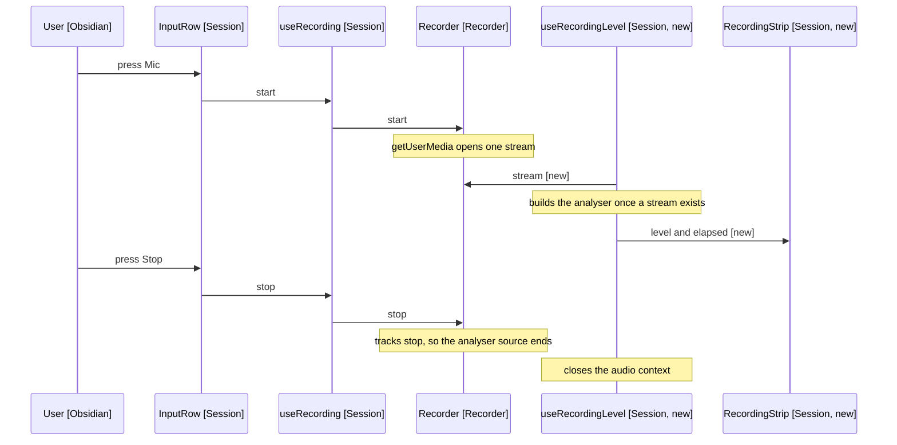

# Design

Recording is the one running phase the panel says nothing about. A strip in the
history says it, and the level meter is the part that cannot be faked.

## Goal

Show a level meter and an elapsed clock while the microphone is open, so a
missed tap, a muted microphone and a working five-minute dictation stop looking
alike.

## Where The Gap Is

PendingEntry maps a phase to a line
([PendingEntry.tsx:5](../../../../src/session/views/PendingEntry.tsx)):

```typescript
const PENDING_LINES: Partial<Record<Phase, string>> = {
  transcribing: 'Transcribing…',
  thinking: 'Thinking…',
  cancelling: 'Stopping…',
}
```

Recording is absent, so the component returns null and the history shows
nothing. The strip originally filled that slot, taking PendingEntry's place in
HistoryList. It moved out on 2026-09-16, per D4: a history of any length scrolls
the meter out of sight, which is the whole of what it is for. It now sits
between the history and the input row, and the text input hides while it shows.

## What Changes

| Concern              | Today                    | New                                  |
| -------------------- | ------------------------ | ------------------------------------ |
| Strip placement      | Nothing                  | A row between the history and input  |
| History, other waits | The pending line         | Unchanged                            |
| Record button        | Reads Stop               | Reads Stop in the accent colour      |
| Instruction field    | Disabled while recording | Hidden while recording               |
| Audio context        | None                     | One, open only while the stream is   |
| PanelState           | No recording entry       | Unchanged, the strip is presentation |

## Sharing The Stream

The meter reads the recorder's own MediaStream rather than opening a second one
(D1 in [4-decisions.md](4-decisions.md)). MediaRecorder exposes it, and Recorder
already reaches through to it when releasing tracks
([recorder/index.ts:73](../../../../src/recorder/index.ts)):

```typescript
recorder.stream.getTracks().forEach((track) => track.stop())
```

So Recorder gains one accessor, and RecorderPort
([useRecording.ts:7](../../../../src/session/views/hooks/useRecording.ts)) gains
the same member, since the hook codes against the port rather than the class.

```typescript
stream(): MediaStream | null
```

Null between recordings, which is what the meter reads to know there is nothing
to attach to.

## The Meter

A hook owns the audio graph, so the component holds no lifecycle:

```text
useRecordingLevel(streamFn) -> level 0 to 1, elapsed seconds, begin()
```

- An AudioContext and an AnalyserNode, built at begin() and closed when the
  stream goes. Nothing exists while idle (NFR3)
- begin() rather than an effect watching the phase, because the context has to
  be built inside the gesture itself. An effect reacting to a phase change runs
  after the state update, which is already outside that gesture
- The loop polls streamFn, since the stream only arrives once getUserMedia
  resolves. A stream that never arrives releases the graph rather than looping
  for one that is not coming
- requestAnimationFrame reads getByteTimeDomainData and reduces it to one
  amplitude. A frame loop rather than a timer, so it stops when the panel is
  backgrounded
- Reduced motion stops the loop and holds the bars at rest (NFR4). The clock
  carries liveness on its own

The bars render from that one number. A meter, not a waveform: the question is
whether sound is arriving now, and history needs a canvas and a buffer to answer
a question nobody asked.

## The Clock

Beside the meter rather than in the header (D2), so the two live facts sit
together. m:ss counting up from the start, held in the same hook that owns the
frame loop, since both are per-second work that ends with the stream.

## Behaviour Sequence



Arrows: uses-relationship (client to supplier).

## Test Plan

### Recorder

- answers the live stream while recording
- answers nothing between recordings

### useRecordingLevel

- builds no audio context while the stream is null
- closes the context when the stream goes
- holds the bars at rest under reduced motion

### RecordingStrip

- renders the meter and the clock while recording
- renders nothing in every other phase
- shows elapsed time as m:ss

### InputRow

- carries the accent colour while recording

## Out Of Scope

- A waveform, a pause control, a countdown, and live partials. All four are
  named in the requirements.
- Verifying that the bars follow a real voice. The suite can drive a fake
  analyser; only a person with a microphone can confirm the floor is visibly
  below speech.

## References

- [2-requirements.md](2-requirements.md) - the three claims and the constraints
- [4-decisions.md](4-decisions.md) - the stream, the clock's home, and the assumptions
- [src/session/views/PendingEntry.tsx:5](../../../../src/session/views/PendingEntry.tsx) - the phase map with no recording line
- [src/recorder/index.ts:73](../../../../src/recorder/index.ts) - where Recorder already reaches the stream
- [src/session/views/hooks/useRecording.ts:7](../../../../src/session/views/hooks/useRecording.ts) - RecorderPort, which widens with Recorder
- [styles.css:398](../../../../styles.css) - the pending line's muted weight, which the strip matches
