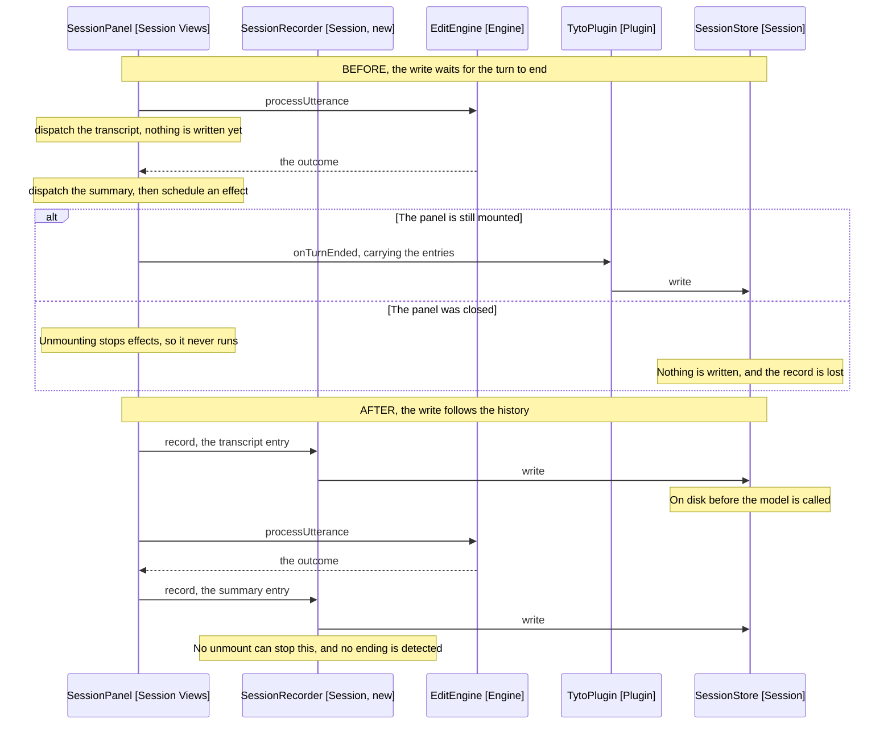

# Design

One rule: whenever the panel's history changes, the record is rewritten. The
thing that does it is not React's, so nothing about the panel going away stops
it.

## Goal

Make the session record follow the history rather than the turn, so a closed
panel and an evicted WebView both leave what was shown on disk.

## Where the write is reached from today

The panel calls onTurnEnded from a React effect (SessionPanel, Session Views),
and the plugin's implementation writes the store (main.ts). The effect is not an
accident: it runs after the render the ending's dispatch produced, so the entries
handed over include the summary or error that ended the turn.

Unmounting stops effects. The turn's own promise still resolves, and its
continuation still reaches anything outside React, which is why the note is
still edited. Nothing schedules that effect again, so the store's one writer is
never called.

## The rule that replaces it

The panel stops being asked when to write. Instead, every dispatch goes to a
recorder that holds the entries and writes them.

```text
on dispatch(action):
  state = reduce(state, action)      // what renders
  recorder.record(state.entries)     // what is written
```

A SessionRecorder (Session, new) takes the entries the reducer produced and
writes the record. It is session-scoped, built in wiring, and knows nothing
about React. An unmount leaves the last entries it was handed already written.

It holds the SessionRepository and the SessionStore, which is what lets it
assemble the record itself. The panel hands it entries and nothing else.

The rule states in one sentence: what the panel has shown is on disk. There is
no turn-ending to detect, no effect to schedule, and no path where the write is
owed but not made.

## Why this is less machinery, not more

Writing at the turn's end needs the ending reported from somewhere outside the
panel, which means a callback on TurnProgressPublisher, a channel on
SessionListeners, a mapping in SessionProgress and a subscription in
SessionBuilder. Four classes edited to answer one question: has the turn ended.

Writing on every dispatch does not ask that question. The last dispatch of a
turn writes the turn's final state, and the one before it wrote the state before
that. Both are correct records of what the panel showed at the time.

So the ending channel is not built. onTurnEnded goes from the panel's props, and
nothing replaces it.

## What the record holds, unchanged

SessionSnapshotFactory (Session) already assembles the record from the
SessionRepository and a list of entries. The recorder calls it in the plugin's
place, more often and with different entries, and nothing about what it builds
moves.

The write is already whole-file, already fire and forget, and already silent on
failure (SessionStore, Session). A record written five times a turn is the same
write five times, not a different kind of write.

## Why not the SessionRepository

The entries could in principle live beside the messages, since both are session
state and both outlive a turn. They do not, because the readers differ.

SessionRepository is read by fourteen classes, eight of them in the engine, and
its comment says why: it is queried and updated only through there so no tool
moves the target note in passing. It holds what a turn needs while running. The
engine does not import PanelEntry today, and giving it a reason to would widen the
engine-to-session cycle the package design already names as a compromise.

[11-the-two-records.md](../../../architecture/11-the-two-records.md) is the map
of what each list holds and where the two overlap.

## Entries are rewritten, not appended

An entry can change after it is created. AskedEntries (Session Models) settles a
pending choice to name what was picked, drops a question's suggestions when the
turn ends, and clears the retryable flag on an earlier error when a new
recording starts.

So the record is a snapshot of the whole list, never a log appended to. That is
what it already is, and it is why recording the entries rather than the entry is
the shape: the recorder is handed the list as it now stands.

## What a mid-turn record restores as

A record written while a turn ran names a phase that is no longer true by the
time it is read.

Nothing needs to change for that. restoredState (SessionPanel, Session Views)
ignores the stored phase and opens idle, and AskedEntries.turnEnded settles
every pending entry on the way in. Both were written for an evicted WebView,
which could always leave a turn unfinished.

Writing more often makes that handling load-bearing rather than incidental, so
the test plan covers it directly.

## Behaviour Sequence

The same turn, before and after. The alt in the first half is what the current
code cannot survive.



Arrows: uses-relationship (client to supplier).

The two halves differ in what triggers the write. Before, the turn ending does,
and a closed panel never reports one. After, the history changing does, and the
history changes whether anyone is watching.

## What the panel stops owning

onTurnEnded goes from SessionPanelProps, and the effect that called it goes with
it, along with the ending state the effect was held for.

buildSnapshotFromEntries goes too. It existed so the plugin could assemble a
record from entries it could not see, and the recorder now holds both halves,
so nothing reads it. The panel hands over entries and asks for no record.

The two notices stay. notifySucceeded and notifyFailed are the plugin deciding
what a turn is worth telling the user, which is a judgement about what is on
screen. The panel is the right place to ask that from. A record is not.

## What does not change

- What the record holds, so a session written before this restores after it.
- The reducer, which still owns what an entry looks like.
- SessionStore, which already writes whole-file and never throws.
- The notices, which still come from the panel.
- What the model receives, so no prompt text moves and the fixture stays green.

## Test plan

- The recorder writes when the panel dispatches an entry
- The record holds the entries as they now stand, not only the newest
- A turn that ends after an unmount is still written
- A turn that ends with the panel mounted is written as before
- A cancelled turn is written
- An entry rewritten by a later action is written in its new form
- A record written mid-turn restores idle, whatever phase it stored
- A pending choice in a mid-turn record settles on the way in
- The panel renders unchanged, since the reducer still drives it

## Out of scope

- Persisting audio, which
  [28-not-losing-a-recording](../../3-archived/28-not-losing-a-recording/2-requirements.md)
  holds in memory by design.
- Marking a turn that ran unwatched, which is an open question in the
  requirements.
- Capping how many entries a record holds, which nothing does today.

## References

- [2-requirements.md](2-requirements.md) - what is lost, and the eviction window this closes
- src/session/session-recorder.ts:20 - record, the write no unmount can stop
- src/session/views/hooks/useRecordedHistory.ts:33 - the dispatch that records, which replaces the effect
- src/session/views/hooks/useRecordedHistory.ts:18 - restoredState, which ignores the stored phase
- src/wiring/session-builder.ts - where the recorder is built, beside the repository it reads
- src/session/session-snapshot-factory.ts:20 - the record, assembled unchanged
- src/session/session-store.ts:28 - write, already whole-file and fire and forget
- src/session/models/asked-entries.ts:6 - what settles a pending entry, on the way in and at a turn's end
- src/session/session-repository.ts:6 - the session-scoped holder the recorder reads
