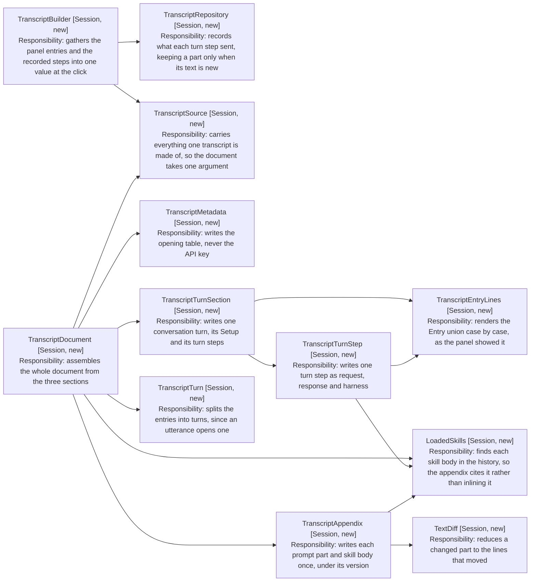

# Design: The Transcript Classes

How the classes that build a transcript fit together. Where the record lives and
how it reaches the panel is [3b-wiring.md](3b-wiring.md); what they write is
[3a-document-shape.md](3a-document-shape.md).

Two groups, split by what they hold. TranscriptBuilder and TranscriptRepository
carry session state. Everything under TranscriptDocument is pure, taking a
TranscriptSource and returning lines.

Arrows: uses-relationship (client to supplier). Every writer reads
TranscriptSource, so those arrows are left out: drawn, they say nothing and
cross everything.

That split is what makes the format testable without a DOM or a model. Only
TranscriptBuilder reads the store, so every case in
[5-test-plan.md](5-test-plan.md) hands TranscriptSource a literal and asserts on
the string that comes back.
