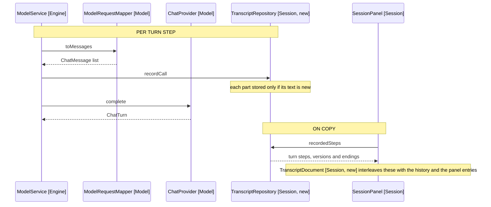

# Design: Wiring

Where the record is kept, how it reaches the panel, and the button that fires
it. What it renders is [3a-document-shape.md](3a-document-shape.md).

## Where the record lives

TranscriptRepository sits beside SessionRepository (Session), which the mapper
reads to build a request, so a fault in the transcript store cannot change what
the model is sent.

Both the engine and the panel need it, and EngineFactory (Engine) builds the
session repository internally and returns only an EditEngine (Engine), so a
store built there cannot be read back. SessionBuilder (Session) already builds
both sides of a session, so it constructs the store and passes it two ways: into
EngineFactory.build as a new argument, which forwards it through
TurnRunnerFactory (Engine) to ModelService (Engine) and ConversationTurnRunner
(Engine); and onto the panel props, beside the settings the metadata needs.

Arrows: uses-relationship (client to supplier).

ModelService already holds SessionRepository, so recording costs one more
constructor argument and one call. The mapper is unchanged: ModelService records
the parts on the way past.

Reset rebuilds the panel props through SessionBuilder, so the store is new with
the session, and a copied transcript covers the session on screen and no other.
That matches the chat history it walks, which resets the same way.

## What the panel contributes

SessionBuilder (Session) already holds OwlSettings (Settings), which the
metadata table needs, and passes it to the panel as one new prop. PanelState
(Session) holds every entry the screenshot shows, and the export renders the
Entry union case by case, as HistoryEntry (Session) does for display.

TranscriptDocument (Session, new) owns the Markdown: entries, records and
settings in, one string out, no clipboard and no React. That keeps the format
testable without a DOM, against [4-sample-output.md](4-sample-output.md).

## The setting

The transcript carries note text and vault instructions verbatim, so the button
is opt-in. OwlSettings (Settings) gains transcriptCopyEnabled, defaulting false,
and SettingsPanel (Settings) gains a checkbox following the searchEnabled block
beside it.

Named for this feature rather than as a debug mode, so a later diagnostic makes
its own decision instead of appearing under a flag the user turned on for this
one.

## The button

PanelHeader (Session) gains a second button beside Reset, following the copy on
each reply entry: same clipboard call, same copied-state label for 1500ms. It
disables while a turn runs, as Reset does, and while there are no entries. Its
aria-label is Copy transcript, so a screen reader tells it from the per-entry
Copy.

With the setting off the button is absent rather than disabled: a greyed control
with nothing naming the setting reads as broken. PanelHeader already renders
Reset only when given onReset, so an absent onCopy is the pattern it has.
