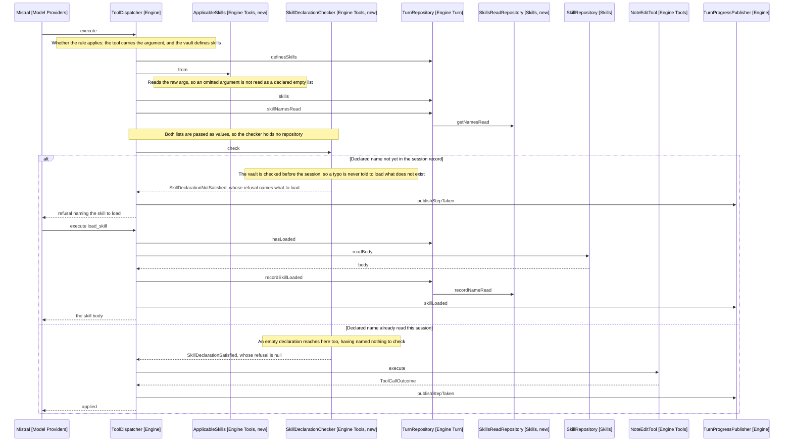

# Design

The record of what was read moves to the session. What covers this utterance
becomes a required argument on every guarded call. no_skill_applies retires, and
a reply reporting a refusal says what the user can do next.

## Goal

Stop the gate refusing what the conversation can see, make it check that the
skill the model named is the skill it read, and leave no refusal the reader
cannot act on.

## The session-scoped record

SkillsReadRepository (Skills, new) holds the names of skills whose bodies
reached the model this session. It mirrors PathsReturnedByVaultRepository
(Search Models): a set, a recorder, a query, and a comment naming its scope.

- `record(name)` adds a name once a body has been read
- `has(name)` answers whether the body is already in the conversation

TurnRunnerFactory (Engine Turn) builds it once, beside the paths repository it
already holds, and passes it into each TurnRepository (Engine Turn) the same
way.

Its comment carries the fact it depends on: the body is in the chat history, so
a name recorded here means the model can still read the steps. If the history is
ever truncated or summarised, this record moves with it.

## The declared argument

Every tool the gate guards gains one required parameter:

```text
applicable_skills: string[]  // names from the skill list that cover this
                             // utterance, or [] when none does
```

The guarded set is the four tools `opensVaultAccess` (ToolCall) already covers,
run_command, glob_notes, grep_notes and read_note, plus the three edit tools,
replace_text, insert_text and insert_at.

open_note is excluded: it opens only a path the user chose, and the search that
found that path was already guarded. resolve_date is excluded for the reason it
was left out of `opensVaultAccess`: it reaches no vault, and the phrase it reads
is what tells the model which skill the turn needs.

The parameter is added only when the vault defines skills.
`ToolCatalogue.forCapabilities` (Engine Tools) already takes `skillsExist` and
filters on it, so the same flag chooses between the plain schema and the one
carrying the argument. A vault defining none sees the release 3 schemas
unchanged.

Reading it back needs no new accessor: `stringsArgument` (ToolCall) returns the
array, filtered to strings.

## What the harness checks

Two classes and an outcome type split the work, and ToolDispatcher (Engine)
orchestrates them in place of `mustSettleSkills`, at the same point in
`execute`.

- ApplicableSkills (Engine Tools, new) is the value read off one call: the names
  it declared, and whether it sent the argument at all.
- SkillDeclarationChecker (Engine Tools, new) takes the vault list and the names
  read as values, and returns a SkillDeclarationOutcome (Engine Tools, new):
  satisfied, or not satisfied carrying what the model is told. Two states,
  because one caller asks one question, and the three ways to fail differ only
  in wording, so each is a factory on the unsatisfied state. A vault defining no
  skills is satisfied before any other check, since its calls are the release 3
  calls and their schemas carry no applicable_skills.

The dispatcher reads both lists off TurnRepository and passes values, so no
repository reaches the checker.

| Check           | Condition                           | Result                             |
|-----------------|-------------------------------------|------------------------------------|
| Argument present| The call carries applicable_skills  | Refuse, naming the argument        |
| Names are real  | Every name is a skill in the vault  | Refuse, listing the vault's skills |
| Names are read  | Every name is in the session record | Refuse, naming which to load       |
| Otherwise       | Including an empty declaration      | Proceed                            |

`stringsArgument` returns an empty array both for an omitted argument and for a
declared `[]`, and those are different claims. ApplicableSkills reads the raw
`args` to tell them apart, so a model that omits the argument is refused rather
than read as declaring none.

The harness never decides which skill fits. It checks that what the model
declared is what the model read, which is the model's own judgement held to
itself.

The unread refusal names the skills to load:

```text
load journal, then call this again declaring it
```

That is the change that keeps the gate out of RepeatedRefusalCounter (Engine
Turn) reach. Today's refusal asks the model to re-derive what it needs; this one
says it.

## Behaviour Sequence

One guarded call, in a vault defining skills. The outer alt is the session
record, which is what release 3 had no equivalent of: the same declaration is
refused before the body is read and passes after it, whichever turn read it.



Arrows: uses-relationship (client to supplier).

The record outlives the turn, so the second branch is what a later utterance
takes without the round trip the first spends. That is the reported session:
turn 1 walks the upper branch, turn 2 walks the lower one on its first call.

Two refusals are not drawn, because both end the call the same way as the first
branch's refusal and differ only in text. A name no vault skill carries is
answered with the vault's list, checked before the record so a typo is never
told to load something that does not exist. A call sending no argument at all is
refused before either check.

## What retires

no_skill_applies goes: the constant, the `isRecordNoSkillApplies` predicate, the
schema, the `skillsExist` branch in `isOffered`, the `TurnStep.noSkillApplies`
that branch published, and `recordNoSkillApplies` with its
ALREADY_LOADED_RESULT. An empty declaration is the same claim, made on the call
it licenses.

`skillsExist` then decides nothing about which tools are offered, so `isOffered`
stops taking it. It stays on `forCapabilities`, where it now chooses whether the
guarded schemas carry the argument.

`skillsSettled`, `settleSkills` and `loadedASkill` (TurnRepository) go with it.
Nothing is settled per turn any more: each call is judged on what it declared
and what the session holds.

`hasLoaded` stays, reading the session record, and keeps guarding a second read
of a body already in the conversation.

## The prompt

SkillSection (Model Prompt) rules change with the tool. The sentences naming
no_skill_applies and the never-both rule go. What replaces them states the
argument:

- Every call that reaches the vault names its applicable skills.
- An empty list says none covers the utterance.
- A skill named must be read first, and the refusal says which.

The catalogue beneath is unchanged, and a vault defining no skills still omits
the section, so the release 3 fixture stays green. The fixture pins prompt text
only, not schemas, so the added argument does not touch it.

## The reply that names the way out

ModelsRole (Model Prompt) tells the model to say what stopped it. That produces
a reply reporting the block and nothing else, so a user refused an unchosen open
is not told the note in front of them is still writable.

The line gains a clause: say what the user can do next. It is general rather
than about this refusal, so it covers every turn that ends without an edit.

It sits in the release 3 fixture, which pins prompt text. Re-recording it is the
deliberate act docs/AGENTS.md describes, not a workaround: the model is being
told something new, so the fixture is the thing to update rather than route
around.

No permission moves. `refusedOpenPath` (TurnRepository) stays turn-scoped, and
the open note is already editable on the next utterance.

## Where the gate sits

One call site, in ToolDispatcher. The gate runs before the dispatcher routes a
call, so it covers the edit tools as well as the four that open vault access,
and NoteEditTool's own check would sit behind a branch nothing can reach. It
goes with the rest.

## What does not change

- load_skill, which now reads the session record. Its already-loaded message
  says "in this session" rather than "this turn", since that is what it now
  means.
- A vault defining no skills, in prompt, schemas and behaviour.

## Test plan

Every case runs without a model.

- SkillsReadRepository records a name and answers `has` for it
- A skill read in an earlier turn satisfies a declaration in a later one
- A declaration naming an unread skill is refused, and the refusal names it
- A declaration naming a skill no vault skill carries is refused with the list
- An empty declaration proceeds
- A declaration is held even when a different skill was read earlier
- A missing applicable_skills argument is refused, distinctly from a declared []
- ToolCatalogue omits the argument when the vault defines none
- ToolCatalogue no longer offers no_skill_applies at all
- load_skill for a name already read returns the already-loaded message
- The release 3 fixture carries the reply clause, re-recorded deliberately

An edit applying on the utterance after a refused open is existing behaviour,
covered by the turn scope of `refusedOpenPath`. A test pins it so the scope is
not narrowed by accident.

The two existing assertions on the old refusal text, in edit-engine.test.ts,
change to the declaration refusals.

## Out of scope

- Carrying the record into StoredSession (Session Models). A restored session is
  refused once and recovers on the same turn.
- Verifying a declaration against the utterance. The harness checks the model
  against itself; nothing stops an empty declaration.
- Reconciling declarations that differ between calls in one turn. Each call is
  judged alone.
- The wording of individual refusal messages. Only the reply rule changes.

## References

- [2-requirements.md](2-requirements.md) - the reported session, and the two faults
- src/search/models/paths-returned-by-vault-repository.ts - the session-scoped repository this mirrors
- src/engine/tools/tool-schemas.ts - the schemas and the catalogue filter
- src/engine/tool-dispatcher.ts - the gate, and the handler that retires
