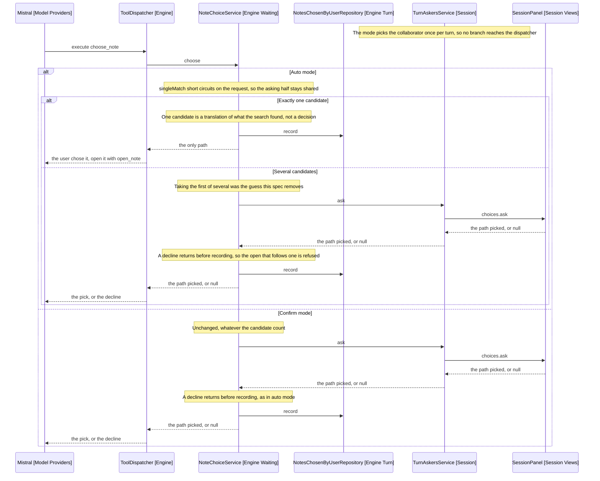

# Design

Auto mode's collaborator stops taking the first of several and starts parking
for them. Confirm mode is untouched.

## Goal

Make auto mode never guess between notes, and never ask about a note there is no
choice about.

## Where the branch lives

TurnAskersService (Session) picks the collaborator from the mode, which is what
keeps the mode out of the dispatcher. That stays. What changes is what the auto
branch builds.

`NoteChoiceService.automatic` (Engine Waiting) resolves with `candidates[0]`.
It becomes a collaborator that resolves only for a single candidate and
otherwise asks, which is the same asker the confirm branch uses:

```text
singleMatch(ask):
  if candidates has exactly one path, resolve with it
  otherwise ask, as confirm mode does
```

The asking half is the panel asker TurnAskersService already builds, so both
branches share it and only the short circuit differs. The name `automatic` goes
with the behaviour it described.

Three other call sites construct `automatic` as a default where no asker was
supplied: EngineFactory (Engine), TurnRunnerFactory (Engine Turn) and the test
support builders. They are defaults for a caller that asks nothing, so they take
`unasked` (NoteChoiceService, new): `singleMatch` with an asker that declines.
A single candidate still resolves, and several return null rather than reaching
a panel that is not there.

Recording is unchanged: `choose` records whatever it returns, so a single match
is consent for the turn exactly as a pick is, and open_note's `holds` check
passes either way.

## Behaviour Sequence

One choose_note call, in a vault with search enabled. The outer alt is the open
mode, which is the setting a user changes rather than anything the turn decides.
Confirm is the default and is drawn as it already behaves.



Arrows: uses-relationship (client to supplier).

Recording is the same call on every path that returns one, which is what makes a
single match consent for the turn: open_note reads the same repository whether a
user picked the path or the search identified it alone.

Three default callers take a fourth path not drawn here, because no panel
exists to reach: EngineFactory, TurnRunnerFactory and the test support builders
construct `unasked`, which is the auto branch with an asker that declines.

## Auto mode gains the choosing tool

`choiceOffered` (EngineFactory) is `this.settings.openMode === 'confirm'` today,
which is what withheld choose_note from auto mode. A mode that now asks about
several candidates needs it, so the argument becomes constant true.

The parameter stays. ToolCatalogue (Engine Tools) gates choose_note on search
being enabled as well, which NFR4 of
[14-choosing-the-note](../14-choosing-the-note/2-requirements.md) requires, and
that gate is what the parameter now carries alone.

## The prompt does not change

SystemPrompt (Model Prompt) is not given the mode, so the model is told the same
thing in both: offer what a search found, and open what the user picked. What
differs is whether a one-item offer reaches the user, which happens behind
choose_note and is invisible to the model.

The tool result is the same either way. The model reads a path and opens it, so
there is no branch for it to learn and no rule to invert. The release 3 fixture
is untouched.

This is what makes the change small. A mode is a choice of collaborator, as
FR13 had it, and a collaborator that sometimes answers instantly is still one.

## The setting copy

The checkbox reads "Ask which note Tyto should open", which now describes only
confirm mode. It becomes "Ask before opening a note Tyto found", and its note
says what each side does: with it on, Tyto shows you what it found and waits;
with it off, Tyto opens a note when only one matched and still asks when several
did.

The stored value and its two states are unchanged, so nothing migrates.

## What does not change

- Confirm mode, in every case.
- The refusal for a path no search returned.
- Consent staying turn-scoped, so a later turn asks again.
- The step naming the opened path.
- The cap on how many candidates may be offered.
- A command that opens its own note, which never asked.

## Test plan

- The single-match collaborator resolves a one-candidate request without asking
- It asks for a three-candidate request
- It records the candidate it resolved, so `holds` answers true
- A declined multi-candidate request returns null in auto mode
- Confirm mode still asks for a one-candidate request
- ToolCatalogue offers choose_note in auto mode with search enabled
- ToolCatalogue omits it when search is disabled, in both modes
- The release 3 fixture is unchanged
- The settings copy names both behaviours

## Out of scope

- Retiring either mode. Both now promise something a user would choose between.
- Judging whether a single match is the right note. The harness cannot, and the
  steps list is what surfaces it.
- Undoing a wrong single match. Obsidian's own undo reverses the edit.

## References

- [2-requirements.md](2-requirements.md) - what each mode promises
- src/session/turn-askers-service.ts - the branch, and the asker both sides share
- src/engine/waiting/note-choice-service.ts - `automatic`, which this replaces
- src/engine/engine-factory.ts - `choiceOffered`, which stops reading the mode
