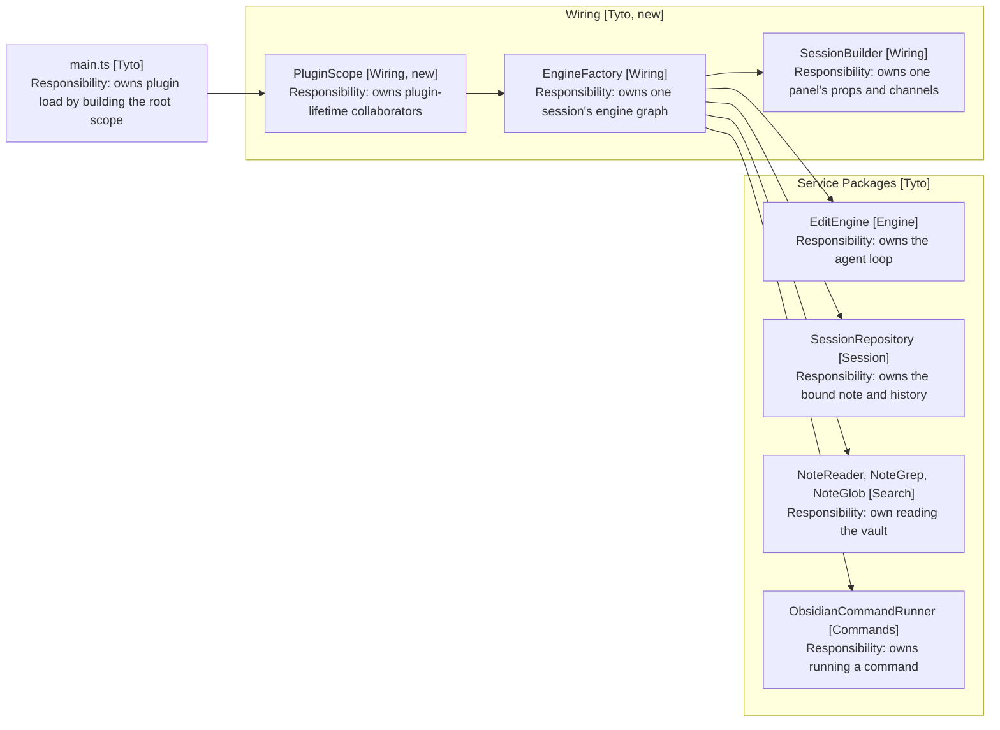
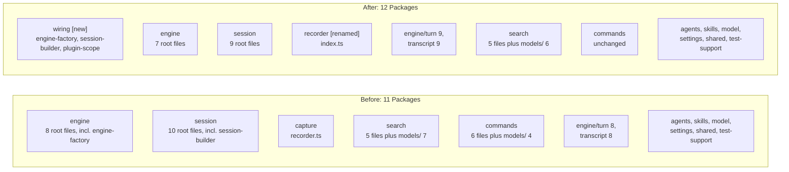

# Design

Wiring becomes a building block: a package holding construction knowledge and no
behaviour. It is the one package that may reach another's interior, which is
what lets every other package close.

## Goal

Move the two composition roots into a package named for that job, make the scope
nesting visible, and give an entry point to every package that has a single
owning service.

## Wiring as a building block

EngineFactory is a DI container with the reflection taken out. Every concept a
container has is already in the code, resolved at compile time instead of at
run time.

| Container concept | Where it is today                                       |
| ----------------- | ------------------------------------------------------- |
| Registration      | The new expressions inside the two builders             |
| Resolution        | build, returning a wired EditEngine                     |
| Singleton scope   | EngineFactory's constructor fields                      |
| Per-request scope | EngineFactory's build parameters                        |
| Child container   | SessionBuilder, holding an EngineFactory                |
| Test override     | The EngineAskers interface and the defaulted parameters |
| Composition root  | main.ts, which builds both                              |

Naming the package wiring rather than container keeps the vocabulary plain and
avoids a term that means four things. The container model stays in the
architecture doc as the idea the package implements.

No library. A hand-written root is checked by the compiler, fails at build time
rather than at resolution time, and reads top to bottom. Importing a container
would lose all three.

## The three package kinds

| Kind    | Owns                   | May construct across packages | Named after       |
| ------- | ---------------------- | ----------------------------- | ----------------- |
| Wiring  | Construction knowledge | Yes, every package            | Its job           |
| Service | Behaviour, one entry   | No                            | Its entry service |
| Value   | Types, no behaviour    | No                            | The concept       |

A value package holds values only. A repository accumulates state and changes
it, so it sits beside the services that use it however small it is. The test is
a mutable collection surviving across calls, not the presence of methods.

A value type belongs in a value package once more than one package reads it.
Read by one, it stays beside its reader, whatever folder it currently sits in.

The rule is positional: a file may construct a class from another package only
if its path starts with src/wiring. That is checkable by reading the path, which
an exemption naming one class is not.

## What the scopes are

Three lifetimes, each holding the one below. Today the nesting is real but
implicit: EngineFactory's constructor fields outlive a session while its build
parameters do not, and only a comment says so.

| Scope   | Lives for         | Holds                                                   |
| ------- | ----------------- | ------------------------------------------------------- |
| Plugin  | The loaded plugin | app, settings, SkillRepository, AgentsMdRepository      |
| Session | One bound note    | SessionRepository, TranscriptRepository, the EditEngine |
| Panel   | One visible panel | The listeners, the askers, the notices, the panel props |

Arrows: uses-relationship (client to supplier).

Only wiring points into the service packages. That is the whole claim of this
design, and it is why the arrows out of the subgraph all start in one box.

The shape PluginScope takes is written out in
[7-plugin-scope.md](7-plugin-scope.md), since commit 2 is the one commit that
adds a class rather than moving one.

## The tree, before and after

Four packages change. commands is untouched, and every value type stays in
the folder it sits in today.

No arrows: this is the folder tree, not a dependency graph. The map in
[4-survey.md](4-survey.md) carries the dependencies.

| Package | Before              | After             | Why                    |
| ------- | ------------------- | ----------------- | ---------------------- |
| wiring  | did not exist       | 3 files           | Construction knowledge |
| engine  | 8 root files        | 7                 | engine-factory leaves  |
| session | 10 root files       | 9                 | session-builder leaves |
| capture | capture/recorder.ts | recorder/index.ts | Named for its service  |
| search  | models/ 7           | models/ 6         | A repository leaves    |
| engine  | turn/ 8             | turn/ 9           | It arrives here        |
| session | transcript/ 8       | transcript/ 9     | LoadedSkills moves up  |

session dropping to 9 matters: it sat exactly on the ten-file limit that
[26-packages-over-the-limit](../26-packages-over-the-limit/1-index.md) left
watched, so this spec buys it a file of headroom.

## What moves, and what the move fixes

EngineFactory and SessionBuilder move to src/wiring, keeping their class names.
Engine then stops constructing session, which removes two of the twelve
engine-to-session imports.

The other ten take SessionRepository or TranscriptRepository as a collaborator
type, and no wiring arrangement touches those.
[4-survey.md](4-survey.md) lists them and measures the surface engine actually
uses, which is narrow enough for a pair of ports. That is a design change, so it
is out of scope here.

## Entry points, where a package has an owner

Only capture qualifies with nothing invented: it holds one class beside one
value type. It becomes src/recorder, with index.ts declaring Recorder.

skills, agents and session each hold one owning service plus value types that
cross the boundary. They take an entry once those types move out, which is why
the value split comes after this one.

search, commands, model and engine have no owner. The survey says why, and this
spec leaves them named as they are rather than inventing a facade whose only
behaviour is delegation.

## Value types stay inside their packages

A value read by more than one package belongs to neither, and six here meet that
count. They stay put anyway: the rule breaks cycles, and no cycle runs through
search/models or commands/models. Engine and settings read them; neither folder
reads back.

Nor is an interior closing on them. Neither search nor commands gains an entry
point in this spec, since neither has a single owning service, so nothing is
shutting engine out of those folders yet.

What does move is two repositories misfiled as values.
[8-value-types.md](8-value-types.md) has both, and the counts.

## What does not change

- Behaviour. No test changes except its import paths.
- EngineFactory and SessionBuilder keep their class names.
- The ten-file limit. No folder this spec creates or feeds exceeds it.
- The release 3 prompt fixture, which no file here touches.

## Test plan

The unit suite is the test: it passes unchanged except for import paths. Beyond
it, three checks the suite cannot make:

- Grep for construction across a package boundary outside src/wiring and
  confirm there is none, test-support aside.
- Confirm src/engine no longer constructs SessionRepository or
  TranscriptRepository.
- Confirm no folder exceeds ten files after the value packages split out.

## Out of scope

- Ports closing the engine-to-session cycle. Named in the survey, left to its
  own spec.
- A facade for the four packages with no owner. The survey records the choice
  rather than making it.
- Adopting a DI library. The hand-written root is the better artefact.
- Whether test-support may reach interiors. Recorded as a question.

## References

- [2-requirements.md](2-requirements.md) - the rule and what may not change
- [4-survey.md](4-survey.md) - the entry surface of every package, and the cycle
- [src/engine/engine-factory.ts](../../../src/engine/engine-factory.ts) - the container being named
- [architecture/7-package-design.md](../../architecture/7-package-design.md) - the package table this updates
