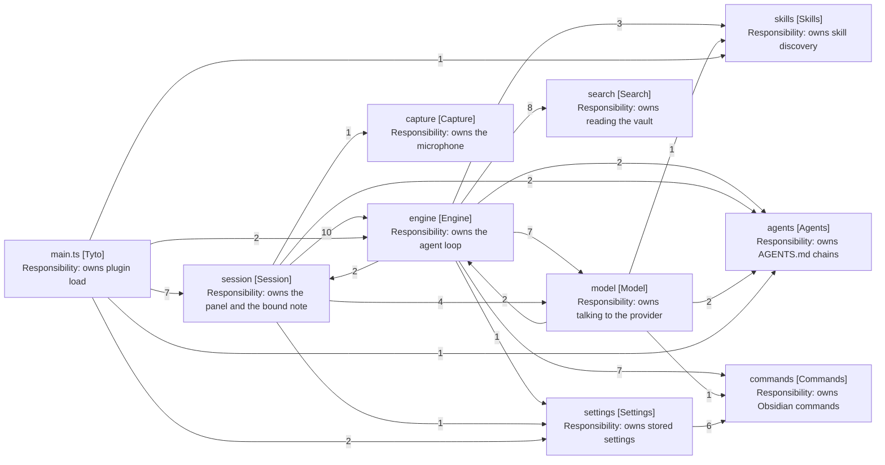

# Survey: What Each Package Exposes

An entry is a file inside a package that something outside the package imports,
counted once however many times it is imported. Counted across src, excluding
tests and test-support.

A package with one entry can be named after it. A package with several has no
owner to name itself after, and the choice is a facade or a plural name.

## Every package, by entry count

| Package  | Entries crossing the boundary | Owner                 | Kind               |
| -------- | ----------------------------- | --------------------- | ------------------ |
| capture  | 1                             | Recorder              | Single             |
| settings | 2                             | TytoSettings, the tab | Value plus UI      |
| skills   | 3                             | SkillRepository       | Single plus values |
| agents   | 4                             | AgentsMdRepository    | Single plus values |
| search   | 8                             | none                  | Multi              |
| commands | 9                             | none                  | Multi              |
| model    | 9                             | none                  | Multi              |
| session  | 9                             | SessionRepository     | Multi              |
| engine   | 12                            | EditEngine            | Multi              |

## The map

Edge labels are how many entries the reader reaches, so a thick number is a wide
interior rather than a busy caller.

Arrows: uses-relationship (client to supplier). Labels count the distinct entries
the client reaches.

The engine-to-session and model-to-engine arrows are the two cycles. Everything
else points one way.

### Every entry, and who reaches it

| Package  | Entry                                  | engine | session | model | settings | main |
| -------- | -------------------------------------- | ------ | ------- | ----- | -------- | ---- |
| capture  | recorder                               |        | yes     |       |          |      |
| settings | settings                               | yes    | yes     |       |          | yes  |
| settings | settings-tab                           |        |         |       |          | yes  |
| skills   | skill                                  | yes    |         | yes   |          |      |
| skills   | skill-repository                       | yes    |         |       |          | yes  |
| skills   | skills-read-repository                 | yes    |         |       |          |      |
| agents   | agents-md-chain                        | yes    | yes     | yes   |          |      |
| agents   | agents-md-file                         |        |         | yes   |          |      |
| agents   | agents-md-repository                   | yes    |         |       |          | yes  |
| agents   | instruction-report                     |        | yes     |       |          |      |
| search   | note-reader                            | yes    |         |       |          |      |
| search   | note-grep                              | yes    |         |       |          |      |
| search   | note-glob                              | yes    |         |       |          |      |
| search   | search-report                          | yes    |         |       |          |      |
| search   | models, four types                     | yes    |         |       |          |      |
| commands | obsidian-command-runner                | yes    |         |       |          |      |
| commands | obsidian-command-catalogue             | yes    |         |       | yes      |      |
| commands | obsidian-command-registry              | yes    |         |       | yes      |      |
| commands | obsidian-command-search                |        |         |       | yes      |      |
| commands | allow-list                             | yes    |         |       | yes      |      |
| commands | opened-note-wait                       | yes    |         |       |          |      |
| commands | models/allowed-obsidian-command        | yes    |         | yes   | yes      |      |
| commands | models/note-opened-by-obsidian-command | yes    |         |       |          |      |
| commands | models/obsidian-command-match          |        |         |       | yes      |      |
| model    | providers/types                        | yes    | yes     |       |          |      |
| model    | providers/models/tool-call             | yes    | yes     |       |          |      |
| model    | providers/models/chat-turn             | yes    |         |       |          |      |
| model    | providers/models/chat-message          |        | yes     |       |          |      |
| model    | providers/mistral-provider             |        | yes     |       |          |      |
| model    | model-request                          | yes    |         |       |          |      |
| model    | model-request-mapper                   | yes    |         |       |          |      |
| model    | model-request-parts                    | yes    |         |       |          |      |
| model    | relative-date-resolver                 | yes    |         |       |          |      |
| session  | session-repository                     | yes    |         |       |          |      |
| session  | transcript/transcript-repository       | yes    |         |       |          |      |
| session  | session-builder                        |        |         |       |          | yes  |
| session  | session-store                          |        |         |       |          | yes  |
| session  | models/stored-session                  |        |         |       |          | yes  |
| session  | views/SessionPanel                     |        |         |       |          | yes  |
| session  | views/obsidian, three files            |        |         |       |          | yes  |
| engine   | edit-engine                            |        | yes     |       |          | yes  |
| engine   | engine-factory                         |        | yes     |       |          | yes  |
| engine   | turn-progress-publisher                |        | yes     |       |          |      |
| engine   | turn-step                              |        | yes     |       |          |      |
| engine   | turn/ending/turn-ending-kind           |        | yes     |       |          |      |
| engine   | turn/turn-cancellation-controller      |        | yes     |       |          |      |
| engine   | turn/notes-chosen-by-user-repository   |        | yes     |       |          |      |
| engine   | waiting/note-choice-service            |        | yes     |       |          |      |
| engine   | waiting/user-question-service          |        | yes     |       |          |      |
| engine   | waiting/choice-request                 |        | yes     |       |          |      |
| engine   | note-editing/open-note                 |        |         | yes   |          |      |
| engine   | note-editing/note-details              |        |         | yes   |          |      |

Three readings the counts alone do not give:

- Engine is the reader, not the read. It reaches into six packages; only session
  and model reach into it.
- Session's nine entries are seven doors for main.ts and two for engine. The two
  engine reads are the cycle; the rest is plugin bootstrap, which wiring absorbs.
- Commands serves engine and settings through overlapping but different sets.
  Neither reads the whole package, which is the shape of two concepts sharing a
  name.

## The four with no single owner

### search: three peers, not a hierarchy

NoteReader, NoteGrep and NoteGlob are read by engine's tool services, one tool
each. None calls the others, so no one of them is the owner. The four value
types beside them are read by engine too.

A facade would have to be invented: a Search class delegating three ways, whose
only behaviour is delegation. That is a new class earning its place only by
satisfying the rule, which is the wrong reason.

### commands: six classes to three packages

The widest surface in the tree. Engine reads the runner, the catalogue, the
registry, the allow list and the wait; settings reads the search, the catalogue,
the registry and the allow list; model reads one value type.

Settings and engine want different things from it. Engine runs commands; the
settings tab lists and picks them. That reads like two concepts under one name
rather than one concept needing a facade.

### model: a mapper, a provider, and the types between them

ModelRequestMapper, MistralProvider and the date resolver are peers. The largest
surface is providers/types, read 25 times, which is the port every consumer
codes against rather than a service.

Model's shape is already close to right: consumers depend on an interface, and
the concrete provider is constructed once. What it lacks is a name saying so.

### engine and session: large enough that one entry would be a fiction

Engine exposes twelve files, nine of them to session. EditEngine is the owner in
name, yet session also needs the cancellation controller, the progress
publisher, the turn step and both waiting services, because the panel drives a
turn rather than only starting one.

Test-support reaches ten further files, which is the widest interior reach in
the tree and why the requirements leave its exemption open.

Session exposes SessionRepository to engine 8 times and TranscriptRepository 4.
Those two are the entry, and the rest of session is genuinely private already.

## What the survey concludes

- One package can take an entry point today without inventing anything: capture.
- Three more are close, holding one service plus value types that leak: skills,
  agents, session.
- Four cannot, because there is no owner: search, commands, model, engine.
- The cycles are the larger finding, and they outlive this spec. See
  [6-cycles.md](6-cycles.md).
