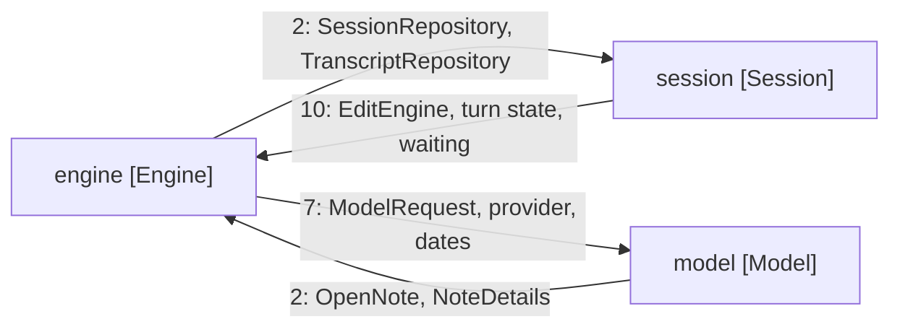
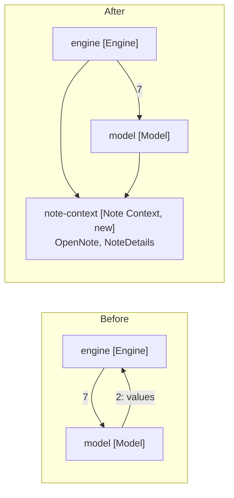
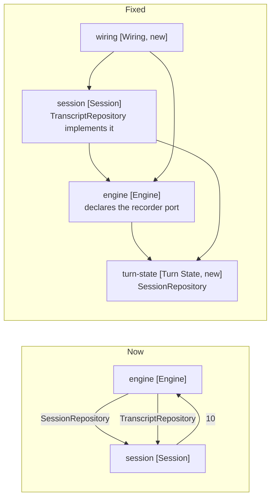

# The Two Cycles

Two package cycles the survey turned up. Neither is closed by this spec: the
wiring move removes two construction sites and nothing else. They are recorded
here so the specs that do close them start from measured surfaces.

Arrows: uses-relationship (client to supplier).

The model cycle is documented in
[architecture/7-package-design.md](../../architecture/7-package-design.md). The
session cycle is not: that doc records session depending on engine, and engine
on session for nothing.

### model and engine: two values lent upward

OpenNote holds an editor, a path and a cursor. NoteDetails is a snapshot of the
same. Neither holds a service, and both are what a prompt is made of, so a value
package below both closes the cycle with a move and nothing else.

Arrows: uses-relationship (client to supplier).

### engine and session: two repositories, two different problems

The surfaces say these are not the same case.

| Repository        | Engine calls                                                 | Session calls                                                         | Overlap      |
| ----------------- | ------------------------------------------------------------ | --------------------------------------------------------------------- | ------------ |
| SessionRepository | targetNote, chatHistory, appendChatMessage, changeTargetNote | targetNote, chatHistory, appendChatMessage, isBound, changeTargetNote | Almost total |
| Transcript        | recordCall, recordEnding, recordedEndings                    | recordedSteps, recordedParts, panelStepPublished, isEmpty, hasFailed  | Nearly none  |

SessionRepository holds the target note and the chat history, which is what a
turn runs on rather than what a panel owns. It sits in session by history. A
package below both ends that half of the cycle.

TranscriptRepository splits by direction instead: engine writes, session reads.
That is a port, declared by engine and implemented by session's existing class.

Arrows: uses-relationship (client to supplier).

Moving SessionRepository is a larger claim than it looks: eleven files name it,
and if it is turn state then its name is wrong. That rename is the one part of
this needing a decision rather than a move.

### Where the twelve imports sit

| Site                              | Uses                          | Constructs |
| --------------------------------- | ----------------------------- | ---------- |
| engine-factory                    | SessionRepository, Transcript | Yes        |
| turn/turn-runner-factory          | SessionRepository, Transcript | Yes        |
| edit-engine                       | SessionRepository             | No         |
| tool-dispatcher                   | SessionRepository             | No         |
| turn-ending-service               | SessionRepository             | No         |
| note-binding/target-note-resolver | SessionRepository             | No         |
| turn/model-service                | SessionRepository, Transcript | No         |
| turn/tool-call-executor           | SessionRepository             | No         |
| turn/conversation-turn-runner     | TranscriptRepository          | No         |

Moving wiring out fixes the two that construct. The other ten take the
repositories as collaborator types, and no wiring arrangement touches those.

Closing the rest is a design change rather than a move, so it belongs in its own
spec. The order that works: the note-context move first, since it needs no
decision; wiring next, which this spec builds; then turn-state and the recorder
port.
