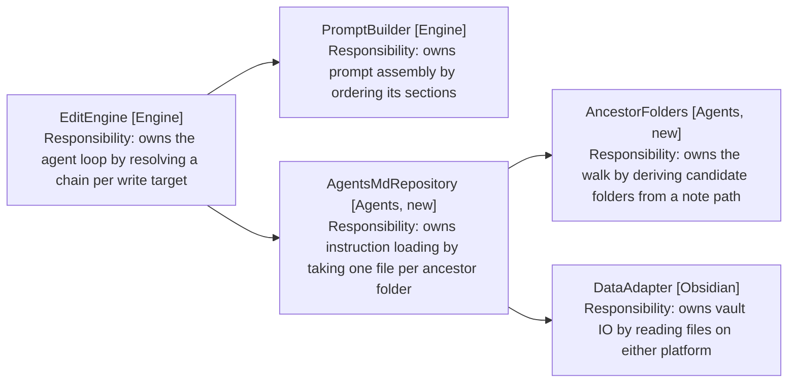

# AGENTS.md Loading: Component Design

Delta on the Mobile MVP design. Unlisted components are unchanged.

## Source tree

```
src/agents/
  agents-md-repository.ts  # one instruction file per ancestor folder
  ancestor-folders.ts      # vault root down to the note's folder
  agents-md-file.ts        # one loaded file: folder, filename and contents
```

A package of its own, not a member of Skills. Skills owns conditional
instructions routed by description; this owns unconditional ones routed by
path. They share no code, and merging them would give the package two reasons
to change.

Engine gains the dependency. Skills is untouched.

## Discovery

AncestorFolders (Agents, new) turns the target note's path into candidate
folders. For Projects/Acme/Notes/meeting.md it yields the vault root, then
Projects, Projects/Acme and Projects/Acme/Notes. Root first, so the list is
already in prompt order (FR1, FR4).

Obsidian paths are vault-relative and use forward slashes, so the walk is a
split on the separator rather than a filesystem operation. It cannot escape the
vault root because there is nothing above the empty prefix to yield (FR3).

AgentsMdRepository (Agents, new) reads at most one file per folder, trying
AGENTS.md and falling back to CLAUDE.md only where the first read is rejected
(FR2). A rejected read is an absent file, not a failure, mirroring
SkillRepository (Skills) (FR12). No directory listing (NFR1), and the same
adapter SkillRepository already uses, so mobile resolves identically (NFR4).

A file whose contents are empty or whitespace-only is dropped at read time,
so it never reaches the cap or the prompt (FR12). Carrying it through would
emit a labelled but empty block, which costs tokens and gives the model a
section to interpret where the user wrote nothing. An AGENTS.md that is empty
still suppresses the folder's CLAUDE.md, since the fallback turns on whether
the read succeeded, not on what it returned.

The fallback is why the walk yields folders rather than paths: the filename is
chosen per folder, at read time. A folder holding both files contributes only
its AGENTS.md, so a CLAUDE.md symlinked to its neighbour is never read twice
and never duplicates instructions in the prompt.



Arrows: uses-relationship (client to supplier).

## Prompt assembly

PromptBuilder.build (Engine) gains a fourth section, between the dictation
rules and the skill catalogue (FR5). An empty chain omits the section entirely,
the pattern skillSection already uses, so a vault with no instruction files
produces the release 2 prompt byte for byte (FR11).

Each file is fenced and labelled with its folder, so the model can weigh a
vault-wide rule against a folder-specific one (FR6). The section leads with a
line saying later entries come from nearer folders and win on conflict (FR7).
Ordering is the whole override mechanism, so leaving the model to infer what
the order means would rest the feature on an inference.

Instructions are quoted user content. The section says so, and says that
nothing in it grants a tool or widens a path, which keeps a vault file from
talking its way past the single-note limit (NFR3).

## Resolution per write target

The chain belongs to the note a turn writes to, not to the session (FR8). This
release writes to one note per turn, the session note, so resolution happens
once as the turn starts and the session note is the target. The interface takes
a note path rather than reading the session's binding, which is what keeps
release 7 from having to rewrite it.

AgentsMdRepository (Agents, new) caches a resolved chain by folder path for the
life of the session (NFR2). Folder rather than note, since every note in a
folder shares a chain. A turn writing three notes in one folder walks it once,
and rebinding to a note in an already-walked folder costs no reads.

The cache is not invalidated when a vault file changes. Editing an AGENTS.md
mid-session leaves the stale chain in place until the session restarts. That is
the cheap choice and the honest one to state; a vault event listener is
available if it proves annoying in use.

No chain crosses to another target (FR13). The resolved chain is passed to the
write, not held as engine state, so there is nowhere for one note's rules to
leak into another's write.

Budget and how a drop is reported: [5-budget-and-reporting.md](5-budget-and-reporting.md).
