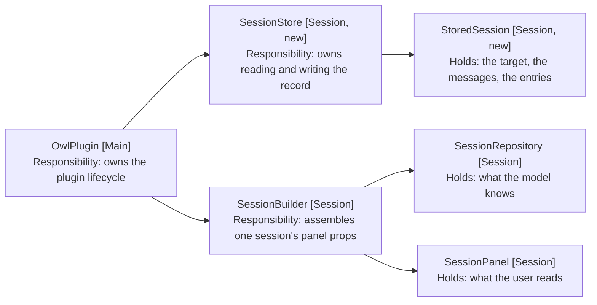
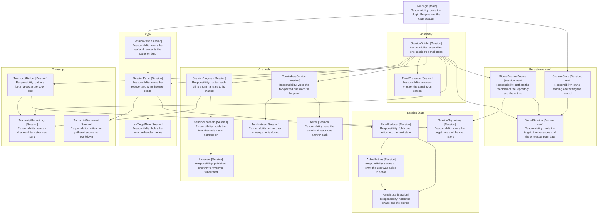
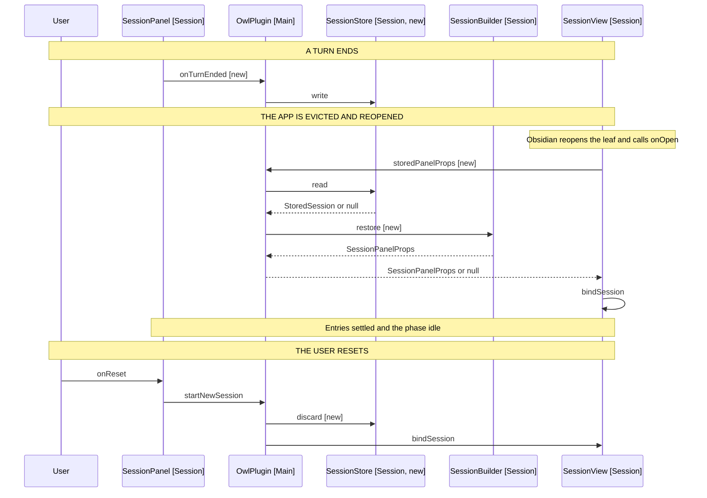

# Session Persistence: Component Design

What is written, who writes it, and when. Delta on
[sessions-without-a-note](../2026-09-03d-sessions-without-a-note/3-component-design.md);
unlisted components are unchanged.

## Table of Contents

1. [One Record, Two Stores](#one-record-two-stores)
2. [The Session Subsystem](#the-session-subsystem)
3. [The Record Is a Value](#the-record-is-a-value)
4. [The Transcript Is Not Restored](#the-transcript-is-not-restored)
5. [Who Writes It](#who-writes-it)
6. [Restoring Is a Different Shape from Building](#restoring-is-a-different-shape-from-building)
7. [A Restored Session Says So](#a-restored-session-says-so)
8. [A Restored Turn Is Never Running](#a-restored-turn-is-never-running)
9. [Behaviour Sequence](#behaviour-sequence)
10. [The File Sits Beside the Settings, Not In Them](#the-file-sits-beside-the-settings-not-in-them)
11. [What a Version Buys](#what-a-version-buys)
12. [Out of Scope](#out-of-scope)

## One Record, Two Stores

The session is already two stores holding plain values. Persistence adds a
repository that reads and writes both as one record, and nothing else moves.



Arrows: uses-relationship (client to supplier).

SessionStore (Session, new) is the only component that knows a session can
outlive the app. Neither store it reads knows it is being written.

The plugin reaches both stores through SessionBuilder (Session), which is what
already holds the wiring: it constructs SessionRepository (Session) and hands
the panel its props. Nothing new reaches past it.

## The Session Subsystem

Where the two new components sit among the ones already there. Five groups, and
persistence touches three of them.



Arrows: uses-relationship (client to supplier).

Three groups change. Persistence is new. Assembly gains restore beside build,
and View gains an entries prop and the callback that says a turn ended. Channels
and Transcript are untouched, and are drawn because the diagram is the map of
what a restore must not disturb.

StoredSession (Session, new) is reached by both SessionStore and SessionBuilder,
which is the whole of the coupling persistence adds: the store owns the file and
the builder owns what the record becomes.

Gathering the record is its own component, StoredSessionSource (Session, new).
It reads SessionRepository and the entries the panel passes in, which is a
service's job rather than a value's: the record crosses a file boundary, so it
must not reach a store itself.

## The Record Is a Value

```typescript
// stored-session.ts
// Plain data, because it crosses a file boundary: a class with methods would
// need reviving, and every field here is already a string or a list of them.
export interface StoredSession {
  // Bumped when a field changes meaning. A record from another version is
  // discarded rather than migrated (FR9).
  version: 1
  // Null for an unbound session, which is a session that can still search.
  targetPath: string | null
  messages: StoredMessage[]
  entries: Entry[]
  // Epoch milliseconds, written as the turn ends, so a restore can say how old
  // the conversation it brought back is. Optional: a record written before this
  // field existed has none, which costs a stamp rather than the session.
  writtenAt?: number
}

// ChatMessage (Model) is a class with a private constructor and five factories,
// so the record holds its four fields and a factory rebuilds it from them.
export interface StoredMessage {
  role: ChatRole
  content: string
  toolCalls: { id: string; name: string; args: Record<string, unknown> }[]
  toolCallId: string
}
```

The role picks the factory on the way back: a tool role rebuilds through
toolCallResult, an assistant role with tool calls through modelToolCalls, and
the rest through the factory named for the role. Reaching the constructor
directly is not an option, and must not become one.

Entry needs no mapping. It is already a discriminated union of plain objects,
which is what makes storing what the user reads cheaper than rebuilding it.
Ten of the eleven kinds store as they are, including the steps entry that holds
a turn's whole step list. The eleventh is restored, which is dropped on the way
out: a restore adds one, so storing it would stack a second on the next restore
and a third after that.

Rebuilding the entries from the chat history was the alternative, and it does
not work: the history holds tool calls and tool results the panel never shows,
and the panel holds steps and refusals the history never carries. They are two
records of one turn, written for two readers.

## The Transcript Is Not Restored

TranscriptRepository (Session) is built per session beside SessionRepository,
and holds what each turn step was sent. It is not in the record, and a restored
session starts with an empty one.

Storing the transcript instead of the record is the obvious-looking move, since
TranscriptSource (Session) already gathers the entries, the chat history and the
target path that the record would hold. It is the wrong artefact three times
over:

| Against                | Why                                                     |
| ---------------------- | ------------------------------------------------------- |
| It is a view           | Assembled at the copy click from the two stores         |
| It carries the prompts | Every part text verbatim, which NFR2 forbids on disk    |
| It answers a question  | Step ranges and endings explain a turn, not restore one |

A transcript exists to tell a human how a turn ran. A record exists to put the
session back. They overlap in what they read and agree on nothing about what is
worth keeping, so the record stays the smaller of the two.

The cost is an index that must not start at zero. A recorded step names the
slice of chat history its call carried, and the first step of a session starts
at 0 because nothing preceded it. After a restore something did, so the fresh
transcript must start past the restored messages or the first step after a
restore claims every message the previous session wrote.

So restoring seeds the transcript with the restored history length, rather than
leaving it empty. TranscriptBuilder (Session) reads the entries and the
transcript separately and needs no change; a transcript with no steps is the
case a session before its first turn already produces.

## Who Writes It

The plugin, once a turn ends. Not the engine, which would have to know its own
conversation is being recorded, and not the panel, which would write on every
render.

| Moment              | Written | Why                                              |
| ------------------- | ------- | ------------------------------------------------ |
| A turn finishes     | Yes     | The session moved, and no turn is in flight      |
| A turn fails        | Yes     | The instruction is in the history and matters    |
| A turn is cancelled | Yes     | What was written before the stop is worth saying |
| Mid-turn            | No      | A half-turn is not a state to restore to (FR3)   |
| The user resets     | Deleted | The replaced session must not come back (FR8)    |

The panel tells the plugin when a turn finishes or fails, through
notifySucceeded and notifyFailed. Both land on TurnNotices (Session), whose only
job is showing a notice to a user whose panel is closed. A cancelled turn
dispatches turnCancelled to the reducer and calls neither, by design: the user
stopped it and already knows.

Persistence needs all three, and wants none of what the notices want. So the
panel gains onTurnEnded, carrying the ending rather than the message:

```typescript
// SessionPanel.tsx, beside the two notice callbacks
notifySucceeded?(summary: string): void
notifyFailed?(message: string): void
onTurnEnded?(ending: TurnEndingKind, entries: readonly Entry[]): void
```

The notice pair is named for what it does rather than for when it fires, because
onTurnFinished and onTurnEnded are synonyms in English and were not synonyms
here: the first fired only on success, the second fires on every ending. Naming
the pair notify says the real split, which is a notice against a record. A
notice needs a message and skips the cancel the user already knows about; a
record needs neither.

TurnEndingKind (Engine) names the five ways a turn stops, but the panel can only
report three of them. It reads an Outcome (Shared), and TurnOutcomes (Engine)
builds both Exhausted and Stuck as the same chat failure, so both reach the
panel as Failed. The transcript still records the true kind, because
TranscriptRepository (Session) is told by the engine rather than by the panel.

Threading the real kind out of processUtterance (Engine) was the alternative. It
changes that method's return shape and every caller of it, for a distinction
persistence never reads: the record is written the same way whichever of the
five ended the turn.

The entries travel with the ending. The reducer owns them, and the plugin that
writes the record cannot see inside the panel, so the callback carries them as
transcriptOf (Session) already does. They are read after the ending's own
dispatch has rendered, or the record loses the summary or error that ended the
turn.

Collapsing the two notice callbacks into this one was a second alternative, and
it loses their arguments: a finished turn notices with a summary and a failed
one with a message, and an ending carries neither.

## Restoring Is a Different Shape from Building

SessionBuilder (Session) builds a session from a file. Restoring builds one from
a record, so the two differ in what they start from and agree on everything
after.

```typescript
// session-builder.ts, beside build
// The record supplies the target and the history; the file supplies neither,
// because the note a session was on is in the record.
build(file: TFile | null, presence: PanelPresence): SessionPanelProps
restore(stored: StoredSession, presence: PanelPresence): SessionPanelProps
```

Both return SessionPanelProps, so the plugin binds a restored session through
SessionView.bindSession (Session) exactly as it binds a built one. That method
is also what remounts the panel, since it bumps the key the panel is rendered
under, so restored entries reach a fresh reducer rather than an existing one.

The panel takes its entries as a prop it does not have today, defaulting to
empty. That is the whole of the panel's change: the reducer's initial state
stops being the INITIAL_PANEL_STATE constant and becomes a value built from the
prop.

The target is where the two shapes actually differ. SessionRepository (Session)
is constructed from a TFile and keeps only its path, so restore hands it the
stored path rather than resolving a file that may no longer exist (FR7).

The header still wants a name, which build takes from the file's basename. A
path-only restore derives one instead, which useTargetNote (Session) already
does privately for a note a command moved mid-turn. Lifting that derivation out
of the hook is the smaller change, since the two callers want the same answer.

It lands as NoteName (Session, new), beside the other value objects rather than
in views/: that folder is React components, and the hook is now one of two
callers.

## A Restored Session Says So

A restored panel and one that never went away look identical, so without a line
of its own a restore is invisible: the user cannot tell a conversation that came
back from one they never left, and neither exit test has anything to observe.

So a restore appends one entry of its own, the eleventh kind, last in the
restored list:

> Session restored from 2026-09-11 14:32 AEST.

The stamp is when the session was last written, not when it came back: what the
user wants to know is how old the conversation they are resuming is.

It says nothing about the thinner transcript those turns carry. That gap is
real, but it only shows for a user who copies a transcript, and the setting is
off by default. A line every restore pays for, to warn about something most
restores never meet, costs more than the gap does.

LocalTimestamp (Session, new) formats it, and TranscriptMetadata (Session) now
shares it rather than keeping the near-identical formatting it had. Local time
with the zone named, since both a session and a transcript are read against the
day the user had rather than against UTC, and the zone says which day that was
when they have since moved. The transcript's Copied row gains the zone with it.

It comes from writtenAt on the record, which is optional. A record written
before that field existed has none, and the line reads without it rather than
guessing a time. Adding a field changes no existing field's meaning, so the
version does not move for it.

A panel entry rather than a Notice (Obsidian). A toast vanishes, and where the
session picks up is a fact about the conversation rather than a passing one: it
belongs in the history beside the turns it separates, and reaches a copied
transcript with them. TurnNotices (Session) exists for a user whose panel is
closed, and a restore happens as the panel opens.

It is also what tells a restore from a fresh session by hand. A restored panel
and one that never went away are otherwise identical on screen, so both exit
tests would be reading a panel that proves nothing either way.

## A Restored Turn Is Never Running

A record written mid-turn cannot exist, since FR3 forbids the write. A record
written at a turn's end can still hold a pending entry, because a turn that
failed or was cancelled leaves its shortlist unanswered.

So restoring settles what it loads, using the path AskedEntries (Session)
already has:

| Stored entry       | Restored as                          |
| ------------------ | ------------------------------------ |
| A pending choice   | Settled, saying the turn ended (FR6) |
| A pending question | Settled, its suggestions gone        |
| Any phase          | idle (FR5)                           |

AskedEntries.turnEnded is exactly the entry half of this, so restoring runs it
rather than restating what settling means. It carries the phase through
unchanged, because every caller in the reducer sets the phase itself on the
entry it then appends. Restoring appends nothing, so it sets idle itself.

## Behaviour Sequence



Arrows: uses-relationship (client to supplier).

The read happens where a panel first exists, and there are two such moments.
Obsidian reopens the sidebar leaf itself on restart, so SessionView.onOpen
(Session) is the earlier one and asks the plugin for a stored session as it
mounts. openSession is the other, for a leaf that existed before the plugin
could restore into it.

Reading only on openSession was the first shape, and it fails the case the user
actually meets: the sidebar comes back on restart holding an empty panel, and
stays empty until they know to invoke Owl again. That is the fill-later failure
FR4 names, reached from the other direction.

The view checks twice whether it already has a session, before the read and
after it. A user can start one while the read is in flight, and a restore must
not replace the session they are already using.

## The File Sits Beside the Settings, Not In Them

`session.json` in the plugin folder, written through the DataAdapter (Obsidian)
that SkillRepository and AgentsMdRepository already take. Those two only read;
the adapter also offers write, remove and exists, so the store needs no new
mechanism.

The folder comes from the manifest's dir rather than a constant, read off the
plugin and passed to the store as the skills path is passed today. A hard-coded
path breaks for anyone who renamed the folder. That field is optional in the
Obsidian typings, and an absent one means no session is stored: the store reads
and writes nothing, which is the behaviour the desktop already has.

Not data.json, for two reasons. A session write and a settings write would race
for one file, and the file holding the API key should not also hold every note
excerpt a turn read (NFR2, FR11).

A session is where the user is, so a synced session would carry a phone's
conversation to a desktop mid-turn. That is a different feature and probably an
unwanted one.

## What a Version Buys

One number, checked on read. A record whose version is not the current one is
deleted and treated as absent (FR9).

The alternative is migrating, which needs a second shape to migrate from. There
is one shape, so a migration would be written for a case that does not exist
yet and could not be tested against a real record.

## Out of Scope

- More than one stored session. Restoring becomes a choice, and a choice needs
  a way to make it.
- Trimming a long session. A session that outgrows a sensible write is worth
  measuring before it is worth solving.
- Syncing. A session is where the user is.
- Resuming an in-flight turn. The request is gone with the WebView, and
  reissuing it is a retry the user can already ask for.
