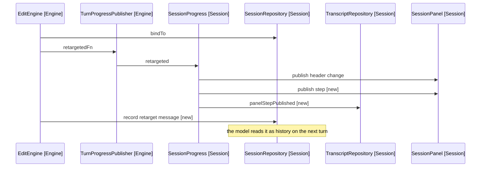

# Design

The two homes chosen here were replaced by D1 of
[reporting-what-a-turn-did](../2026-09-16e-reporting-what-a-turn-did/1-index.md), which
makes a retarget its own panel entry kind. Kept as the record of what shipped.

A retarget moves the header and leaves no other trace. Three destinations want
it, and they do not all take it the same way.

## Goal

Record that a session changed note, so a transcript read back says when it
happened and the model can see why consecutive turns discuss different notes.

## What Carries A Retarget Today

SessionProgress.publisher wires the channel
([session-progress.ts:27](../../../../src/session/session-progress.ts)):

```typescript
(path) => this.session.retargets.publish(path),
```

One subscriber, useTargetNote, which sets the header name. Nothing else.

Beside it, the skill-loaded callback takes the other route. The reason is
written down at
[session-progress.ts:29](../../../../src/session/session-progress.ts): it is
published as a step rather than a line beside the list, because its place in the
order says whether it happened before the edit. A retarget has the same claim.

## Two Writes, Three Destinations

A retarget writes twice, and the two are independent:

```text
TurnStep.retargeted  -> publishStep       -> session.steps -> panel entry list
ChatMessage.system   -> appendChatMessage -> chat history  -> model, transcript
```

The panel reads steps, so the step is what reaches it. The model reads the
history, and so does the transcript through TranscriptSource.chatHistory, so one
message serves both. Between Turns below is why the history rather than a step
carries the transcript.

## What Changes

| Concern             | Today              | New                                       |
| ------------------- | ------------------ | ----------------------------------------- |
| Panel header        | Names the new note | Unchanged                                 |
| Panel entry list    | Nothing            | A step saying the note changed            |
| Transcript          | Nothing            | The same step, in the turn it happened in |
| Model history       | Nothing            | A system message where it happened        |
| Retarget while idle | Moves the header   | See Between Turns below                   |

## The Step

TurnStep gains a factory beside the others
([turn-step.ts:29](../../../../src/engine/turn-step.ts)), taking the shape of
TurnStep.opened, which already renders a path:

```typescript
static retargeted(path: string | null): TurnStep {
  return new TurnStep('Retargeted', path ?? 'no note bound')
}
```

The null case exists once
[binding-to-the-active-tab](../2026-09-16c-binding-to-the-active-tab/1-index.md)
lands. Before it, a retarget always carries a path.

## The Message To The Model

PromptFactory puts the note context after the history
([prompt/index.ts:36](../../../../src/model/prompt/index.ts)), so a retarget
message sits in the conversation where it happened and the standing "here is the
note now" message still comes last. Nothing about the ordering changes.

The message is a past-tense event, not a directive. That distinction is the
answer to the risk below.

```typescript
ChatMessage.system('The user moved to a different note. Later turns are about this one.')
```

## Behaviour Sequence



Arrows: uses-relationship (client to supplier).

Today only the header arrow exists.

## Between Turns

A recorded step is created by TranscriptRepository.recordCall, before a provider
call ([transcript-repository.ts:38](../../../../src/session/transcript/transcript-repository.ts)),
and TranscriptTurnSection writes one section per conversation turn. A retarget
while the session is idle has no turn to belong to, which is the mobile case
that raised this spec.

The chat history has no such gap. SessionRepository.appendChatMessage writes
into the list PromptFactory sends, so a retarget appended the moment it happens
sits in the conversation at that point whether or not a turn is running.

That makes one write serve the model and the transcript. TranscriptSource
already carries chatHistory
([transcript-source.ts:22](../../../../src/session/transcript/models/transcript-source.ts)),
so the transcript renders the retarget from the history rather than needing a
section kind of its own.

The panel step keeps the step route, since the panel list is built from steps
and not from the history. The two halves are independent: a retarget writes one
message and publishes one step.

Enqueueing the retarget as a turn was rejected. See D2 in
[4-decisions.md](4-decisions.md).

## What The Transcript Had To Change

The history reaches the transcript already: recordCall opens each step's slice
where the step before it closed, so no message is skipped by index. What the
transcript could not do was render a system message once it arrived.

| Where the retarget lands | Sliced by                     | Rendered before |
| ------------------------ | ----------------------------- | --------------- |
| Inside a turn            | The next turn step's Request  | As the user     |
| Between two turns        | The next turn's first Request | As the user     |
| After the last turn      | The last step's tail          | Not at all      |

The first two were mislabelled: requestLines files anything that is not a tool
result as the user, so a retarget read as something the user typed. They now
render as a harness line.

The third was dropped: the tail reaches the Response block, which keeps only
tool calls and the model's own words. A retarget on an idle session is the case
this spec raised, so the last step's Harness block now carries it. Only the
session's last step does, since every earlier step is followed by one whose
Request block already renders it.

## Test Plan

### TurnStep

- renders the path when a note is bound
- says no note bound when the retarget carries null

### SessionProgress

- publishes a step when the session retargets
- counts the step against the transcript, so the two stay in step

### TranscriptTurnSection

- writes a retarget that happened between turns, in the turn that followed it
- writes a retarget that happened after the last turn, in that turn
- writes it once, so a reader cannot read one retarget as two
- never files it as the user, who typed none of it

### PromptFactory

- carries the retarget message in the history, ahead of the note context

### EditEngine

- appends the retarget message whether or not a turn is running

## Out Of Scope

- When a retarget happens, which is
  [binding-to-the-active-tab](../2026-09-16c-binding-to-the-active-tab/1-index.md).
- Naming the note in the message. The note context that follows already names
  it, and the archived finding below is about note-naming.

## Risk

[following-the-note-across-a-restore](../../3-archived/2026-09-14h-following-the-note-across-a-restore/1-index.md)
found the model re-running a command that dragged the target back mid-turn. It
named NoteContextMessage as one of three causes. That message asserts the
current note last and says it supersedes everything above, which reads as a
directive.

A past-tense event in the history is a different shape, and the message above
names no note for that reason. Whether that holds is a judgement the unit tests
cannot make, so test a real vault before calling it done, the way
[AGENTS.md](../../../../AGENTS.md) asks for any prompt change.

## References

- [2-requirements.md](2-requirements.md) - the three destinations and the open questions
- [binding-to-the-active-tab](../2026-09-16c-binding-to-the-active-tab/1-index.md) - the sibling, which fixes when a retarget happens
- [src/session/session-progress.ts:27](../../../../src/session/session-progress.ts) - the retargets channel, beside the skill-loaded step that shows the pattern
- [src/engine/turn-step.ts:29](../../../../src/engine/turn-step.ts) - TurnStep.opened, the factory the new one is shaped after
- [src/session/transcript/transcript-repository.ts:38](../../../../src/session/transcript/transcript-repository.ts) - recordCall, which is why a between-turns retarget has no turn
