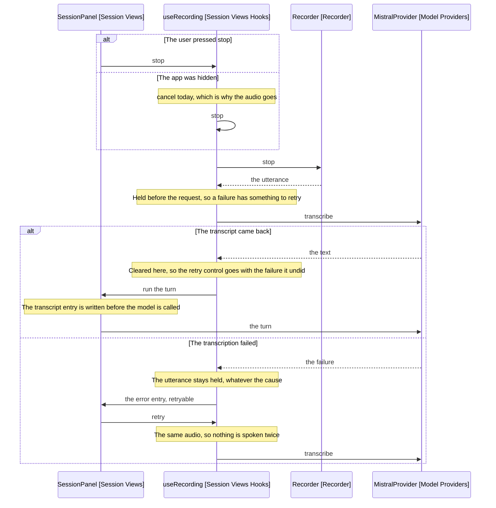

# Design

A hidden app stops the recording instead of throwing it away, and the panel
holds the utterance until a transcript comes back.

## Goal

Make a locked screen cost the rest of the sentence rather than all of it, and a
failed transcription cost a click rather than a recording.

## Hiding sends rather than discards

discardOnBackground (useRecording, Session Views Hooks) calls cancel today, which
drops the audio and returns nothing. It calls the same path the user's own cancel
button does, so a hide and a deliberate cancel are indistinguishable.

They are not the same intent. A cancel is the user choosing to lose the
recording; a hide is the operating system interrupting it. So the hide takes the
stop path, which is the one the send button already takes.

```text
onHidden():
  if not recording, return
  stop, exactly as the send button does
```

That is the whole change. The hook's existing stop resolves the utterance, holds
it, transcribes it and runs the turn, so the hide needs no path of its own.
Recorder needs no change either: stop already resolves with what was captured.

The subscription behind it is onDocumentHidden (main.ts), on visibilitychange,
which is the whole app going away. The panel's own visibility is a different
thing: sessionLeafIsVisible reports whether the drawer is open, is read only to
decide whether a finished turn needs a notice, and is not wired to recording at
all. It stays that way, so collapsing the sidebar keeps recording.

## Closing the panel sends too

Closing the view is not collapsing it. onClose (SessionView, Session Views
Obsidian) unmounts React and nulls panelProps, which drops the only reference to
the Recorder.

Nothing releases it on the way out. useRecording has no unmount cleanup, so the
MediaRecorder and its MediaStream stay live with the microphone open, the audio
reachable by nothing, and the stream leaking until Obsidian reloads. Reopening
the panel builds a fresh Recorder, so the old one is never reclaimed.

That is a defect rather than a behaviour, and it predates this spec. It is fixed
here because it is the same loss: words spoken and then thrown away.

useRecording gains an unmount cleanup that takes the same path a background
takes.

```text
on unmount:
  if not recording, return
  stop, exactly as the send button does
```

One rule then covers every way the panel can go away: whatever ends a recording
other than the user, the audio is sent rather than dropped.

## What a sent turn reaches after unmount

The turn survives the panel. EditEngine (Engine) is built by SessionBuilder
(Wiring) and edits the note through NoteEditor, none of which React owns, so a
turn started on the way out still applies.

What does not survive is the panel's own record. dispatch goes to an unmounted
reducer, and onTurnEnded fires with entries the component can no longer read, so
the session written on the way out may miss the last turn.

So a closed panel keeps the edit and may lose the history line describing it.
That is the right way round: the note is the artefact, and the transcript entry
is a record of how it got there.

Closing the panel mid-dictation is rare enough that this spec does not chase the
missing entry. Writing the transcript as it is dispatched would close it, and
that is the persistence change named under the eviction hole below.

## Why sending beats holding

runTurn (SessionPanel, Session Views) dispatches the transcript entry before it
calls the model. So the words reach the history as soon as the transcription
comes back, whatever the turn does next.

That is what makes sending the right default. A user who locked their screen
mid-sentence comes back to their own words written down, rather than to a
control they must press to find out what they said.

The edit the turn makes is the part that happened unwatched, and Obsidian's own
undo reverses it. The transcript is the part that cannot be reconstructed, and
sending is what preserves it.

[mobile-v1](../../1-upcoming/2026-09-14c-mobile-v1/2-component-design.md) reaches the same
position as its onBackground default, on the grounds that losing dictated
content is worse than a truncated utterance. A user who wants the other
behaviour gets the setting there.

## What the user sees on returning

No notice. The Notice the discard showed auto-dismisses, so a user whose screen
was off never saw it, and after this change there is nothing to announce: the
panel holds the transcript, the steps and the summary, which is the same record
any other turn leaves.

A turn that failed while hidden leaves its error entry, retryable, since the
utterance is held exactly as any failed transcription holds one.

## Where the held utterance lives

useRecording (Session Views Hooks) drops the utterance today: stop awaits the
transcription and dispatches a failure, and the blob has no other reference.

It gains a ref holding the last utterance, set before the transcription is
attempted and cleared when one succeeds. The hook already owns a ref for the
background listener, so this is the shape it uses.

```text
stop():
  utterance = recorder.stop()
  held.current = utterance
  transcribe(utterance)

retry():
  if nothing held, return
  transcribe(held.current)

transcribe(utterance):
  transcript = ports.transcribe(utterance.blob, utterance.mimeType)
  if failed, dispatch failed and keep what is held
  otherwise clear what is held and run the turn
```

Recording again overwrites the ref, which is what drops the previous utterance.
Cancel clears it, because a cancelled recording is one the user chose to lose.

The ref holds one utterance. A second recording replaces the first rather than
queueing, which matches what the panel offers: one retry, for the recording just
made.

## The retry reaches the entry that failed

The failure is already an error entry carrying its step (PanelState, Session
Models). Only a transcription-step failure is retryable, because only that step
has audio behind it: a chat or apply failure has a transcript the model already
received.

The error entry gains a retryable flag, carried on the failed action. The hook
sets it, not the reducer: what makes a failure retryable is the utterance still
in the hook's ref, which the reducer cannot see. Only the transcribe path sends
it, which is what keeps a chat or apply failure unretryable without the reducer
reading the step. HistoryEntry (Session Views) renders a retry control on a
retryable entry, the way it renders choices on a pending choice entry.

The flag is cleared on every entry at both moments the panel stops holding the
audio: a new recording starting, and a transcript coming back. So a stale retry
control never sits above a fresh recording, and the control goes with the
failure a successful retry undid. That is the same settling the reducer does for
asked entries at the end of a turn.

## Behaviour Sequence

One recording, ended two ways. The outer alt is what ended it, which is the
distinction the current code does not draw.



Arrows: uses-relationship (client to supplier).

Both endings converge after the first alt, which is the point: a hide takes the
send button's path rather than one of its own.

## The limits stay, and the README says so

Splitting a long recording across several requests was designed and cut. The
limits it worked around are 60 minutes and 500 MB, and a dictation reaches
neither: five minutes of Opus is about 1 MB.

It was also verified not to work everywhere. WebM clusters are self-contained,
so desktop and Android could split, but iPhone records fragmented MP4 whose moof
boxes carry byte offsets into the file they were written for. Relocating a
fragment invalidates them, so an iPhone part does not decode.

A feature that solves a problem nobody has, on two platforms out of three, is
not worth its risk. The README states the limits instead, so a user planning an
hour-long dictation knows before they start rather than after.

Nothing in the code enforces them. A recording past a limit fails at the
provider, and the held utterance is what keeps it recoverable.

## How far the turn gets while hidden

The turn starts as the app goes away, so how much of it completes depends on how
long the app stays away.

The session is written on onTurnEnded (main.ts), so a turn that finishes while
hidden is persisted and survives an eviction. A turn still in flight when the
WebView is evicted is not: no entry was written, and the transcript goes with
it.

That is the remaining hole, and it is narrower than the one being fixed. A brief
hide completes the turn; only a hide long enough to evict mid-turn loses
anything, and the request is a few seconds against an eviction measured in
minutes.

Closing it properly means writing the transcript entry as it is dispatched
rather than at the turn's end, which is a change to
[22-session-persistence](../22-session-persistence/2-requirements.md)
rather than to this path. It is not in this spec.

## What does not change

- Recorder, in every respect. stop and cancel already do what each path needs.
- The transcribe port's signature, so the panel still passes a blob and a type.
- The user's own cancel, which still discards without offering a retry.
- Every non-transcription failure, which has no audio to retry.
- What the model receives, so no prompt text moves and the fixture stays green.
- When the session is written, which stays the end of a turn.

## Test plan

- Backgrounding during a recording takes the stop path rather than cancelling
- It transcribes and runs the turn, as the send button does
- Backgrounding outside a recording does nothing
- No notice is shown
- Unmounting during a recording takes the same stop path
- Unmounting outside a recording does nothing, and leaves no stream open
- Collapsing the sidebar does not unmount, so it does not stop a recording
- The utterance is held when transcription fails
- Retry sends the same blob and type
- A successful transcription clears what is held
- A successful retry runs the turn with its transcript
- A second failure leaves the utterance held
- Recording again replaces what is held
- The user's cancel clears what is held
- A chat-step failure is not retryable
- The reducer marks an entry retryable only while audio is held
- A new recording clears the retryable flag on earlier entries
- A transcript coming back clears it too, so a successful retry takes its own
  control away

## Out of scope

- Persisting audio across an evicted WebView. The hold is in memory.
- Writing the transcript before the turn ends, which would close the eviction
  hole above.
- A choice between sending and holding on a hide. This spec always sends; the
  onBackground setting in
  [mobile-v1](../../1-upcoming/2026-09-14c-mobile-v1/2-component-design.md) is where the
  other option lands.
- Splitting a long recording, and any countdown or indicator for the limits.
- Streaming capture, which is [desktop-v1](../../1-upcoming/2026-09-14b-desktop-v1/3-streaming-capture.md).

## References

- [2-requirements.md](2-requirements.md) - the five-minute loss and what discards it
- src/session/views/hooks/useRecording.ts:46 - discardOnBackground, which cancels
- src/session/views/obsidian/session-view.tsx:70 - onClose, which unmounts and drops the Recorder
- src/wiring/session-builder.ts:110 - where a reopened panel builds a fresh one
- src/session/views/hooks/useRecording.ts:61 - stop, the path the hide takes instead
- src/session/views/SessionPanel.tsx:89 - runTurn, which writes the transcript before calling the model
- src/main.ts:98 - onTurnEnded, where the session is written
- src/main.ts:173 - onDocumentHidden, the visibilitychange subscription
- src/recorder/index.ts:28 - stop, which resolves with what was captured
- src/session/models/panel-state.ts:15 - the error entry the retry control sits on
- src/session/views/HistoryEntry.tsx:56 - where a pending entry renders its control
