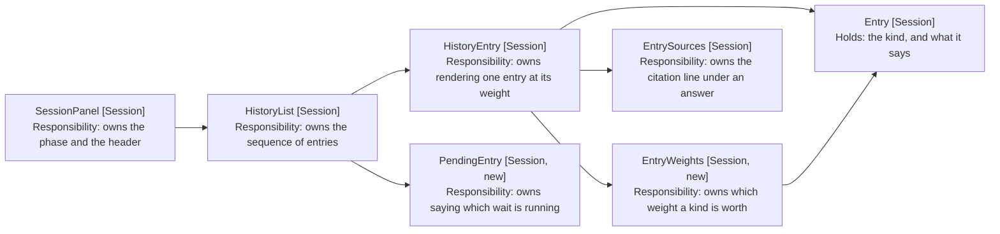

# Tidy Up Chat Panel: Component Design

How six entry kinds become three weights. Delta on the
[harness MVP](../4-harness-mvp/05-component-design.md); unlisted components are
unchanged.

## The Kind Says What, the Weight Says How Much

HistoryEntry (Session) maps each kind to a class today, one per kind, and the
stylesheet gives all six the same padding and radius. That is why the panel
reads flat: the mapping is complete, but every value it maps to is the same
except the colour.

The kind stays as it is. What changes is that the component asks a second
question of it.

```typescript
// models/entry-weight.ts
export type EntryWeight = 'utterance' | 'reply' | 'context'

// What an entry is worth on screen, which is not what it says. Three kinds are
// replies and two are context, so the panel reads as a conversation rather
// than as six kinds of box (FR1-FR5).
export class EntryWeights {
  static of(kind: Entry['kind']): EntryWeight
}
```

| Kind         | Weight    | Why                                          |
| ------------ | --------- | -------------------------------------------- |
| user         | utterance | The only thing the user wrote                |
| assistant    | reply     | What the turn produced                       |
| answer       | reply     | A reply that cites its sources               |
| error        | reply     | A failure is the turn's outcome, not context |
| instructions | context   | What was loaded before the work started      |
| command      | context   | What the harness did on the way to the reply |

A separate type rather than a field on Entry: the weight is a presentation
decision, and Entry crosses from the engine's publishers into the panel. Putting
it on Entry would make every publisher state how its entry should look.



Arrows: uses-relationship (client to supplier).

## Three Treatments, One Stylesheet

The weight becomes a class, and the stylesheet holds what each one looks like.
The kind keeps its own class beside it, because two replies still differ: an
error is coloured, an answer carries sources.

```
owl-entry owl-entry-reply owl-entry-error
          ^ weight        ^ kind
```

Utterance is the only weight that changes the panel's shape.

```
                    ╭──────────────────────────╮
                    │ Add watermelon to this   │
                    │ week's shopping list.    │
                    ╰──────────────────────────╯
Instructions applied: vault root
Skill applied: shopping-list
ran Open or Create File: Shopping list

Added "watermelon" to this week's shopping list.
```

The bubble is capped at a proportion of the panel, not a fixed width (NFR2). A
drawer is resized freely, and a cap in pixels is either too wide on a phone or
too narrow on a desktop.

Reply is plain text at full width. Removing the background is what gives it
weight: it is the only thing on screen with no styling competing for attention,
which in a list of tinted boxes is the strongest position rather than the
weakest.

Context is a tight line, muted, smaller and italic, with the gap between
consecutive lines removed so a turn's notes stack as one block (FR6). The gap
belongs between turns, not inside one. The italics are what separate a note the
harness wrote from a reply, once neither carries a background.

Which leaves the list's uniform gap doing the wrong job in two places. A block
that stacks tightly still needs air around it, or the utterance above and the
reply below read as part of the same run.

| Boundary            | Gap     | Why                                  |
| ------------------- | ------- | ------------------------------------ |
| Context to context  | None    | A turn's notes are one block         |
| Around an utterance | Widest  | It is the boundary between two turns |
| Context to reply    | Wider   | The reply is what the notes led to   |
| Everything else     | Default | The list's own gap already suits it  |

The utterance takes its room on both sides, in equal measure. It is not the top
of a turn so much as the line between the turn before it and the turn it opens,
and a margin on one side alone reads as a lean rather than a break.

## The Copy Control Needs an Anchor It No Longer Has

The copy button is positioned against the entry's padding today. A reply has no
padding once this lands, so a button pinned to the corner would sit over the
text it copies.

Context lines drop the control entirely. A line naming which instruction files
loaded is not something a user copies, and a button on every one of them would
outnumber the text.

Utterances drop it too. The user wrote those words, so the panel is not where
they go to get them back.

Replies keep it, in a gutter to the right of the text rather than over it or
beneath it, and still revealed on hover or focus (FR7, FR8). The reply becomes a
row of two: the body takes the room that is left, and the button holds a column
it never shares.

The body is what gains a wrapper. An answer's sources sit under its text, so
without one the row would lay text, sources and button out as three columns.

## A Pending Line Holds the Reply's Place

The panel has two busy phases and shows neither. Controls grey out, which says
something is happening but not what, and not where the result will land.

PendingEntry (Session, new) renders at the end of the history whenever the phase
is busy. It is not an Entry: nothing publishes it, it never enters PanelState's
list, and it disappears when the reply arrives rather than being replaced in the
array (NFR3).

```typescript
// views/PendingEntry.tsx
export const PendingEntry = ({ phase }: { phase: Phase }) => ...
```

| Phase        | Line         | The wait                          |
| ------------ | ------------ | --------------------------------- |
| transcribing | Transcribing | Audio becoming text               |
| thinking     | Thinking     | The model working                 |
| recording    | nothing      | The user is speaking, not waiting |
| idle         | nothing      | Nothing is running                |

Naming the phase is what makes a stall diagnosable (FR10). A transcription that
hangs and a model that hangs look identical otherwise, and they have different
causes and different fixes.

HistoryList (Session) renders it after the entries, so it sits where the reply
will appear (FR9). Nothing removes it explicitly: the phase leaves busy when the
turn ends, fails or is cancelled, and the line goes with it (FR11).

## The Header Loses a Button

SessionPanel (Session) renders a return-to-starting-note button whenever the
target has moved. It goes, with the `returnToStartingNote` prop that feeds it
(FR12).

This retires FR20 of the harness MVP, whose only control it was. EditEngine
(Engine) is subscribed to file-open, so opening a note rebinds the session to
it: Obsidian's navigation is the return control, and the button duplicated it.

The target-note name stays, because it answers a question Obsidian does not:
which note this session is bound to now (FR13).
