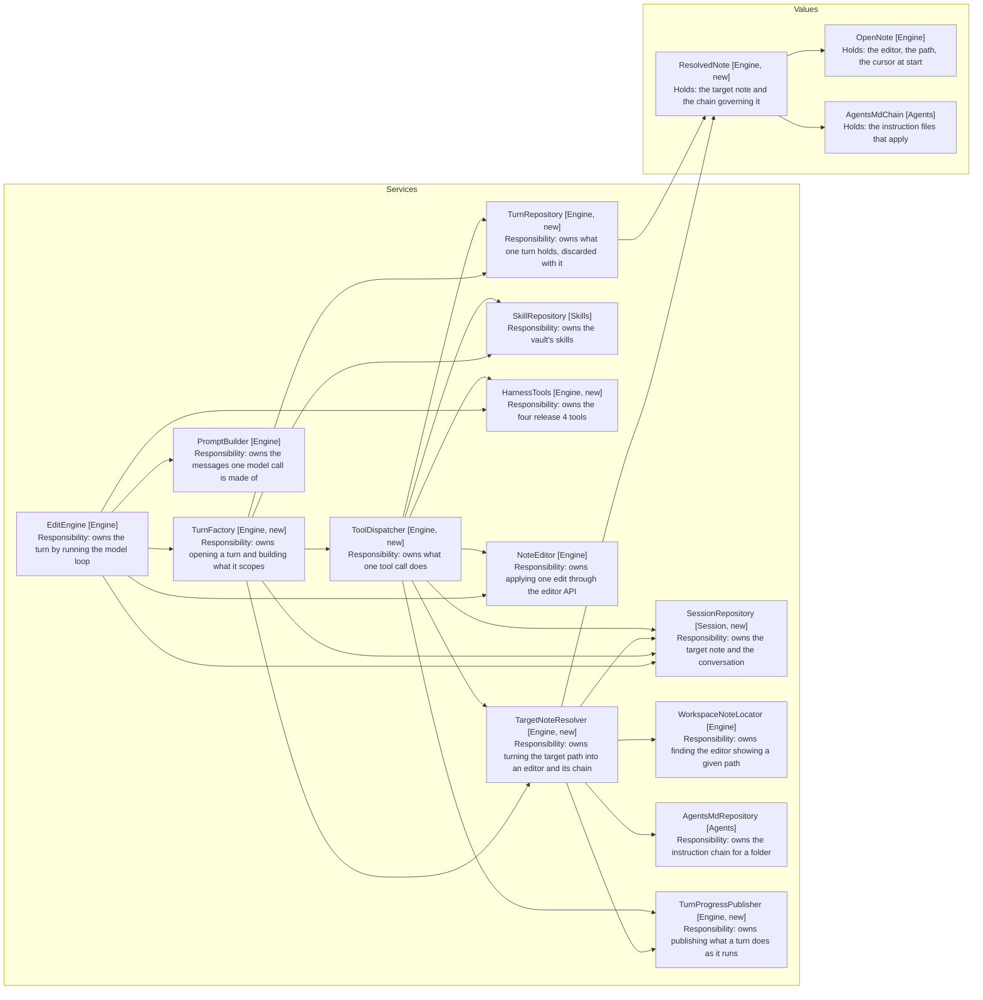
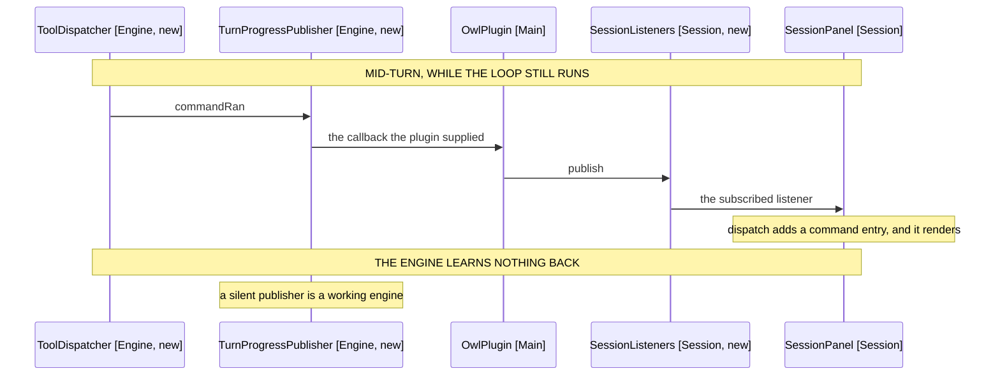

# Obsidian Agent Harness: Component Design

Delta on the AGENTS.md Loading design. Unlisted components are unchanged.
Covers the packages, the private-API question, and what the two flows share.

Commands in detail: [06-commands-and-rebinding.md](06-commands-and-rebinding.md).
Search in detail: [07-search-and-answering.md](07-search-and-answering.md).

## Source tree

```
src/commands/
  command-catalogue.ts     # allowed commands, resolved from the live list
  command-runner.ts        # runs one command, reports what opened
  allow-list.ts            # entries, and the pattern rule
  models/
    allowed-command.ts     # one id and display name pair
    command-effect.ts      # what changed after a command ran

src/search/
  vault-search.ts          # scored matches over markdown files
  note-reader.ts           # one named note, read in full
  note-excerpt.ts          # a fixed-width cut around a match offset
  models/
    search-hit.ts          # path, score and excerpt

src/engine/
  harness-tools.ts         # the four new tools, run and bounded
  tool-dispatcher.ts       # what one tool call does to note, session and panel
  target-note-resolver.ts  # the target path, turned into an editor and a chain
  turn-factory.ts          # opens a turn: what is turn-scoped is built here
  turn-repository.ts       # the note in hand, its chain, the edit position
  turn-progress-publisher.ts  # what a turn publishes as it runs
  engine-factory.ts        # assembles one session's engine
  models/
    resolved-note.ts       # the target note, plus the chain governing it
    turn.ts                # one turn's collaborators, built together
    turn-budget.ts         # per-turn command and search counters

src/session/
  session-repository.ts    # the target note and the conversation
  listeners.ts             # one publish-subscribe channel
  session-listeners.ts     # the channels a turn publishes to
```

Two packages, not one. Commands acts on the vault through Obsidian; Search only
reads it. They share no code, and the flows they serve are independent by FR30,
so merging them would give one package two reasons to change.

Engine gains both, and splits its own state in two. What survives a turn lives in
SessionRepository (Session, new); what a turn resolves lives in TurnRepository
(Engine, new). NoteContext (Engine) is renamed NoteDetails, and AgentSession
(Engine) is gone.

## Collaborators

Services above, values below. No value points at a service, and state changes
only through a repository: SessionRepository (Session, new) for what survives
between turns, TurnRepository (Engine, new) for what one turn holds.



Arrows: uses-relationship (client to supplier).

SessionRepository (Session, new) is reached by four services and holds none, so
a tool moves the target note by asking rather than by writing a field it happens
to touch.

The two repositories split by lifetime. SessionRepository (Session, new) holds
the target as a path, which survives every turn. TurnRepository (Engine, new)
holds the editor found for it, which does not: a handle kept across turns goes
stale silently when the user closes the tab, whereas a path re-resolves and fails
loudly. TargetNoteResolver (Engine, new) is the only thing that crosses between
them: it resolves and returns, and the caller decides what to do with the
result. WorkspaceNoteLocator (Engine) holds no path of its own.

TurnFactory (Engine, new) is where the two lifetimes meet. It holds what
outlives a turn and builds what does not, so nothing turn-scoped is reachable
before a turn opens or after it ends, and every collaborator arrives through a
constructor rather than through a method parameter.

One box worth watching. ToolDispatcher (Engine, new) has seven suppliers, because
it handles three unrelated tool families, and a uniform tool facade would collapse
most of them.

### Reporting a turn's progress

A turn returns one summary, at the end. Four things have to reach the user
before then: a command entry before the edit that follows it (FR16), an answer
block (FR27), the target note in the header (FR19), and the instruction files
that applied (release 3, FR14-16).

They push rather than return. TurnProgressPublisher (Engine, new) is the four
callbacks that do it, supplied by the plugin, so the engine narrates without
knowing where any of it lands.



Arrows: uses-relationship (client to supplier).

The other three channels take the same path. `answered` carries the text and its
cited paths, `retargeted` carries the path the header names, and
`instructionsResolved` carries the chain, which OwlPlugin (Main) splits three
ways: a panel entry, a Notice when the cap dropped a file, and a console line
naming each.

Nothing reads back. TurnProgressPublisher.silent() is what a test constructs, and
every turn behaves the same, which is what separates this from SessionRepository
(Session, new): a silent repository breaks the turn, a silent publisher does not.

## Both Private APIs Are Reachable

The two feasibility questions resolve in opposite directions, and neither
blocks the release.

| Need               | Surface                         | Public |
| ------------------ | ------------------------------- | ------ |
| List commands      | app.commands.listCommands       | No     |
| Run a command      | app.commands.executeCommandById | No     |
| Score a text match | prepareSimpleSearch             | Yes    |
| Enumerate notes    | Vault.getMarkdownFiles          | Yes    |
| Read a note        | Vault.cachedRead                | Yes    |

Search needs no private API at all. prepareSimpleSearch is exported from the
obsidian module and returns a scored SearchResult with match offsets, which is
what an excerpt needs. The scan is therefore the design, and driving Obsidian's
search view is rejected: the view renders results for a person rather than
returning them, so reading them back would mean parsing the DOM.

Commands needs two private methods. The Command interface is public and typed;
only the registry holding them is not. Both are reached through one module
augmentation, declared once in the Commands package:

```typescript
declare module 'obsidian' {
  interface App {
    commands: {
      listCommands(): Command[]
      executeCommandById(id: string): boolean
    }
  }
}
```

This is the same access the vault's own open-or-create-file plugin already
relies on, so the surface is load-bearing for plugins in the wild rather than
incidental. It is still not covered by Obsidian's compatibility promise, which
NFR4 answers: CommandCatalogue (Commands, new) probes for the methods on
construction and yields an empty catalogue when they are absent, so the harness
degrades to search only rather than failing to load.

## Prompt Additions

PromptBuilder (Engine) gains a command section, built the same way as the skill
catalogue: omitted entirely when the catalogue is empty, so a vault allowing no
commands produces the release 3 prompt byte for byte (NFR8).

The section carries the id and name pairs (FR9) and one standing instruction:
decline a command whose effect cannot be determined from its name, and say
which and why (FR11). NFR3 states what that instruction is worth. It is a second
layer over a list the user may have widened by pattern, not the thing keeping
destructive commands out of reach.

### What one model call is made of

PromptBuilder (Engine) returns messages rather than text, so EditEngine (Engine)
names the parts and the order without assembling either.

| Part           | Carries                                                 |
| -------------- | ------------------------------------------------------- |
| Standing rules | Role, dictation, instructions, skills, commands, search |
| Chat history   | Earlier turns, ending with the utterance being answered |
| Note snapshot  | The target note's path, cursor and current content      |

Two system messages, not one. The history holds stale copies of the note from
earlier turns, and the model weights recent messages most heavily, so a merged
message would put the current note behind every older description of it. The
note goes last instead, and says in words that it supersedes them.

The utterance is the tail of the history rather than a part of its own, because
it is what the conversation already ends with. EditEngine appends it as the loop
opens, beside the call that reads it back.

## Iteration Cap

The cap rises from 6 to 10, and stays one number rather than becoming per-flow.

A search turn spends calls the edit loop never did: a search, one or two reads,
then the answer. Six leaves no room for the model to refine a query once. Ten
covers the longest sensible chain, which is a command, a search, two reads and
an edit, with a call to spare.

Per-flow caps were rejected. The loop does not know which flow it is in until
the model calls a tool, and a turn may legitimately use both, so a single cap is
the only one that can be enforced where the counting happens.
