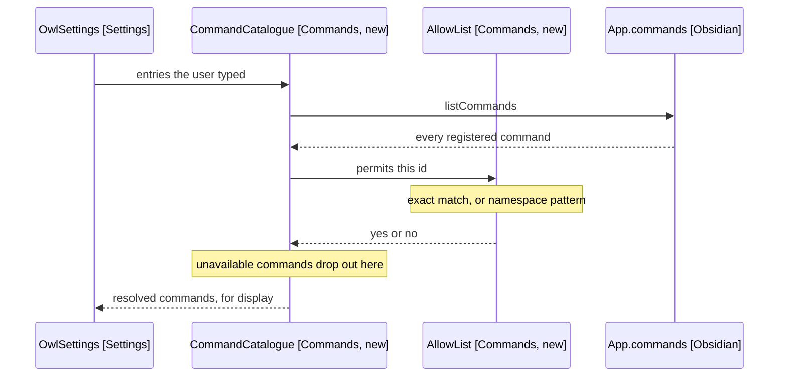
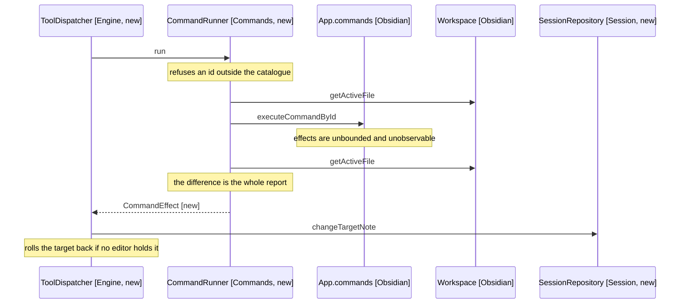
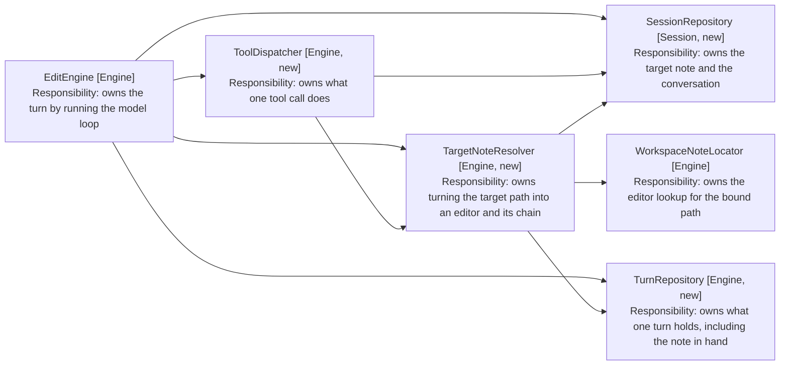

# Commands and Rebinding

How an allow-list becomes a catalogue, and how running a command moves the
session binding. Part of the [component design](05-component-design.md).

## The Allow-List Resolves, It Does Not Store

AllowList (Commands, new) holds what the user typed: a list of entries, each an
exact command id or a namespace pattern (FR3). It stores nothing about which
commands exist.

CommandCatalogue (Commands, new) resolves those entries against the live
command list every session, so a command registered after the pattern was
written is matched without a settings edit (FR6). Resolution is the only place
the two meet, which keeps the stored settings independent of what is installed.

### Flow: the user reviews what their allow-list includes

Arrows: uses-relationship (client to supplier).

The pattern rule lives in AllowList and nowhere else. A pattern splits on the
first colon: the plugin id must be literal, and only a trailing wildcard may
follow (FR4). A pattern without a colon is refused, as is a wildcard in the
plugin id.

Refusal happens when the entry is saved, not when it is matched. A pattern that
cannot be expressed is a settings error the user can see and fix, whereas one
refused at match time would silently allow nothing.

## Running a Command Is a Diff, Not a Call

CommandRunner (Commands, new) records the active note path, calls
executeCommandById, then reads the active path again. The difference is what it
reports (FR14).

That is the whole verification the harness performs, and the design accepts the
limit rather than hiding it. A command's effects are unbounded: it may write
files, change settings, or do nothing observable. Comparing the bound note
before and after answers exactly one question, which is the only one the next
tool call depends on: which note the edit tools will now target.

### Flow: the user says "open my daily note and add a paragraph"

Arrows: uses-relationship (client to supplier).

A command that opens no note leaves the target alone (FR17). A command that
opens one moves it, and the tool result says so in words, because a silent move
would leave the model anchoring into the wrong note.

A note that opened but has no editor is the third case, and it reports as the
second. ToolDispatcher (Engine, new) moves the target, asks TargetNoteResolver
(Engine, new) to find its editor, and puts the target back when it cannot, so
the model is told nothing opened rather than anchoring into an unopened note.

### Where the target note lives

SessionRepository (Session, new) owns the target note as a path, and every move
goes through it. What a turn holds is derived from that path, not a second copy
of it.

Arrows: uses-relationship (client to supplier).

The split is between what survives and what is derived. SessionRepository
(Session, new) holds the path, which outlives every turn. TurnRepository (Engine,
new) holds the editor found for it, which does not: a handle kept across turns goes
stale the moment the user closes the tab, whereas a path re-resolves and fails
loudly.

WorkspaceNoteLocator (Engine) holds neither. It takes a path and finds the editor
showing it, so nothing in the engine keeps a second copy of the target.

The repository also keeps the note the session started on, so FR20 has somewhere
to return to.

Commands run one at a time. The runner is called from the existing tool-call
loop, which already executes calls in sequence, so a turn that opens a note and
then edits it cannot interleave.
