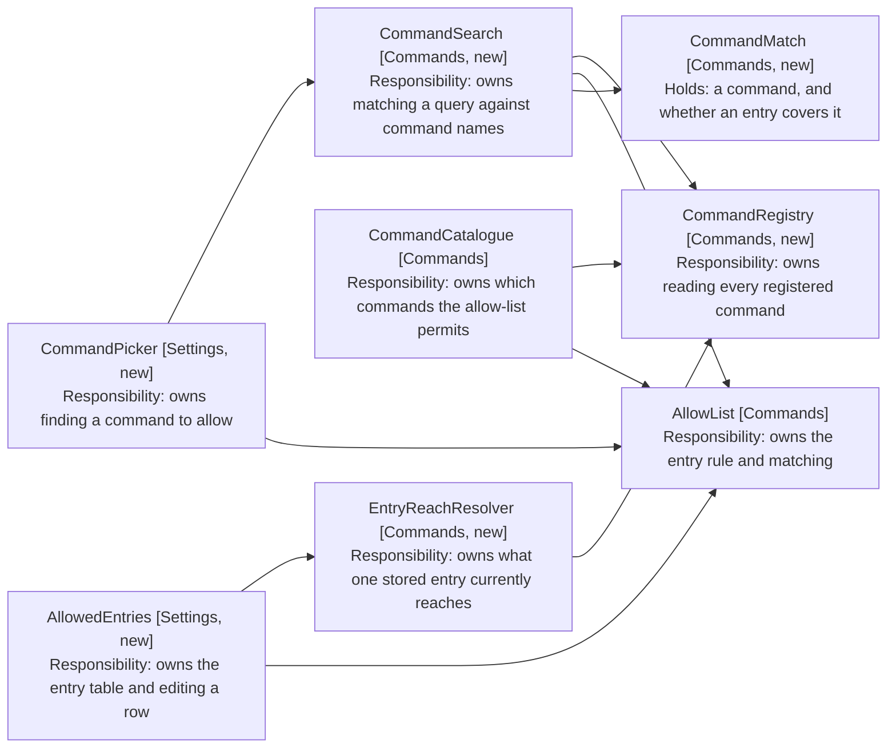
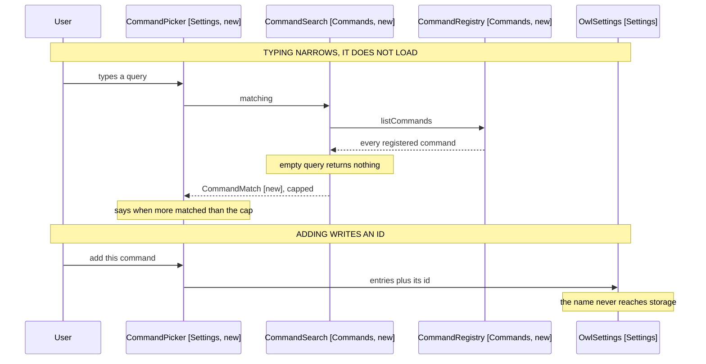

# Settings Command Picker: Component Design

How a name becomes an allow-list entry. Delta on the
[harness MVP](../1-harness-mvp/05-component-design.md); unlisted components are
unchanged.

## The Catalogue Answers One Question, the Picker Another

CommandCatalogue (Commands) resolves the allow-list against the live command
list and yields what is permitted. That is the model's view, and it is the only
view the harness MVP needed.

The picker needs the opposite: every command, whether allowed or not, so a user
can find one to add. Same registry, different question.

```
src/commands/
  command-registry.ts      # every registered command, one read
  command-search.ts        # name matching, capped
  entry-reach-resolver.ts  # what each stored entry currently reaches
  models/
    command-match.ts       # a command, and whether the list already covers it
    entry-reach.ts         # one entry, and the commands behind it

src/settings/
  CommandPicker.tsx        # query field and results
  CommandMatchRow.tsx      # one result, with its id and add control
  AllowedEntries.tsx       # the entry table
  AllowedEntryRow.tsx      # one entry, editable, beside what it reaches
```

CommandRegistry (Commands, new) holds the module augmentation and the probe that
CommandCatalogue (Commands) holds today, so both read the registry through one
place rather than two. The catalogue keeps its filtering and becomes its only
job.

```typescript
// command-registry.ts
export class CommandRegistry {
  constructor(private app: App) {}

  // Every registered command that is available in the current context. Empty
  // when the registry is absent, which is what keeps a missing private API from
  // failing the plugin (NFR4 of the harness MVP).
  list(): readonly AllowedCommand[]

  isReachable(): boolean
}
```

CommandCatalogue (Commands) takes a CommandRegistry (Commands, new) instead of an
App, and its body becomes the allow-list filter over `registry.list()`. Its
`isReachable` delegates. The augmentation and the availability check move with
the registry, so the catalogue no longer imports Obsidian at all.

Four call sites construct a catalogue and each gains the registry:
EngineFactory (Engine), OwlSettingsTab (Settings), and two in builders.ts
(Test Support).

CommandRunner (Commands) gains the registry for `executeCommandById`, which is
the other half of what the registry owns. It keeps its App, because the
before-and-after diff reads `app.workspace` for the active file, which the
registry has no part in.

```typescript
// command-registry.ts, beside list()
executeCommandById(id: string): boolean
```



Arrows: uses-relationship (client to supplier).

CommandCatalogue (Commands) and CommandSearch (Commands, new) both read the
registry and both consult the allow-list, but they compose them oppositely: the
catalogue filters to what is permitted, the search annotates everything with
whether it is.

AllowList (Commands) gains one method for the annotation. `permits` answers yes
or no; the picker needs to know which entry said yes, so a pattern-covered
command can render differently from an exactly-listed one (FR6, FR7).

```typescript
// allow-list.ts, added beside permits
coveringEntry(commandId: string): string | null
```

```typescript
// models/entry-reach.ts - what one stored entry currently reaches
export class EntryReach {
  constructor(
    readonly entry: string,
    readonly commands: readonly AllowedCommand[],
  ) {}

  // A single command names itself; a pattern reports a count; neither reports a
  // name that was stored, because none is (NFR1).
  describe(): string
  reachesNothing(): boolean
}
```

```typescript
// models/command-match.ts
export class CommandMatch {
  constructor(
    readonly command: AllowedCommand,
    readonly coveredBy: string | null,
  ) {}

  isCovered(): boolean
  isCoveredByPattern(): boolean // coveredBy ends with the wildcard
  pluginId(): string // the part before the first colon
  hasPositionalId(): boolean // the part after it parses as an integer
}
```

## Nothing Renders Until a Query Is Typed

A vault offers several hundred commands (FR1). The query is what makes the list
finite, so the empty query returns nothing rather than everything (FR4).



Arrows: uses-relationship (client to supplier).

```typescript
// entry-reach-resolver.ts
export class EntryReachResolver {
  constructor(private registry: CommandRegistry) {}

  // One EntryReach per stored entry, in the order the user has them. An entry
  // matching nothing still yields a row, because a silently inert entry is the
  // case FR11 exists to surface.
  reachOf(entries: readonly string[]): readonly EntryReach[]
}
```

```typescript
// command-search.ts
export class CommandSearch {
  constructor(
    private registry: CommandRegistry,
    private allowList: AllowList,
  ) {}

  // An empty or blank query returns no matches and no overflow, so the picker
  // renders nothing before the user types (FR4).
  matching(query: string): SearchResults
}

// The cap is 20. It fits a desktop panel without scrolling far, and a phone
// scrolls a short list more readily than it reads a long one. A query matching
// more than 20 is too broad to pick from, so the overflow line is the signal to
// type more rather than a paging control.
export class SearchResults {
  constructor(
    readonly matches: readonly CommandMatch[],
    readonly overflowed: boolean,
  ) {}
}
```

Matching is a case-insensitive substring over the display name, not a fuzzy
score. A user reads the name off the palette and types part of it, so recall
matters more than ranking, and an ordering the user cannot predict is worse than
registry order.

Cost is bounded by the cap on rendered rows (FR3), not by the scan. Several
hundred commands is one pass over an array Obsidian already holds.

## A Pattern Is Offered, Never Imposed

The wildcard question the requirements leave open: a picker adds one command,
and patterns exist because positional ids shift.

The answer is to offer, and to show the reach before the user commits.

| The user picks                        | The picker offers        |
| ------------------------------------- | ------------------------ |
| A command whose plugin has no entry   | Its exact id             |
| A second command from the same plugin | The pattern, or the id   |
| A command whose id is positional      | The pattern, warning why |

Accepting a pattern replaces the individual entries for that plugin, because
keeping both would leave the user reading a list where one line already covers
another. The count of what the pattern reaches is shown with the offer (FR7), so
the reach is visible at the moment of choosing rather than afterwards.

Positional ids are detected structurally: the part after the colon parses as an
integer. That is a heuristic about a convention, not a rule Obsidian enforces,
so it warns rather than refuses (FR8). A user whose plugin genuinely names a
command `1` loses nothing but reads one extra line.

## The Entry List Is a Table, Not a Textarea

The bulk textarea goes. It was one field holding every entry, so a per-entry
name, a per-entry error and a per-entry remove control had nowhere to live.

Each entry becomes a row: the entry itself, editable, beside what it currently
reaches.

| Entry                          | Reaches         |
| ------------------------------ | --------------- |
| daily-notes:goto-today         | Open today      |
| open-or-create-file-command:\* | 9 commands      |
| shopping:add                   | Reaches nothing |

The left column is stored; the right is derived on every render and never
persisted (NFR1). A retitled command shows its new title, and a pattern shows a
count because it has no single name (FR10).

"Reaches nothing" is the case worth surfacing (FR11). An id whose plugin was
disabled, uninstalled or renamed stays in settings and silently matches nothing,
which today is invisible until the model fails to find a command.

Editing a row is how a pattern replaces an id the picker added (FR12). The row
validates as it is typed, through the AllowList (Commands) rule that already
exists, and keeps what the user typed while showing why it is refused (FR13) -
the same draft-state discipline the textarea needed, now per row.

An unreachable registry empties the right column and leaves the left editable
(NFR3), so a vault where the private API is gone still shows and edits its
allow-list.
