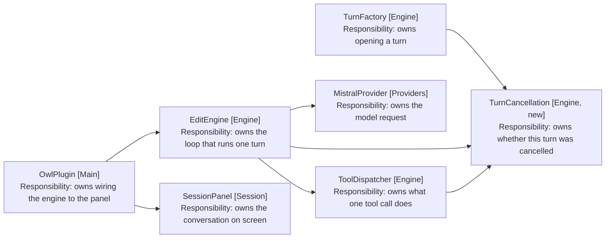
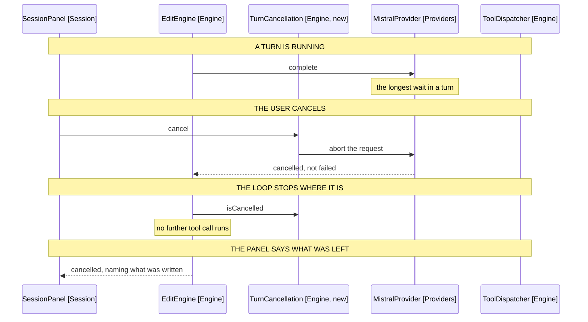

# Cancelling a Turn: Component Design

How a turn stops. Delta on the
[harness MVP](../1-harness-mvp/05-component-design.md); unlisted components are
unchanged.

## Table of Contents

1. [A Cancellation Is a Fact the Turn Reads](#a-cancellation-is-a-fact-the-turn-reads)
2. [Three Places Must See It](#three-places-must-see-it)
3. [Behaviour Sequence](#behaviour-sequence)
4. [An Abort Is Not a Failure](#an-abort-is-not-a-failure)
5. [The Turn Records What It Wrote](#the-turn-records-what-it-wrote)
6. [The Panel Swaps Send for Cancel](#the-panel-swaps-send-for-cancel)
7. [Out of Scope](#out-of-scope)

## A Cancellation Is a Fact the Turn Reads

The loop, the provider request and a parked question all have to stop. Passing a
flag to each spreads the same decision across three signatures, and none of them
can then be asked whether a cancel has happened.

So the cancellation is one object, held for the turn and read by whoever needs
it.

```typescript
// turn-cancellation.ts
// One per turn, so cancelling one utterance never reaches the next. Holds an
// AbortController rather than a boolean, because the provider request needs a
// signal and the loop needs a question.
export class TurnCancellation {
  cancel(): void

  isCancelled(): boolean

  signal(): AbortSignal

  // Resolves when cancelled, so a parked question can race against it (FR6).
  whenCancelled(): Promise<void>
}
```

Built by TurnFactory (Engine) alongside TurnRepository (Engine), which is what
scopes it to the turn. Nothing has to reset it.

It is a value in the domain-driven sense: it holds state and no collaborator. The
engine asks it what happened rather than telling it what to do.

## Three Places Must See It



Arrows: uses-relationship (client to supplier).

Each of the three reads it differently, which is why one boolean would not do.

| Reader                     | Reads         | Effect                        |
| -------------------------- | ------------- | ----------------------------- |
| EditEngine, between calls  | isCancelled   | Ends the loop before the next |
| MistralProvider, in flight | signal        | Abandons the fetch            |
| A parked question          | whenCancelled | Settles, so the await returns |

The third is what makes FR6 work without the question knowing about cancelling.
It races its own answer against whenCancelled, and whichever settles first wins.

## Behaviour Sequence



Arrows: uses-relationship (client to supplier).

A cancel between tool calls needs no abort at all. The loop checks isCancelled
before dispatching the next one, so FR5 costs one branch.

## An Abort Is Not a Failure

MistralProvider (Providers) wraps its fetch in a try, and an aborted request
throws. Left alone it becomes `request failed: AbortError`, and the panel renders
that as a failure.

The user did cause the abort. What they did not cause is a failure: they asked
the turn to stop and it stopped, which is the request working rather than
breaking. Reporting it as an error tells them something went wrong when nothing
did.

So the provider distinguishes the two.

```typescript
// mistral-provider.ts, in the catch
// An abort is the user stopping the turn, not the request failing, so it is
// reported as its own outcome rather than as a chat failure (FR9).
if (this.wasAborted(error)) return Outcomes.cancelled(step)
```

Outcome (Shared) gains a third case beside Success and Failure. It is not a
failure: the turn stopped because the user said so, and NFR1 requires a turn
nobody cancels to be unchanged, which a third case preserves and a repurposed
Failure would not.

ChatProvider (Providers) gains the signal on its contract:

```typescript
// types.ts
complete(messages: ChatMessage[], tools: ToolSchema[], signal?: AbortSignal)
```

Optional, so every existing caller and the fake in the suite compile unchanged.

## The Turn Records What It Wrote

FR10 names what a cancelled turn changed, and nothing today can answer it.
TurnRepository (Engine) holds lastEditEnd, one position overwritten by each edit.

```typescript
// turn-repository.ts, beside recordEdit
// The paths written this turn, in order, so a cancelled turn can say what it
// left rather than the user reading the note to find out (FR10).
writtenNotes(): readonly string[]
```

A list of paths rather than of edits. What the user needs is which notes to look
at, and holding the edits themselves would be the start of an undo this spec
does not do.

## The Panel Swaps Send for Cancel

PanelState (Session) gains one phase and one action.

| Addition | Shape                                           |
| -------- | ----------------------------------------------- |
| Phase    | cancelling, between the click and the loop stop |
| Action   | cancelled, carrying what was written            |
| Entry    | cancelled, weighing as a reply                  |

The cancelling phase exists because the loop does not stop instantly. A user who
clicked Cancel needs the button to stop offering, and the panel needs somewhere
to sit until the turn returns.

SessionPanel (Session) renders Cancel in the Send button's place whenever the
phase is not idle. The recording Cancel that sits beside Stop today goes, since
this one covers it (FR1).

```typescript
// SessionPanel.tsx, replacing the Send button
const running = state.phase !== 'idle'
const stoppable = running && state.phase !== 'cancelling'
```

Cancel shows whenever a turn runs and is clickable until it is clicked, which is
what stops a second click reaching a turn already stopping (FR14).

The mic button stays disabled while a turn runs, as it is today. Only the
rightmost button changes.

## Out of Scope

- Undoing what the turn wrote. FR10 names the notes; release 7 reverts them.
- Cancelling a command Obsidian is already running. The plugin hands control over
  and does not get it back, so a cancel during one applies once it returns.
- Cancelling from outside the panel. No hotkey, no command palette entry.
