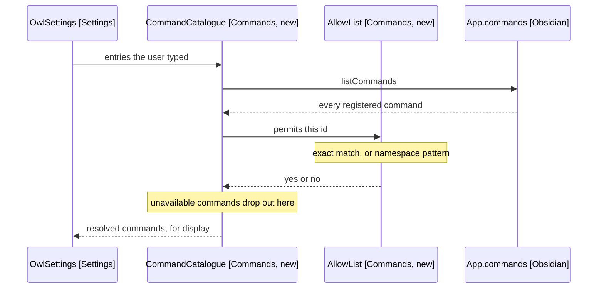
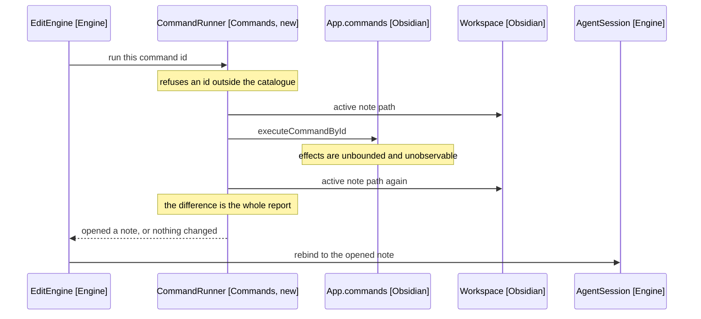

# Commands and Rebinding

How an allow-list becomes a catalogue, and how running a command moves the
session binding. Part of the [component design](4-component-design.md).

## The Allow-List Resolves, It Does Not Store

AllowList (Commands, new) holds what the user typed: a list of entries, each an
exact command id or a namespace pattern (FR3). It stores nothing about which
commands exist.

CommandCatalogue (Commands, new) resolves those entries against the live
command list every session, so a command registered after the pattern was
written is matched without a settings edit (FR6). Resolution is the only place
the two meet, which keeps the stored settings independent of what is installed.

Arrows: uses-relationship (client to supplier).

The pattern rule lives in AllowList and nowhere else. A pattern splits on the
first colon: the plugin id must be literal, and only a trailing wildcard may
follow (FR4). An entry without a colon is refused, as is a wildcard in the
plugin id.

Refusal happens when the entry is saved, not when it is matched. A pattern that
cannot be expressed is a settings error the user can see and fix, whereas one
refused at match time would silently allow nothing.

## Running a Command Is a Diff, Not a Call

CommandRunner (Commands, new) records the active note path, calls
executeCommandById, then reads the active path again. The difference is what it
reports (FR14).

That is the whole verification the harness performs, and the design accepts the
limit rather than hiding it. A command's effects are unbounded: it may write
files, change settings, or do nothing observable. Comparing the bound note
before and after answers exactly one question, which is the only one the next
tool call depends on: which note the edit tools will now target.

Arrows: uses-relationship (client to supplier).

A command that opens no note leaves the binding alone (FR17). A command that
opens one rebinds the session, and the tool result says so in words, because a
silent rebind would leave the model anchoring into the wrong note.

Commands run one at a time. The runner is called from the existing tool-call
loop, which already executes calls in sequence, so a turn that opens a note and
then edits it cannot interleave.
