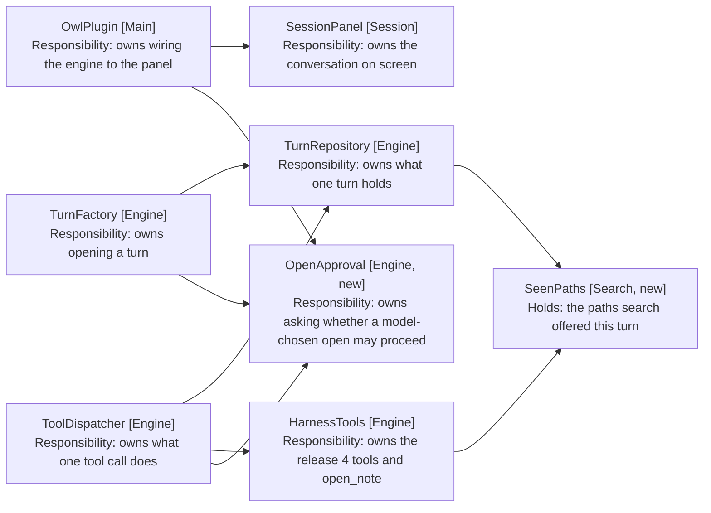
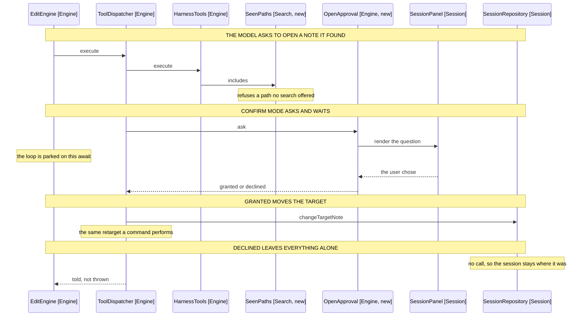

# Model-Chosen Targets: Component Design

How the model opens a note it found, and how a turn pauses to ask. Delta on the
[harness MVP](../1-harness-mvp/05-component-design.md); unlisted components are
unchanged.

## Table of Contents

1. [The Turn Already Pauses](#the-turn-already-pauses)
2. [A Fifth Tool, Bounded by What Search Returned](#a-fifth-tool-bounded-by-what-search-returned)
3. [Confirmation Is a Question the Publisher Cannot Ask](#confirmation-is-a-question-the-publisher-cannot-ask)
4. [Behaviour Sequence](#behaviour-sequence)
5. [The Approval Is Held for the Turn](#the-approval-is-held-for-the-turn)
6. [The Panel Asks and Answers](#the-panel-asks-and-answers)
7. [The Header Gains a Path](#the-header-gains-a-path)
8. [The Prompt Ranks the Two Routes](#the-prompt-ranks-the-two-routes)
9. [Out of Scope](#out-of-scope)

## The Turn Already Pauses

The requirements call pausing mid-turn the hard part, because a turn is one
promise resolving to a summary. The loop turns out to already support it.

EditEngine (Engine) awaits every tool call, and ToolDispatcher (Engine) is async
throughout. A dispatcher that returns a promise settling on a click pauses the
loop where it stands, with the iteration counter, the chat history and the turn
state all held on the stack.

So no new loop mechanism is needed. What is needed is a channel that carries an
answer back, and TurnProgressPublisher (Engine) is not one: every callback on it
returns void, by design.

## A Fifth Tool, Bounded by What Search Returned

HarnessTools (Engine) gains open_note beside the four it has. It takes a path
and retargets the session to it.

```typescript
// harness-tools.ts, beside runCommand and readNote
// Refused rather than thrown, in the shape every other tool refuses, so the
// model reads the reason and searches again (FR2, FR3).
private async openNote(call: ToolCall, budget: TurnBudget): Promise<HarnessResult>
```

Three refusals guard it, in order:

| Refusal            | Source of the answer | Requirement |
| ------------------ | -------------------- | ----------- |
| Budget spent       | TurnBudget           | FR4         |
| Path never offered | SeenPaths            | FR3         |
| No note there      | NoteReader           | FR2         |

SeenPaths (Search, new) is the new value. VaultSearch (Search) returns hits, and
the paths of those hits are the only paths open_note accepts.

```typescript
// seen-paths.ts
// A turn-scoped record of what the vault offered, so an opened note is one
// search confirmed rather than one the model recalled (FR3).
export class SeenPaths {
  record(hits: readonly SearchHit[]): void
  includes(path: string): boolean
}
```

Held on TurnRepository (Engine) rather than SessionRepository (Session), because
FR3 scopes it to the turn. A path offered three turns ago has had three turns to
go stale, and the cheap re-search is what keeps the guarantee honest.

FR2 stays despite FR3 making it nearly unreachable. The gap it covers is a note
deleted or renamed between the search and the open, which is small but real.

## Confirmation Is a Question the Publisher Cannot Ask

TurnProgressPublisher (Engine) narrates one way and reads nothing back. That is
the property the MVP design calls out: a silent publisher is a working engine.

Adding a return value to it would break that. So the question travels on its own
collaborator, and the publisher is left alone.

```typescript
// open-approval.ts
// One question, asked of whoever supplied it. The engine awaits an answer
// without knowing that a panel button is what produces it (NFR5).
export class OpenApproval {
  constructor(private ask: (path: string) => Promise<boolean>) {}

  static granted(): OpenApproval
}
```

OpenApproval (Engine, new) is what a test constructs granted, and what the
plugin constructs wired to the panel. Auto mode constructs the granted one too,
so the mode is a choice of collaborator rather than a branch inside the
dispatcher (NFR3).



Arrows: uses-relationship (client to supplier).

## Behaviour Sequence



Arrows: uses-relationship (client to supplier).

A decline is a tool result, not an exception. The model reads that it was
refused and reports what stopped, rather than claiming an edit (FR7), and the
turn ends the way any turn ends.

Auto mode runs the identical path with a granted approval, so the diagram is one
flow rather than two branches. NFR3 is met by construction: the refusals sit
above the approval and run whichever mode is on.

## The Approval Is Held for the Turn

FR12 asks once per turn, not once per open. So the approval remembers.

```typescript
// open-approval.ts
// Granted once, held for the turn: a two-step instruction is approved before
// its first step rather than again at the edit (FR12).
async grantFor(path: string): Promise<boolean>
```

Held per path rather than as a single flag. A turn that opens a second, different
note asks again, which is what keeps the cap in FR4 meaningful rather than a
formality the first approval waives.

The hold dies with the turn, since OpenApproval (Engine, new) is built by
TurnFactory (Engine) alongside TurnRepository (Engine). Nothing has to expire it.

## The Panel Asks and Answers

The panel gains one entry kind and one phase.

| Addition   | Shape                                       |
| ---------- | ------------------------------------------- |
| Entry kind | confirm, carrying the path and two buttons  |
| Phase      | confirming, so the input row stays disabled |
| Action     | openRequested, and openAnswered             |

The entry weighs as a reply. It is what the turn produced, and it is what the
user is being asked to read, so it sits where they are already looking rather
than muted with the context lines.

PanelReducer (Session) resolves the pending question when openAnswered arrives,
and replaces the entry with a line saying which way it went. A confirm entry
left on screen after the turn ends would be a button that no longer does
anything.

Cancelling a turn while it waits answers declined. The promise must settle, or
the loop stays parked and the session never returns to idle.

## The Header Gains a Path

SessionPanel (Session) holds targetName and derives it with noteNameOf. FR14
adds the path beneath it.

```typescript
// SessionPanel.tsx, beside targetName
const [targetPath, setTargetPath] = useState(props.notePath)
```

Both come from the same retargeted channel, so nothing new publishes. The
existing subscription sets two pieces of state rather than one.

Styling is the context weight from
[3-tidy-up-chat-panel](../3-tidy-up-chat-panel/2-requirements.md): smaller and
muted, under the name. A long path truncates with an ellipsis rather than
wrapping, which keeps the header one line in a narrow drawer (NFR6).

Truncation takes the head, not the tail. The trailing folders say which sibling
the note is, and that is the question a path under a name is there to answer.

## The Prompt Ranks the Two Routes

RuleBuilder (Engine) currently closes commandRules with a line that FR11
reverses:

```typescript
// rule-builder.ts, the line as it stands
'When an utterance names a destination no listed command reaches, say so rather than',
'searching the vault for it.',
```

That was correct when search could not open anything. It becomes the opposite
instruction: search is the fallback, and a command is the preference.

```typescript
// rule-builder.ts, replacing it
'When an utterance names a destination, prefer a listed command that opens it.',
'Search for the note only when no listed command reaches it, then open what you found.',
```

The preference is stated unconditionally rather than per mode. A command follows
the user's own configuration, so it survives a vault reorganisation that a
search-derived path does not, and that reason holds in auto mode too.

The mode itself is not in the prompt. A model told it is in auto mode may act
more freely than the user meant, and the requirement to prefer a command does
not need the mode to justify it.

## Out of Scope

- Creating a note at a model-chosen path. open_note refuses a path with no note
  rather than making one.
- A chat toggle for the mode. FR9 keeps it in settings.
- Remembering an approval past the turn that granted it.
