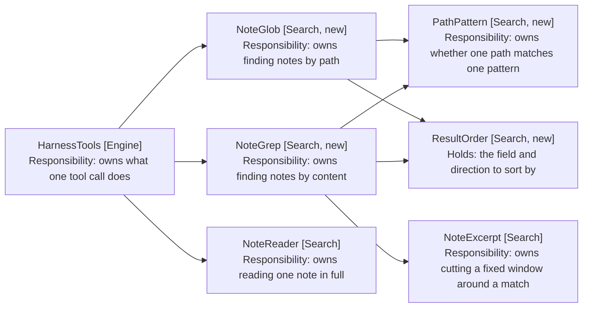

# Finding Notes: Component Design

How a path pattern becomes a list of notes, and how a regular expression becomes
a list of matches. Delta on the
[harness MVP](../1-harness-mvp/05-component-design.md); unlisted components are
unchanged.

## Table of Contents

1. [One Matcher, Two Searchers](#one-matcher-two-searchers)
2. [The Glob Is a Compiled Pattern](#the-glob-is-a-compiled-pattern)
3. [Two Searchers Over One Pass](#two-searchers-over-one-pass)
4. [Behaviour Sequence](#behaviour-sequence)
5. [Ordering Is a Value, Not a Branch](#ordering-is-a-value-not-a-branch)
6. [What Replaces VaultSearch](#what-replaces-vaultsearch)
7. [Two Tools, Two Budgets](#two-tools-two-budgets)
8. [The Prompt States the Order](#the-prompt-states-the-order)
9. [Out of Scope](#out-of-scope)

## One Matcher, Two Searchers

Both tools take a path pattern: glob to select what it returns, grep to narrow
what it reads. So the matcher is one collaborator that neither owns.



Arrows: uses-relationship (client to supplier).

NoteGlob (Search, new) reads no note contents, which is NFR2 by construction: it
holds the vault to list files and never calls cachedRead.

## The Glob Is a Compiled Pattern

PathPattern (Search, new) compiles the pattern once and tests each path against
it, rather than walking segments per path.

```typescript
// path-pattern.ts
// Compiled once per call, because a vault of a thousand notes tests the same
// pattern a thousand times. A regular expression rather than a segment walk:
// the three wildcards are a translation, and a walk would reimplement
// backtracking for `**`.
export class PathPattern {
  static compile(pattern: string): Attempt<PathPattern>

  matches(path: string): boolean
}
```

The translation is three rules and one escape:

| Pattern | Becomes      | Means                            |
| ------- | ------------ | -------------------------------- |
| `**/`   | `(?:.*/)?`   | Any folders, or none             |
| `**`    | `.*`         | Anything, folder separators too  |
| `*`     | `[^/]*`      | Anything within one segment      |
| `?`     | `[^/]`       | One character, not a separator   |

`**/` collapsing to an optional group is what makes `**/*.md` reach a note at the
vault root. Treating `**` as `.*` alone would require the separator, and a note
with no folder would not match a pattern the user reads as "anywhere".

Every other regular-expression character is escaped, so a vault folder named
`1 - Journal` or `Notes (old)` is matched literally rather than parsed.

Matching is case-insensitive. Obsidian's own search is, macOS vault paths are
case-insensitive on disk, and a model that recalls `week-35` should not miss
`Week-35`.

An unparseable pattern is an Attempt failure, so HarnessTools refuses it the way
it refuses every other bad argument rather than throwing.

## Two Searchers Over One Pass

Both walk getMarkdownFiles once and stop there (NFR1).

```typescript
// note-glob.ts
// No cachedRead anywhere in this class: a path match must not cost a read
// (NFR2), which is what makes listing cheap enough to use speculatively.
export class NoteGlob {
  async find(pattern: string, order: ResultOrder): Promise<Attempt<GlobResult>>
}

// note-grep.ts
// The path filter runs before the read, so narrowing a grep to a folder costs
// one pass over paths rather than a read of every note in the vault.
export class NoteGrep {
  async find(request: GrepRequest, order: ResultOrder): Promise<Attempt<GrepResult>>
}
```

GrepRequest (Search, new) carries the expression, the optional path pattern, and
whether paths alone are wanted. A value rather than four arguments, because
HarnessTools builds it from the tool call and nothing else constructs one.

The regular expression is the model's, so it is compiled inside a try and a
failure becomes a refusal naming the expression (FR9). It is compiled once per
call, like the path pattern.

Both results carry whether the cap trimmed them (FR13). A model told it saw
everything behaves differently from one told it saw the first fifty, and the
difference matters when the answer is "there are no others".

## Behaviour Sequence

```mermaid
sequenceDiagram
    participant Engine as EditEngine [Engine]
    participant Dispatcher as ToolDispatcher [Engine]
    participant Harness as HarnessTools [Engine]
    participant Glob as NoteGlob [Search, new]
    participant Grep as NoteGrep [Search, new]
    participant Seen as SeenPaths [Search]

    Note over Engine,Seen: THE MODEL LISTS A FOLDER BEFORE IT GUESSES
    Engine->>Dispatcher: execute
    Dispatcher->>Harness: execute
    Harness->>Glob: find
    Note over Glob: no contents read; paths only
    Harness->>Seen: record
    Note over Seen: an opened note must be one a search offered

    Note over Engine,Seen: THEN IT LOOKS INSIDE THE ONES THAT MATTER
    Engine->>Dispatcher: execute
    Dispatcher->>Harness: execute
    Harness->>Grep: find
    Harness->>Seen: record

    Note over Engine,Seen: A SPENT BUDGET REMOVES THE TOOL
    Note over Harness: schemas() drops it, so a refusal cannot be retried
```

Arrows: uses-relationship (client to supplier).

Both tools record their paths on SeenPaths (Search), because
[6-model-chosen-targets](../6-model-chosen-targets/1-index.md) makes a search hit
the only source of a path open_note accepts. A glob that could not feed open_note
would leave the model able to find a note and unable to open it.

## Ordering Is a Value, Not a Branch

ResultOrder (Search, new) holds the field and the direction, and knows the
default direction for each field.

```typescript
// result-order.ts
// A value, so both searchers sort through one comparator rather than each
// growing a switch. The direction defaults per field: ascending is right for a
// path and wrong for a date (FR12).
export class ResultOrder {
  static of(sort?: string, order?: string): ResultOrder

  comparing<T>(keyOf: (item: T) => string | number): (left: T, right: T) => number
}
```

An unrecognised sort field falls back to path rather than refusing. The field is
the model's, the set is small, and a turn should not end because it asked for an
ordering that does not exist.

matches is grep's alone, and the design keeps that in the schema rather than in
ResultOrder: the value sorts by whatever key it is handed, and only grep hands it
a match count.

## What Replaces VaultSearch

VaultSearch (Search) goes. NoteGlob and NoteGrep take what it owned, and its
three pieces land differently.

| VaultSearch held        | Becomes                                          |
| ----------------------- | ------------------------------------------------ |
| The one pass over files | Both searchers, each walking getMarkdownFiles     |
| prepareSimpleSearch     | Gone. Exact matching replaces scoring             |
| The recency filter      | ResultOrder's modified sort                       |
| Path scoring            | Gone. PathPattern replaces it exactly             |

The path scoring added to VaultSearch was a narrowing of this design onto the
wrong tool: it made a folder name reachable by fuzzy score when what the model
needed was to list the folder. PathPattern does exactly what the weighting
approximated.

modified_within_days goes with it. A window filters, where sorting orders, and
the model asking "recently" wants the newest first rather than an arbitrary
cutoff it has to pick. Dropping it removes an argument the model had to guess a
number for.

SearchHit (Search) stays, since a grep hit is still a path, a relevance figure
and an excerpt. Its score becomes the match count, which is what it always
effectively was.

## Two Tools, Two Budgets

TurnBudget (Engine) gains two counters beside the four it has.

| Flow      | Cap | Spent by                     |
| --------- | --- | ---------------------------- |
| Commands  | 3   | run_command                  |
| Searches  | 4   | read_note                    |
| Globs     | 3   | glob_notes                   |
| Greps     | 4   | grep_notes                   |
| Opens     | 1   | open_note                    |
| Questions | 4   | ask_user                     |

Separate counters, because a glob costs no read and a grep costs one per
candidate. Sharing them would let cheap reconnaissance starve the reads it exists
to inform, which is what the failing turn did.

The caps exceed what ten iterations can spend, deliberately. The iteration cap is
the real bound; these stop one flow monopolising a turn, and each refusal now
removes its tool from the offered set rather than inviting a retry (FR15).

## The Prompt States the Order

Four ways to reach a note need a stated order, or the model reaches for the most
general (NFR6). RuleBuilder (Engine) replaces searchRules with a sequence:

```typescript
// rule-builder.ts, replacing the search rules
'Reach a note in this order: run a listed command that opens it; glob for its',
'path when you know roughly where it lives; grep for text you expect it to',
'contain; read it only once you know which note you mean.',
'Glob before you guess a filename. A folder listing shows the naming convention,',
'and a guessed name that matches nothing tells you nothing.',
```

The second rule is the one the failing turn needed. A model that globs
`1 - Journal/Weekly/Week-35/*.md` reads the convention off the result; a model
that greps for a guessed name learns only that its guess was wrong.

## Out of Scope

- Tags. getAllTags makes the lookup cheap, but no test double has a
  MetadataCache and that scaffolding is its own piece of work.
- Fuzzy matching in any form. Exactness is the point, and a fuzzy flag would
  restore the choice this design removes.
- Brace expansion and character classes in a glob. Two globs express what braces
  would, and `*` already matches digits.
- Writing what either tool found into a note, which stays with
  [7-cross-file-skills](../../7-cross-file-skills/1-index.md).
- Searching anything but markdown, since getMarkdownFiles is the one pass.
