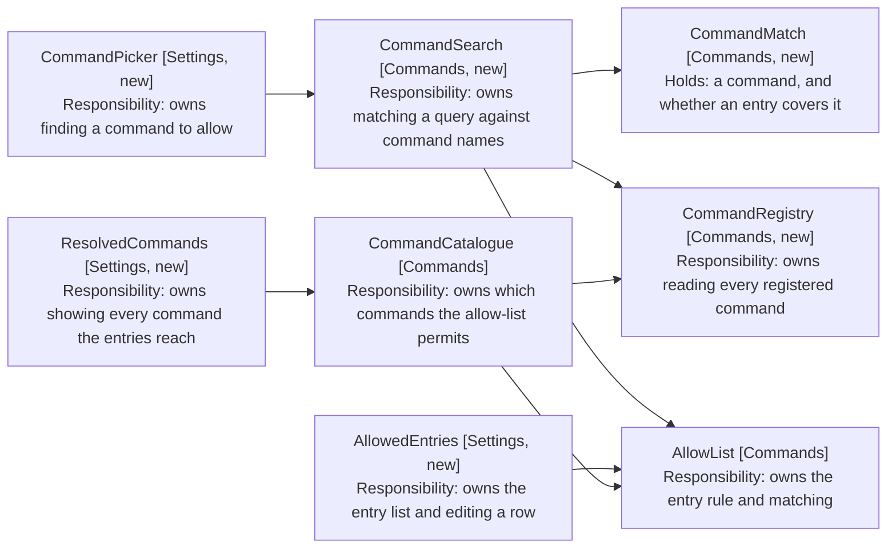
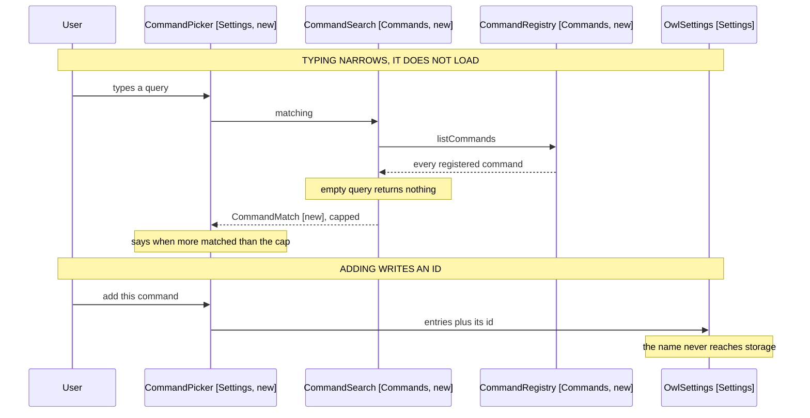

# Settings Command Picker: Component Design

How a name becomes an allow-list entry. Delta on the
[harness MVP](../4-harness-mvp/05-component-design.md); unlisted components are
unchanged.

## The Catalogue Answers One Question, the Picker Another

CommandCatalogue (Commands) resolves the allow-list against the live command
list and yields what is permitted. That is the model's view, and it is the only
view the harness MVP needed.

The picker needs the opposite: every command, whether allowed or not, so a user
can find one to add. Same registry, different question.

```
src/commands/
  command-registry.ts      # every registered command, one read
  command-search.ts        # name matching, capped
  models/
    command-match.ts       # a command, and whether the list already covers it
    search-results.ts      # the capped matches, and whether more matched

src/settings/
  CommandPicker.tsx        # query field and results
  CommandMatchRow.tsx      # one result: the whole row is the control
  AllowedEntries.tsx       # the entry list
  AllowedEntryRow.tsx      # one entry, editable, with its remove control
  ResolvedCommands.tsx     # collapsed: every command the entries reach
```

CommandRegistry (Commands, new) holds the module augmentation and the probe that
CommandCatalogue (Commands) holds today, so both read the registry through one
place rather than two. The catalogue keeps its filtering and becomes its only
job.

```typescript
// command-registry.ts
export class CommandRegistry {
  constructor(private app: App) {}

  // Every registered command that is available in the current context. Empty
  // when the registry is absent, which is what keeps a missing private API from
  // failing the plugin (NFR4 of the harness MVP).
  list(): readonly AllowedCommand[]

  isReachable(): boolean
}
```

CommandCatalogue (Commands) takes a CommandRegistry (Commands, new) instead of an
App, and its body becomes the allow-list filter over `registry.list()`. Its
`isReachable` delegates. The augmentation and the availability check move with
the registry, so the catalogue no longer imports Obsidian at all.

Four call sites construct a catalogue and each gains the registry:
EngineFactory (Engine), OwlSettingsTab (Settings), and two in builders.ts
(Test Support).

CommandRunner (Commands) gains the registry for `executeCommandById`, which is
the other half of what the registry owns. It keeps its App, because the
before-and-after diff reads `app.workspace` for the active file, which the
registry has no part in.

```typescript
// command-registry.ts, beside list()
executeCommandById(id: string): boolean
```



Arrows: uses-relationship (client to supplier).

CommandCatalogue (Commands) and CommandSearch (Commands, new) both read the
registry and both consult the allow-list, but they compose them oppositely: the
catalogue filters to what is permitted, the search annotates everything with
whether it is.

AllowList (Commands) gains one method for the annotation. `permits` answers yes
or no; the picker needs to know which entry said yes, so a pattern-covered
command can render differently from an exactly-listed one (FR6).

```typescript
// allow-list.ts, added beside permits
coveringEntry(commandId: string): string | null
```

```typescript
// models/command-match.ts
export class CommandMatch {
  constructor(
    readonly command: AllowedCommand,
    readonly coveredBy: string | null,
  ) {}

  isCovered(): boolean
}
```

## Nothing Renders Until a Query Is Typed

A vault offers several hundred commands (FR1). The query is what makes the list
finite, so the empty query returns nothing rather than everything (FR4).



Arrows: uses-relationship (client to supplier).

```typescript
// command-search.ts
export class CommandSearch {
  constructor(
    private registry: CommandRegistry,
    private allowList: AllowList,
  ) {}

  // An empty or blank query returns no matches and no overflow, so the picker
  // renders nothing before the user types (FR4).
  matching(query: string): SearchResults
}

// models/search-results.ts
// The cap is 20. It fits a desktop panel without scrolling far, and a phone
// scrolls a short list more readily than it reads a long one. A query matching
// more than 20 is too broad to pick from, so the overflow line is the signal to
// type more rather than a paging control.
export class SearchResults {
  constructor(
    readonly matches: readonly CommandMatch[],
    readonly overflowed: boolean,
  ) {}

  static empty(): SearchResults
}
```

Matching is a case-insensitive substring over the display name, not a fuzzy
score. A user reads the name off the palette and types part of it, so recall
matters more than ranking, and an ordering the user cannot predict is worse than
registry order.

Cost is bounded by the cap on rendered rows (FR3), not by the scan. Several
hundred commands is one pass over an array Obsidian already holds.

## A Pattern Is Not Suggested At All

The wildcard question the requirements leave open: a picker adds one command,
and patterns exist because positional ids shift.

Choosing a command stores its exact id, and nothing else happens. No suggestion
appears, and no warning about positional ids.

A suggestion is a second decision raised at the moment the user has just made a
first one, and it appears exactly when they are least equipped to answer it. A
user who wants a pattern types it over an entry, which the row already supports
(FR12), and the resolved section below shows what it reaches. That path costs a
user who does not want a pattern nothing at all.

The resolved section is what makes this safe to leave out. A user who allows
nine commands from one plugin sees nine entries and a count that agrees with
them, so the case a pattern would collapse is visible without being prompted.

## The Entry List Is a List, and Names Live Below It

The bulk textarea goes. It was one field holding every entry, so a per-entry
error and a per-entry remove control had nowhere to live.

Each entry becomes a row holding the entry itself, editable, beside a remove
control. The rows carry ids and patterns only.

What those entries reach is resolved once, for the whole list, into a collapsed
section beneath it. CommandCatalogue (Commands) already answers exactly that
question, so no per-entry resolver is needed.

```
Allowed commands
  daily-notes                     [Remove]
  open-or-create-file-command:*   [Remove]

  > Reaches 10 commands
```

Expanding names every command the entries reach, with its id. The list is
derived on every render and never persisted (NFR1), so a retitled command reads
with its new title, and an entry whose plugin was uninstalled contributes
nothing to the count.

A count that disagrees with the entries is the signal FR11 asks for. Two entries
reaching zero commands is visible in the summary line without expanding it.

Editing a row is how a pattern replaces an id the picker added (FR12). The row
validates as it is typed, through the AllowList (Commands) rule that already
exists, and keeps what the user typed while showing why it is refused (FR13) -
the same draft-state discipline the textarea needed, now per row.

An unreachable registry resolves to nothing and leaves every row editable
(NFR3), so a vault where the private API is gone still shows and edits its
allow-list.
