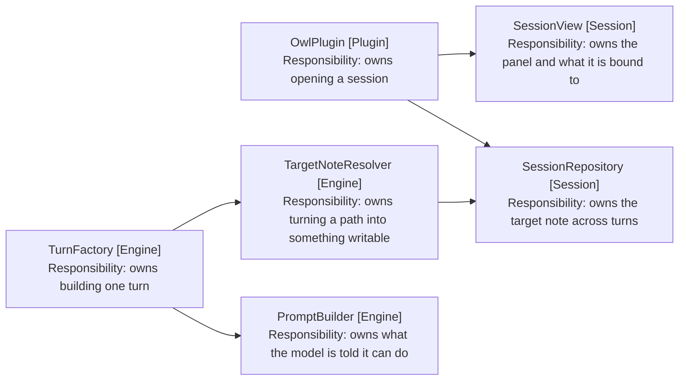

# Sessions Without a Note: Component Design

How a session survives having no note. Delta on the
[harness MVP](../4-harness-mvp/05-component-design.md); unlisted components are
unchanged.

## The Binding Becomes Nullable, and Only There

SessionRepository (Session) takes a TFile and derives a path from it. That path
is the binding, and everything downstream reads it rather than the file.

So the change is one field. The repository holds a nullable path, and the
components that read it gain one branch each.

```typescript
// session-repository.ts
export class SessionRepository {
  constructor(private readonly originalNote: TFile | null) {
    this.targetPath = originalNote?.path ?? null
  }

  // Null until the user opens a note, which is what an unbound session is.
  targetNote(): string | null

  isBound(): boolean
}
```

`resetTargetNoteToOriginal` goes, rather than gaining a null branch. It exists
only for the return-to-starting-note button, which
[6-tidy-up-chat-panel](../6-tidy-up-chat-panel/1-index.md) removes, and an
unbound session has no original note to return to. The two specs land in either
order; whichever is second deletes it.



Arrows: uses-relationship (client to supplier).

## A Turn Opens Without a Note to Write To

TargetNoteResolver (Engine) locates the editor showing the target path. With no
path there is nothing to locate, and that is not a failure: it is a session that
can still search.

```typescript
// target-note-resolver.ts
// A null note is an unbound session rather than a failure, so the turn opens
// and the search tools work (FR4).
async resolve(): Promise<Outcome<ResolvedNote | null>>
```

The instruction chain resolves from the note, so an unbound turn has none. That
is correct rather than a gap: AGENTS.md files apply to a note's folders, and
there is no note.

TurnRepository (Engine) holds a nullable ResolvedNote, and ToolDispatcher
(Engine) refuses an edit when it is null, in the same shape it already refuses
an edit to an unwritable note.

```typescript
// tool-dispatcher.ts, beside the unwritable-note refusal
if (!this.turnRepository.isBound())
  return { result: 'no note is open; tell the user to open one before editing' }
```

Told rather than thrown, so the model reports it in the reply instead of
retrying an edit that cannot land (FR5).

## The Model Is Told Which Session It Is In

PromptBuilder (Engine) states the tools and the bound note. An unbound session
gets a prompt saying so, rather than one describing a note that is not there
(NFR3).

The edit tools stay offered. Removing them would make an unbound session a
different agent with a different tool list, and the model would lose the ability
to explain why an edit cannot run. Offered-and-refused is what lets it answer
the question the user actually asked.

A command that opens a note binds the session, through the retargeting
ToolDispatcher (Engine) already performs. So an unbound session reaches a bound
one without anything new (FR6).

## The Panel Says No Note Rather Than Naming One

SessionPanel (Session) renders the target-note name in its header. Unbound, it
says so.

SessionView (Session) keys its panel on the note name, so an unbound session
needs a stable key rather than one built from null. The session counter it
already bumps is enough on its own.

OwlPlugin (Plugin) drops the guard, and the command is renamed from "Start
session for active note" to one that does not promise a note (FR8). The rebind
prompt is unchanged for a bound session, and skipped when nothing is bound
(FR7).
